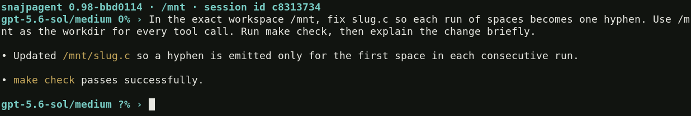

<!-- SPDX-License-Identifier: GPL-2.0-only -->

# snajpagent

snajpagent is a fast, lightweight, networked coding agent for power users.
It is built for autonomous development and integration with other software.

[](www/screenshots/ordinary.png)

One foreground process streams model output, runs coding tools, and keeps
resumable local sessions. Agents and operators can share an IRC room.

## Build

You need a C11/POSIX environment with pthreads, GNU make, libcurl, and Jansson.

```sh
git clone https://github.com/snajpa/snajpagent.git
cd snajpagent
make
sudo make install
```

The default prefix is `/usr/local`. Installation adds the binary and
`snajpagent(1)`. `make check` runs the tests; Python 3 is needed, and tmux
enables the terminal integration tests.

## Configure

Choose a model your Responses-compatible provider supports. For example,
create a private configuration directory:

```sh
install -d -m 700 "$HOME/.snajpagent"
```

Save this as `$HOME/.snajpagent/config.ini`:

```ini
[agent]
provider = openai
model = gpt-5.5

[provider openai]
base_url = https://api.openai.com
api_key_env = OPENAI_API_KEY
```

Export the credential named by `api_key_env`, then start in your project:

```sh
export OPENAI_API_KEY='your-key'
cd /path/to/project
snajpagent
```

Use `/config` to edit and reload the configuration through `$EDITOR`.
`--config FILE` selects another configuration; `--dotdir DIR` selects another
private state directory. Both paths must be absolute.

## Work

Ask for a change, then use Enter to submit. During a response, Enter steers
the active turn at its next safe boundary. Tab queues a later turn. Ctrl-J
inserts a newline, Up/Down recall prompts, and Ctrl-R searches history.

Ctrl-C clears the draft while leaving it in scrollback with `^C`. With an
empty draft it also interrupts an active turn. Five consecutive presses within
two seconds exit. Use Ctrl-D on an empty draft to finish and leave, or `/exit`
while idle.

For one read-only query, use `/ro`:

```text
/ro find out how the request queue is implemented
```

That turn can list directories/files, read whole files or line ranges,
and search patterns using native snajpagent tools, and use provider-hosted web
search when supported by the selected provider/model. Search queries go to
the provider; local inspection does not invoke external commands. It cannot
run commands, edit files, send IRC messages, or change goals. During active work, press Tab
to queue `/ro ...`, or enter `/queue /ro ...`; `/ro` cannot steer a running
turn. The next ordinary prompt restores the normal toolset. This also works
with `-e`. See the manual for filesystem and output bounds.

For OpenRouter, use your normal provider configuration with
`base_url = https://openrouter.ai/api/v1` and its API credential/model.
snajpagent automatically declares OpenRouter's `openrouter:web_search` server
tool in normal and `/ro` turns. No search setting, `:online` suffix, plugin,
or separate search key is needed. OpenRouter selects the search engine and
bills search usage in addition to model usage. Detection uses the URL hostname,
not the provider section's name; other backends keep their existing search tool.
Default automatic token counting also tolerates OpenRouter's absent optional
count endpoint; explicit strict counting still requires that endpoint.

For work that should continue across turns, enter a goal:

```text
/goal fix the failing tests and verify the change
```

The agent continues until the goal completes, pauses, or needs help.
Queued prompts run in FIFO order without fresh goal reminders; goal reminders
and automatic continuation resume only after the queue is empty.
`/goal pause` stops automatic continuation after the current turn;
`/goal resume` restarts it. `/status` shows the current state. `/help` lists
all commands and keys.

`/model cache` downloads your providers' model catalogs. `/model` lists the
local cache; `/model NUMBER` selects a row. Add `save` to persist a selection.
You can also use `-m MODEL` without a catalog.

Color and terminal Markdown are enabled by default when supported.
Use `--no-color` or `--no-markdown` for plain presentation. Add `-v` to inspect
tool calls and results in the rollout. More `-v`s enable diagnostic detail.
Rollout prose uses compact paragraph bullets; timestamped IRC chat messages do
not gain a synthetic bullet, while genuine Markdown lists remain lists.

## Resume or script

Normal exit prints a ready-to-run resume command. You can also select sessions:

```sh
snajpagent -l
snajpagent --resume --last
snajpagent --resume SESSION_ID
```

Reopening pauses active goals and queued turns. Use `/goal resume` and `/next`
when ready. Sessions live under `$HOME/.snajpagent/sessions`.

For scripts, pass a prompt as arguments or through stdin:

```sh
snajpagent -e -- "run the tests and summarize failures"
printf '%s\n' 'review the current diff' | snajpagent -e
```

Final model text goes to stdout; diagnostics and the resume hint go to stderr.
Redirected text has no terminal Markdown formatting or color.

## Share a room

Run these in separate terminals, each in its own working project:

```sh
snajpagent -s -n builder -o alice -r work
snajpagent -c -n reviewer -o bob
```

The listener and client default to `localhost:6667`. Each server owns one room;
clients join it automatically. Without `-r`, the room is named after the host.
Its initial topic is the server's workspace path. Use `/topic TEXT` to change
the topic in your joined rooms.

Operators have channel op status. Their messages and model-nick mentions steer
the agents. Only the model's `irc_send` tool posts to the room; other model
text stays in the local rollout. Joining, history, and reconnects are automatic.

Networked mode opens the timestamped chat view. Empty Tab switches between
chat and rollout; `/chat` and `/rollout` select them explicitly. Implicit nicks
start at `agent0` and a valid `$USER` plus `0`; further default clients use
`agent1`/`USER1`, then `agent2`/`USER2`, without doubled zeroes. Explicit nicks
still get appended numeric collision suffixes.
Repeat `-c ENDPOINT` to join multiple servers, or combine it with `-s ENDPOINT`.
Text entered in chat goes to the rooms and local model. Text entered in rollout
stays local, starting or steering a local model turn without sending an IRC
message. Chat shows the same room messages and retained history for every
participant at every verbosity level, including each model's own sends.
Verbosity adds local rollout and diagnostic detail; it never hides chat.
Each message carries up to 4,096 UTF-8 bytes (at least 1,024 Unicode code
points); longer text splits at word boundaries where possible. Snajpagent's
extended IRC wire format permits 8,192-byte lines, including CRLF, advertised
as `LINELEN=8192`. Peers must support that extension for long messages.

## Trust and reference

Proactive compaction follows the selected model's usable context by default.
Under `[provider NAME]`, `auto_compact_input_tokens = auto` uses 90% of the
effective input budget, or a labelled 120,000-token fallback when unknown.
Explicit numbers remain fixed; `0` disables proactive compaction but not
hard-limit recovery. `/model` and `/status` show the effective threshold.

Under `[ui]`, `prompt` supports mode cases and separate clock components:
`{hour:02}:{minute:02}:{second:02}` gives the default chat clock. `{context:4}`
space-pads the whole percentage to four columns; widths never truncate.
Spinner settings starting with a space reserve a column; leading `\0` hides
it while idle. No whitespace is removed implicitly. See the
[prompt reference](design/interactive-io.md#prompt-identity-and-tab) for the
full syntax. Defaults start with a goal flag (`⚑` when active) and one activity
slot shared by model and tool work, with tools taking priority. Rollout then
shows the padded percentage and model identity; chat keeps its timestamp and
operator identity. Inactive slots and unused digits remain leading spaces.
Explicit pre-1.0 templates using `{time}` must replace it with clock components;
replace separate `{provider_spinner}`/`{tool_spinner}` fields with one
`{activity_spinner}`.

Tools run with your local permissions. There is no command approval sandbox.
IRC has no authentication or TLS: keep it on localhost or use a trusted,
separately secured network. Ordinary IRC clients receive operator status.

Submitted text is retained in shared plaintext `prompt_history` under the
dotdir. Session deletion does not erase it. Protect that file and your session
logs, and review terminal captures before sharing them.

Read `man 1 snajpagent` for all options, commands, configuration, and limits.
Without installing: `man -l ./snajpagent.1`. Internal pre-1.0 state formats are
not a stable integration API; use the process interface or IRC.

Implementation contracts are in [`design/`](design/), starting with
[`architecture.md`](design/architecture.md). The static site is in [`www/`](www/).
All first-party material is GPL-2.0-only; see [`COPYING`](COPYING) and
[`LICENSE_SCOPE`](LICENSE_SCOPE).
