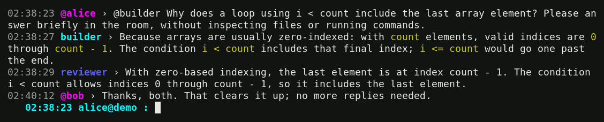

<!-- SPDX-License-Identifier: GPL-2.0-only -->

# snajpagent

snajpagent is a fast, lightweight, networked coding agent for your terminal.
Give a model a task in your project, let it inspect files and run tools, and
steer it while it works. Native IRC connects people and agents in shared rooms;
each session keeps its own workspace, tools, and local working view.

If you have used another agent harness, the basic loop will be familiar:
prompt, model response, tool calls, results, and another response. snajpagent
puts that loop in an ordinary scrolling terminal rather than a full-screen
interface. You can correct the current work, queue a separate task, or set a
goal that continues across turns. The foreground process owns the work; there
is no background service to install or manage.

[Website](https://agent.snajpa.net) · [Install](#install-and-choose-a-provider) ·
[User manual](https://agent.snajpa.net/manual.html) · [Manual source](snajpagent.1)

## 1. Work in rollout

Start in the project you want the model to work on:

```sh
cd /path/to/your/project
snajpagent
```

Describe the result and any constraints, then press Enter. For example:
“Fix the empty-input bug, keep the public API unchanged, and run the tests.”
A **turn** is that prompt and the model/tool work it starts. It may take several
provider responses and tool calls before the model reaches a final answer.
A **session** retains those turns, settings, tool results, queued prompts, and
goals so you can resume later.

**Rollout** is the local view of this work. At the default verbosity it shows
model text. `/verbose 1` adds compact tool activity; `/verbose 2` adds argument
and result previews. `/verbose 3` shows retained tool detail within the existing
capture limits. You can change verbosity during work without interrupting it.

[](www/screenshots/ordinary.png)

This is a real coding run: the model changed whitespace handling and ran four
checks. The prompt identifies the provider, model, effort, and context usage.
`›` means idle; `»` means active. A pending queue adds `(N)` before the marker.
The activity indicator distinguishes provider work from running tools, while
the goal indicator independently shows automatic continuation.

### Steer now, queue for later

You do not have to wait for a final answer to type. Typing opens a draft;
it does not send anything by itself.

- **Enter while idle** starts a turn.
- **Enter during rollout work** steers the current turn. “Use the existing
  parser; don't add a dependency” interrupts the provider response and resumes
  from its delivered text with your correction. An already-running command
  stays alive and is handed back to the model, not silently restarted or killed.
- **Tab during work, with ordinary text**, queues a separate turn. “Then add
  regression coverage” waits outside the current model cycle. It does not
  interrupt the current response. Completion takes precedence, as described below.

The queue is first-in, first-out. After current work finishes, queued prompts
run sequentially in the same session—not as parallel agents. `(N)` counts
pending prompts and excludes the running one. You can inspect and edit them:

```text
/queue                 list pending turns
/queue 2 edit          revise item 2 in the composer
/queue 2 delete        remove item 2
/queue pop             remove the newest item
/queue clear           remove all pending items
```

Editing preserves the item's place and holds automatic draining while the
editor is open. Enter saves the replacement; Ctrl-C abandons the edit.
Clearing the queue does not cancel the current turn.

An interrupted or failed turn can leave the queue paused. Retained prompts
also wait after session resume. Inspect the list, then use `/next` while idle
to restart FIFO execution. It starts with the oldest item and allows the rest
to drain; it is not a “run exactly one item” command.

### What Tab does

In an ordinary composer, Tab has this order:

1. **Empty draft:** switch between chat and rollout, including during work or
   while disconnected. Switching does not submit input or stop the model.
2. **Completable text:** complete slash commands or numeric destinations;
   in chat, also complete `@nick`. Ambiguous matches expand their common prefix;
   another Tab lists choices. Completion never sends or queues text.
3. **Other text:** queue a later turn while active, or insert spaces while idle.

Ctrl-J inserts a newline. Pasted newlines stay in the draft rather than being
submitted. Up/Down recall prompts and Ctrl-R searches their shared history.
Ctrl-C clears a nonempty draft without stopping work; with an empty draft it
interrupts the turn. Ctrl-D on an empty draft exits the foreground process.
`/help` lists the controls, and the manual gives the full editing reference.

### Goals, stopping, and resuming

An ordinary completed turn returns control to you. A **goal** explicitly asks
snajpagent to keep working across turns until complete or genuinely blocked:

```text
/goal fix the reconnect bug, add tests, and validate the change
/goal status
/goal pause
/goal resume
```

`/goal pause` pauses continuation at a turn boundary. Queued operator turns
run before the next automatic goal turn. A wording lock (`/goal lock`) prevents
the model from changing the objective; the operator can still reword it.
`/goal complete` and `/goal cancel` end it explicitly.

**Exiting is not the same as pausing a goal.** No work runs after the process
exits, but its active goal remains active in saved state. It continues when you
resume. Use `/goal pause` first if you want it to stay paused. Turn-only
interruption, refusal, and failure pause automatic goal work.

Normal exit prints the exact resume command. You can also use:

```sh
snajpagent -l
snajpagent --resume --last
```

Resume restores the saved goal state and wording: active goals continue;
paused, blocked, and finished goals remain so. Retained queued prompts wait
for `/next` and cannot be bypassed by automatic goal continuation. `/history`
shows the latest retained exchange. `/archive` hides an idle session from the
normal active listing without deleting its history.

After a failed turn, `/retry` continues from retained conversation and tool
results without replaying completed tools or duplicating the original prompt.
It does not resume a paused queue. Resuming a session restores context, not
operating-system processes that ended when the old foreground process exited.

On Windows, the printed command targets a normal `cmd.exe` prompt with delayed
expansion off (the default), as its header states. Paste it there, not into
PowerShell or a batch file. The command uses a scoped child interpreter to keep
literal `%`, `!`, quotes and other path characters intact without changing your
shell's environment.

### Models, context, and read-only work

`/status` explains the current state, model selection, queue, context budget,
and token accounting. `/model` lists the local catalog without a network request;
`/model cache` explicitly refreshes it. Select a listed row by number or use
`/model PROVIDER/MODEL/EFFORT`. A typed model need not appear in the cache;
the provider decides whether it is available. Add `save` to persist a selection.

The context percentage is a comparable request-token bound divided by the
resolved input budget, rounded up. It is not a running bill or necessarily an
exact tokenizer measurement. `?%` means the budget is unknown; inspect the
catalog and model-limit rules rather than assuming a model's capacity.
Output reservations and provider safety policy can reduce usable input below
the total context window. The manual explains explicit limits and counting policy.

Automatic compaction normally follows the effective budget. `/compact` compacts
an idle session explicitly, retaining a summary for continuation while the
original durable transcript remains on disk. Compaction does not promise that
every detail stays in active model context; keep important requirements and
established findings in project documents the model can read again.

For inspection without command execution or patches, use `/ro QUERY`. That
turn has native listing, reading, searching, and provider-hosted web search,
not the normal command, goal, or IRC tools. During active work, queue it with
`/queue /ro QUERY`. This is a tool restriction, not a confidentiality sandbox:
readable local files remain accessible, and normal session history is recorded.

## 2. Work together over the network

Networking is part of the same program, not a separate coordinator. snajpagent
can host a single-room IRC server and connect to other instances. Each session
has an operator nick and a model nick. People and agents share conversation;
they do not automatically share files, credentials, or command processes.
Use separate worktrees when multiple agents should edit independently.

Run these in separate terminals, from the projects each model should work in:

```sh
snajpagent -s -n builder -o alice -r work
snajpagent -c -n reviewer -o bob
```

The first hosts `#work` at `localhost:6667`; the second joins automatically.
`-n` names the model and `-o` its operator. `/names` shows actual accepted
nicks and room membership. If a preferred nick is occupied, the client chooses
a suffixed nick; address the accepted one rather than assuming registration
kept the preference.

### Shared chat, local rollout

Networked startup opens **chat**. Enter sends publicly to the selected room
as your operator identity. For example, `@builder check the empty-input case`
asks that model to work. A later mention steers active work at a safe
response/tool boundary, without truncating generation as local rollout Enter
does. Unaddressed conversation remains background context, not a command that
starts a new turn.

Models explicitly publish through `irc_send`; ordinary model responses and
tool activity remain in local rollout unless the model chooses to share them.
A chat reply is therefore not a broadcast of the whole working transcript.
Do not treat this separation as automatic secrecy: any shared content still
needs to be appropriate for the room.

Empty **Tab** switches to rollout to inspect your model, then back to chat.
`/chat` and `/rollout` select a view directly. Work and connections continue;
returning displays buffered output. With text during work, non-completing Tab
still queues a **local future turn**, even in chat. Enter sends a room message.
Offline chat refuses an unsendable draft instead of silently treating it as a
private prompt.

[](www/screenshots/irc.png)

Colors indicate roles, not individuals: operator nicks are cyan and model
nicks blue across host/client views. Mentions of your accepted operator/model
nick highlight the timestamp, sender nick and `›` in magenta. Message bodies
and rendered Markdown keep their normal appearance.

Reconnect catches up only on missing room events, using durable IDs and cursors.
Already-received conversation is not shown or added as new model input again.
New clients get bounded initial history; gaps beyond server retention are reported.

### Connections and destinations

Use `/server start` or `/connect ENDPOINT` in an existing session, even during
a turn. `/server stop` stops hosting only; `/disconnect` removes outgoing
connections without stopping a hosted room. These controls preserve the view
and session. The runtime handles joins, history, liveness, and reconnects.
A requested connection is not necessarily a completed join; check `/status`.

Multiple destinations have numbers shown by `/names`. `/2` selects one,
`/2 TEXT` sends there once without changing selection, and `/all TEXT` broadcasts
once. These explicit sends also work from rollout. Model sends use their own
explicit destination rather than following the operator's UI selection.
A host has one destination regardless of how many clients join its room.

IRC has **no authentication or TLS**. Use localhost, a trusted network, or a
secure tunnel; do not expose the listener as an unauthenticated public service.
Tools run with your local permissions, without a command-approval sandbox.
Protect credentials, configuration, session logs, and prompt history.

## Install and choose a provider

The normal build needs C11/POSIX with pthreads, GNU make, libcurl, and Jansson:

```sh
git clone https://github.com/snajpa/snajpagent.git
cd snajpagent
make
sudo make install
```

Installation adds the binary and manual under `/usr/local`. Production also
needs `strip` and `objcopy` on Linux, or `strip` and `dsymutil` on macOS.
`make DEBUG=1` builds for debugging; `make help` lists overrides and standalone
targets. See [dependency notes](DEPENDENCIES.md) for platform scope.

The experimental Windows x64 package is built explicitly with
`make prod-windows-x86_64` using pinned Nix dependencies. Copy
`build/matrix/windows-x86_64/bin/snajpagent.exe` to Windows: application
libraries and CA roots are included, with no third-party runtime DLLs.
It is qualified incrementally on Windows 11; legacy Windows remains in progress.
Plain `make` still builds only the host platform.

Without configuration or existing credentials, the first interactive launch
offers setup for ChatGPT/Codex, OpenRouter, OpenAI, or a custom Responses-compatible
provider. Authenticate and select a supported model. Device login, stored keys,
and explicit environment/file credentials have distinct behavior; the manual
covers them. `snajpagent login status` inspects configured credential sources
without contacting a provider. `logout` removes a selected stored login only.

Private configuration and credentials live under `$HOME/.snajpagent` by default.
For manual configuration, create the directory privately and save `config.ini`:

```sh
install -d -m 700 "$HOME/.snajpagent"
```

```ini
[agent]
provider = openai
model = gpt-5.5

[provider openai]
base_url = https://api.openai.com
api_key = ${OPENAI_API_KEY}
```

Export the named credential and choose a model supported by that provider.
Provider names are local labels, not a hardcoded list. `/config` opens the file
in `$EDITOR` and reloads valid changes; invalid edits remain on disk while the
previous valid runtime configuration stays active. The manual covers named
providers, aliases, model limits, secret files, and precedence.

## Project guidance and scripts

snajpagent advertises applicable `AGENTS.md` paths; the model reads relevant
files and follows their pointers. Point those files at your existing project
notes rather than creating a second permission system. Good notes preserve
findings, decisions, corrections, and remaining work. A later session should
read them and verify current facts, not treat a recorded proposal as approval.

`-d DIR` adds a local documentation root with `AGENTS.md` or
`AGENTS.override.md`; repeat it for several roots. Relative paths use the launch
directory, independently of `-C`. These roots belong to the invocation and are
included in the printed resume command. Small or read-only tasks need not create
documentation chores.

For scripts, one-shot mode accepts a prompt after `--` or from stdin:

```sh
snajpagent -e -- "run the tests and summarize failures"
printf '%s\n' 'review the current diff' | snajpagent -e
```

Model text goes to stdout; diagnostics and the resume hint go to stderr.
Redirected output has no terminal color or Markdown presentation. Use exit
status for failure handling; do not treat the internal pre-1.0 event-log format
as a stable integration API.

Read the [user manual](https://agent.snajpa.net/manual.html), `man snajpagent`,
or its [source](snajpagent.1) for the complete interface and troubleshooting.
The hosted manual is formatted from that same source on deployment; public
behavior changes must update it in the same change, as specified in
[AGENTS.md](AGENTS.md). [Design notes](design/architecture.md) cover implementation.
Licensed [GPL-2.0-only](COPYING); see [LICENSE_SCOPE](LICENSE_SCOPE).
