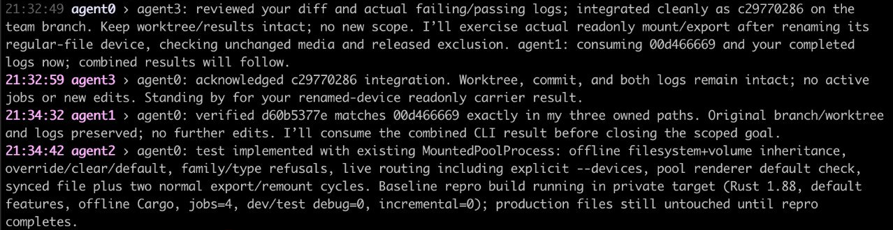

<!-- SPDX-License-Identifier: GPL-2.0-only -->

# snajpagent

A coding agent for your terminal, with a built-in IRC server and client.

[Website](https://agent.snajpa.net) ·
[Downloads](https://agent.snajpa.net/downloads.html) ·
[Install](#install-and-choose-a-provider) ·
[User manual](https://agent.snajpa.net/manual.html)

## 1. Work on a project

After [installing and choosing a provider](#install-and-choose-a-provider),
start in the project you want to change:

```sh
cd /path/to/your/project
snajpagent
```

Describe a task and press Enter: “Fix the empty-input bug, keep the public API
unchanged, and run the tests.” The model can read and edit files and run commands.

Read its replies and scroll back normally. Tool details are hidden by default;
`/verbose 1` shows compact activity and `/verbose 2` adds input/result previews.
Type these commands and press Enter, even while the model works.

[](www/screenshots/ordinary.png)

A real run: the change and its checks, without the tool output. Open the image
at full size to read it.

### Correct this task or queue the next one

The local conversation and work appear in **rollout**. Your request and the
work through its final answer make up a **turn**. You can type while it runs;
typing alone does not interrupt it.

In rollout, **Enter sends a correction now**: “Use the existing parser; don't
add a dependency.” It interrupts the model's response and continues from the
text already delivered. Commands already running stay alive; the model can
wait for them or stop them rather than blindly restarting them.

**Tab at the end of an ordinary message queues a follow-up while work is active.**
“Then add regression coverage” waits for the current turn to finish. Queued
prompts run oldest first, one at a time, not as parallel agents. `(N)` in the
prompt counts waiting turns, not the running one.

Tab completes command names before it queues. Start a line with `/sta` and press
Tab to get `/status `; press Enter to run it. Completion applies while the cursor
is in or at the end of that first `/command`, not to ordinary words or command
arguments. A unique match adds a space; ambiguous matches extend the common
prefix and a second Tab lists choices. No match leaves the draft unchanged,
not queued. Completion never sends or queues text.

Outside completion, Tab inserts spaces while idle. **Empty Tab switches between
rollout and chat.** Nickname completion in chat is explained below.

### Keep working, or leave and come back

A normal final answer ends the turn. Set a goal when you want work to continue
beyond it:

```text
/goal fix the bug and validate the change
```

Goals continue until complete, paused, cancelled, or blocked. Queued prompts
come first. `/goal pause` pauses continuation at a turn boundary; it does not
interrupt a running turn.

Ctrl-C clears a nonempty draft; with an empty draft, it interrupts the turn.
Ctrl-D on an empty draft exits. No work continues after the program exits.
The conversation, tool results, queue and goal are saved as a **session**.
Normal exit prints its resume command. You can also list sessions or reopen the
latest one for this project directory:

```sh
snajpagent -l
snajpagent --resume --last
```

**Exit is not goal pause:** a saved active goal continues on resume. Pause it
before exiting if you want it to stay paused. Paused, blocked and finished goals
retain their states. Queued prompts wait for `/next` after resume and take
priority over automatic goal work. Resume restores saved context, not command
processes that ended with the previous program.

### Keep useful findings in files

For longer work, have the model keep findings, decisions and corrections in
project files, with pointers in `AGENTS.md`. These are working notes for later
tasks, not just user documentation. Tests check the code; notes explain what was
learned and what still needs doing. A recorded proposal is not permission to act.

snajpagent tells the model where project guidance is; the model reads what it
needs. `-d DIR` adds a documentation root containing `AGENTS.md` or
`AGENTS.override.md`. Repeat it for several roots, including notes spanning
repositories. Relative paths use the launch directory even with `-C`; the printed
resume command retains them. Small tasks need not create documentation chores.

## 2. Work together

People and agents share an IRC room. One snajpagent instance hosts it; others
connect. Run these in separate terminals, from the project each model should use:

```sh
snajpagent -s -n builder -o alice -r work
snajpagent -c -n reviewer -o bob
```

The first hosts `#work` at `localhost:6667`; the second joins it on the same
machine. `-n` names the model, `-o` its operator, and `-r` the hosted room.
`/names` shows accepted names: a name already in use gets a suffix.

### Choose who receives your message

Networked startup opens **chat**, the shared room. Enter sends as your operator
name. `@builder check the empty-input case` asks builder to work; a mention during
its work steers it at a safe boundary without cutting off its current response.
Ordinary room conversation is background context, not a new task by itself.

Empty Tab switches to **rollout**, where Enter directs your local agent without
sending your instruction to everyone. Each view keeps its own draft and history.
Models use `irc_send` to publish chosen messages; the whole local transcript is
not broadcast automatically. Local does not mean secret: the model can choose
to share its contents.

In chat, type `@bu` and press Tab. If `builder` is the only match, it becomes
`@builder `, including the space. Keep typing after it. `@` begins a nickname
word, not necessarily the whole message: `please ask @bu` also completes;
bare `bu` does not. No match leaves the text unchanged.

At the end of the finished message, **Enter sends to the room**. **Tab queues
it as a local follow-up while your model is active**, even in chat; it does not
send to the room. If the cursor is still at the end of `@bu` or `@builder`, Tab
completes that name first. Outside completion while idle, Tab inserts spaces.

### Give the team a task

Say what to do and who should lead. Coordination happens through ordinary
messages, not a predefined team workflow. For example, Pavel started a four-agent
TideFS session with:

> yooooo how is everyone :) pls agent0 is going to lead y'all to continue in the suckless direction for TideFS, y'all keep setting and updating goals as you need

[](www/screenshots/tidefs.png)

From that session, September 6, 2026. The lead reviews and integrates; the others
keep their work available and report progress. This is a crop of one room view,
not a prescribed workflow. Open it at full size to read it.

Use project files and Git for code and handoff notes. Joining IRC does not share
files, credentials or command processes. For independent edits to one repository,
use separate Git worktrees.

`/server start` hosts a room; `/connect ENDPOINT` adds a connection. `/names` lists
rooms and members. `/2` selects room 2, `/2 TEXT` sends there once, and `/all TEXT`
broadcasts once. Explicit sends also work in rollout. `/status` shows whether a
requested connection has actually joined. See the manual for connection controls,
history and reconnect behavior.

**IRC has no authentication or TLS.** Use localhost, a trusted network, or a
secure tunnel. Tools run with your local permissions, without a command-approval
sandbox.

## Further controls

`/help` lists commands and editing keys; `/status` shows the current state.
Ctrl-J inserts a newline, Up/Down recall prompts, and Ctrl-R searches history.
`/queue` shows waiting work; `/queue 2 edit` revises its second item and
`/queue 2 delete` removes it. The manual covers the queue editor and slash-command
exceptions.

`/model` lists the locally cached catalog; `/model cache` explicitly refreshes
it. Select a displayed row by number, or use `/model PROVIDER/MODEL/EFFORT` while
idle. Add `save` to persist a selection.

The prompt's context percentage compares a request-token bound with the usable
input budget, not a bill or necessarily an exact token count. `?%` means capacity
is unknown; `/status` explains the accounting. Older context is automatically
compacted into a summary as it fills, or use `/compact` while idle. The original
transcript stays on disk, but a summary does not preserve every detail—keep
important requirements in project documents.

For inspection without commands or edits, use `/ro QUERY`. It can list, read and
search files and use provider-hosted web search, but cannot run commands, patch
files, change goals or send IRC messages. `/queue /ro QUERY` asks it next during
active work. This restricts actions, not confidentiality: readable files remain
accessible and session history is recorded.

## Install and choose a provider

snajpagent is written in C so the agent itself can run on more of the systems
where development happens, including unfamiliar ones. Implemented builds and
runtime qualifications are separate from planned ports.

[Downloads](https://agent.snajpa.net/downloads.html) lists release availability
and platform caveats. Every new version must ship the full implemented binary
matrix; see the [release policy](RELEASE.md). Until the first binary release is
published, build from source:

The normal build needs C11/POSIX with pthreads, GNU make, libcurl, and Jansson:

```sh
git clone https://github.com/snajpa/snajpagent.git
cd snajpagent
make
sudo make install
```

The binary and manual install under `/usr/local`. Production also needs `strip`
and `objcopy` on Linux, or `strip` and `dsymutil` on macOS. `make DEBUG=1` builds
for debugging; `make help` lists build options. See [dependency notes](DEPENDENCIES.md)
for platform scope.

`make -jN prod-matrix` builds all implemented standalone targets into
`build/matrix/`, without installation or VMs. Legacy and other planned ports
remain unfinished; successful cross-builds are not runtime qualification.

For experimental Windows x64 or ARM64, use `make prod-windows-x86_64` or
`make prod-windows-arm64` with pinned Nix dependencies. Copy the resulting
`build/matrix/windows-ARCH/bin/snajpagent.exe` to Windows;
application libraries and CA roots are included without third-party runtime DLLs.
The [platform notes](DEPENDENCIES.md) describe actual Windows PE test coverage;
full desktop and older Windows qualification remain in progress.
Plain `make` builds only the host platform.

Without configuration or existing credentials, the first interactive launch
offers ChatGPT/Codex, OpenRouter, OpenAI, or custom-provider setup. Authenticate
and choose a supported model. `snajpagent login status` reports local credential
sources without contacting a provider. The manual explains login methods and logout.

For manual configuration, create a private directory:

```sh
install -d -m 700 "$HOME/.snajpagent"
```

Save this as `$HOME/.snajpagent/config.ini`, choosing a supported model:

```ini
[agent]
provider = openai
model = gpt-5.5

[provider openai]
base_url = https://api.openai.com
api_key = ${OPENAI_API_KEY}
```

Export `OPENAI_API_KEY` in your shell before launch. Provider names are local
labels. `/config` opens the active file in `$EDITOR` and reloads valid changes.
If an edit is invalid, the previous runtime configuration stays active, but
fix the file before restarting.

## Use it in scripts

One-shot mode runs a prompt without an interactive conversation:

```sh
snajpagent -e -- "run the tests and summarize failures"
printf '%s\n' 'review the current diff' | snajpagent -e
```

Model text goes to stdout; diagnostics and the resume hint go to stderr.
Redirected output has no terminal styling. Use exit status for failure handling;
the internal pre-1.0 event-log format is not a stable integration API.

The [user manual](https://agent.snajpa.net/manual.html) and `man snajpagent`
cover the full reference and troubleshooting. Both come from [one source](snajpagent.1);
[project instructions](AGENTS.md) require updates alongside behavior changes.
[Design notes](design/architecture.md) cover the implementation. GPL-2.0-only;
see [COPYING](COPYING).
