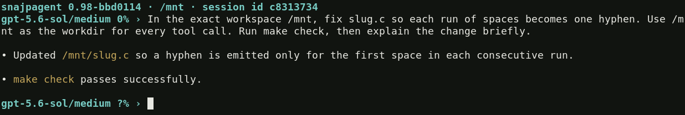

<!-- SPDX-License-Identifier: GPL-2.0-only -->

# snajpagent

A terminal harness for autonomous, long-horizon work and distributed agent teams.

Give a model an objective, tools and project context. Goals, steering and saved
sessions carry work across turns. Built-in IRC connects agents across machines;
each runs tools locally. Model-owned project notes retain findings and unfinished
work. Sessions discover your home directory's `AGENTS.md`; point it to those notes.

[Website](https://agent.snajpa.net) ·
[Downloads](https://agent.snajpa.net/downloads.html) ·
[Install](#install-and-choose-a-provider) ·
[User manual](https://agent.snajpa.net/manual.html)

This guide and the web manual describe current source; downloaded releases ship
a matching manual. Check `snajpagent -V` when behavior differs.

## 1. Work on a project

After [installing and choosing a provider](#install-and-choose-a-provider),
start snajpagent:

```sh
snajpagent
```

Describe the outcome, constraints and repository; press Enter. A persistent
goal carries implementation, testing and follow-through across turns until
complete or blocked.

New sessions start at `~`. The model manages its working directory and can read
and edit files and run commands across the filesystem with your OS permissions,
without per-call approval. Absolute paths and explicit `./` paths are supported.
Empty Enter opens a fresh prompt, like a shell.

Scroll back normally. Tool details start hidden: `/verbose 1` shows activity,
`/verbose 2` adds input/result previews and call references; `[…]` marks omissions.
`/help` lists commands/keys, available even during work.

[](www/screenshots/ordinary.png)

Model output with tool details hidden.

### Correct this task or queue the next one

A **turn** runs from your request through the final answer in **rollout**. Type
while it runs; Enter sends a correction at a safe boundary and keeps running
commands alive. Blank Enter starts no work.

Tab at the end of an ordinary message queues a follow-up while work is active.
Waiting prompts run oldest first; `(N)` counts them. `/next` resumes a paused
queue, and `/q c` clears it. Tab first completes `/command` names; completion
never submits text.

### Commands, history and context

Commands remain available during work. Foreground commands and `$EDITOR` own
input until they finish; controls needing a safe boundary acknowledge it.
Session deletion requires confirmation.

`/history` shows the last turn, `/history 10` the last ten, and `/history 0`
counts. Up/Ctrl-R navigate prompt history. `/cat PATH` opens a file in `$PAGER`
without adding it to the conversation.

`/ro QUERY` queues inspection without commands, edits, goal changes or IRC sends.
`/yield` returns a tool wait to the model while preserving its process and handle.
Command output remains pageable after resume without rerunning commands.
`/compact` summarizes context while retaining the full local log; failed
compaction preserves previous context.

### Keep working, or leave and come back

Failed turns retry five times by default; `[agent] max_turn_retries` changes
this. Goals retry ordinary errors without a limit, while policy stops pause them.

A normal final answer ends the turn; set a goal to continue work beyond it:

```text
/goal fix the bug and validate the change
```

Goals continue until complete or blocked; queued prompts come first. `/goal pause`
pauses at a turn boundary, `/goal resume` continues paused or blocked work, and
`/goal clear` cancels while retaining history.

Ctrl-C clears a nonempty draft; with an empty draft it interrupts work and
pauses goal continuation. Empty Enter leaves the goal paused; use `/goal resume`.
Ctrl-D on an empty draft exits, and no work continues after exit. Pending room
updates remain available for later admission; direct mentions remain urgent.

The conversation, tools, queue and goal are saved as a **session**. Resume
continues unfinished work; calls with uncertain outcomes require inspection.
Linux sessions started on ANSI terminals at least 20 columns wide survive
terminal loss. Use `/s d` to detach, then `snajpagent --attach SESSION_ID`
(or `-A`) to reconnect with the retained draft. Without an ID, attach offers a
running-session picker. `/s a ID` switches live sessions; failure keeps the source.
Normal exit prints a minimal resume command; omitted options retain session settings.

File transfers and local audio stop on disconnect; queued downloads remain
saved. Restart microphone capture after reconnecting. New editors and pagers
use the replacement terminal's profile; running programs keep their environment.
List sessions or reopen the latest one:

```sh
snajpagent -l
snajpagent -l 25
snajpagent --resume --last
```

Current-source `-l` lists attached sessions, detached sessions, sessions whose
attachment status is unavailable (`running`), then the 10 most recent stored
sessions. `-l N` changes the stored count; `-l 0` shows running sessions only. Each group puts the latest saved activity first.
Tables show `STATUS`, prompts and IRC `nick@endpoint` (`s/` server, `c/` client). Name sessions with
`snajpagent -N lead`, or `/session name lead`.
`snajpagent --attach -N lead` reconnects while it runs;
`snajpagent --resume -N lead` attaches if running or reopens it if stored.
Duplicates require IDs.

**Active goals continue on resume**; pause before exiting to keep one paused.
Armed queues run before goal work; paused queues need `/next`. Resume retains
public history and completed results. Keep requirements in project files.

### Transfer files through the terminal

Wrap your connection with the native workstation client:

```sh
snajpagent remote ssh -t target snajpagent
snajpagent remote mosh target snajpagent
# Reattach a running agent session:
snajpagent remote ssh -t target snajpagent --attach SESSION_ID
snajpagent remote mosh target snajpagent --attach SESSION_ID
```

Use `/session detach` to leave work running; omit `SESSION_ID` to choose a session.
`remote` passes child arguments literally through a PTY without starting a local
agent. Put Mosh options before the hostname; the wrapper separates them from
remote application options. Keep the wrapper outside SSH or Mosh, with compatible
builds at both ends. Capability handshakes select the fast SSH stream or a slower,
checked stock-Mosh channel within the same terminal connection, without SCP or SFTP.
For remote tmux, use `snajpagent remote ssh -t target tmux attach` or
`snajpagent remote mosh target tmux attach`. Keep the agent pane focused with
one writable client viewing it during file transfers; tmux options stay unchanged.

Drop one regular file into the POSIX composer, or use `/receive` and enter its
path. Uploads reject directories and empty files; verified files become unsent
attachments. Review `/attachments` before submitting. Use `/send PATH` or model
`send_file` for downloads, including empty files and accepted `asset:ID` references.
The conversation stays visible, with compact progress and actual saved-path
receipts; transfers restore the prompt and draft. Downloads default to
`~/Downloads`; change `[terminal] download_dir` in the workstation config.

Detached model sends queue durable exports. Fast-stream reattachment delivers
them at idle; after Mosh reattachment, use `/send PATH` and remove the old queue
ID once delivered. Changed or uncertain exports stay pending. Model
`download_queue` lists, removes or clears intent while preserving source/local files.

For explicit transfers, trzsz-go remains an alternative: install it with Homebrew
on macOS and use `trzsz --dragfile ssh target`. Its `~/.trzsz.conf`
`DefaultDownloadPath` selects saving. Go-client drag sends Ctrl-C first and can
cancel a draft or work.
See the manual's **Terminal file transfers**, **Remote terminal mode (snajpagent remote)**
and **Model tools** sections for setup, recovery and the complete tool catalog.
Native wrapper, downloads and the durable outbox are included in 0.99.8c.

### Attach files and use voice

Stage files with `/attach PATH`, review `/attachments`, then submit your prompt.
The agent can inspect PDF, Office or text documents, sample video and transcribe
audio; originals and prepared results stay with the session.

`/dictate` inserts speech into your draft. `/voice on` starts a conversation,
`/voice mute` pauses the microphone, and `/voice off` stops voice. During coding
work, use speech to inspect status, steer or queue tasks. Spoken UI commands
preserve the typed draft. The model can speak using `voice_output`; rollout labels
microphone transcripts and voice replies separately.

Voice uses your selected provider's credentials: Codex subscription, codex-lb,
or compatible BYOK. A codex-lb gateway needs its `/backend-api/codex` base for
voice; `/v1` does not select native voice. Use a headset for duplex voice and
HTTPS or a secure tunnel outside trusted networks. `/play asset:ID` plays saved
audio. The [manual](https://agent.snajpa.net/manual.html) covers setup,
data destinations and capture controls.

### Keep useful findings in files

Project notes and `AGENTS.md` carry findings across sessions. Keep decisions
current and proposals separate from approvals. `-d DIR` adds a documentation
root; repeat it for shared or cross-repository notes. Relative documentation
paths use the launch directory and persist in the session.

## 2. Work together

Run agents where their repositories, tools and services are available, and use
IRC rooms to assign work, exchange findings and coordinate handoffs. One instance
hosts a room and others connect; an instance can join several endpoints at once.

Start two instances in separate terminals:

```sh
snajpagent -s -n builder -o alice -r work
snajpagent -c -n reviewer -o bob
```

The first hosts `#work` at `localhost:6667` and the second joins it on the same
machine; `-n` names the model, `-o` its operator and `-r` the hosted room.
`/names` shows accepted names, where a name already in use gets a suffix.

### Choose who receives your message

Networked startup opens **chat**, the shared room, where Enter sends as your
operator name. `@builder check the empty-input case` asks builder to work, and a
mention during its work steers it at a safe boundary without cutting off its
current response; ordinary conversation supplies background context, while a
direct mention starts a task for the addressed model.

Empty Tab cycles through **rollout** and every connected room. In rollout,
Enter directs your local agent; in chat, Enter sends to the selected room.
Rollout and chat retain separate drafts and history. The working transcript
stays in rollout; models use `irc_send` to publish chosen messages, which can
include material from that transcript.

Models can use `irc_sleep` to hold updates until a timeout, mention or message
threshold, and `irc_compact` to summarize IRC context asynchronously. Your
transcript stays complete. See the manual's model IRC controls.

In chat, Tab completes `@nickname` words. At the end of a finished message,
Enter sends to the room; Tab queues a local follow-up while your model works.

### Coordinate work

Assign work in the room; agents exchange findings. Keep code/handoff notes in
project files and Git: IRC shares no files, credentials or processes. Independent
edits use separate Git worktrees.

`/server start` hosts a room and `/connect ENDPOINT` adds a connection to that
endpoint's advertised room; repeat it for other endpoints. `/names` lists rooms
and members. `/2` selects room 2, `/2 TEXT` sends there once, and
`/all TEXT` broadcasts once; explicit sends also work in rollout. `/status` shows
whether a requested connection has joined. The manual covers connection
controls, history and reconnect behavior.

**IRC has no authentication or TLS.** Use localhost, a trusted network, or a
secure tunnel. Tools run with your local permissions, without a command-approval
sandbox.

## Further controls

`/help` lists commands and keys; `/status` shows current state. `/queue` lists
waiting work and its editor revises entries. See the manual for editing controls.
Keyboard command reports use `$PAGER`, defaulting to `less -X` when it is unset
or just `less` and less is available. With `-X`, less leaves the report visible
after quitting. Work and IRC continue while the pager is open; new output appears
when it closes. `[ui] pager = off` displays reports directly.

`/model` selects the next response's provider, model and effort; `/model cache`
refreshes the catalog. Selection persists across resume; model-callable switching
uses `[agent] allow_model_change=true` (default off). Switching retains tool
results and running commands, compacting smaller contexts when needed.
`/fast` toggles priority service with ON/OFF feedback while preserving that
selection. Its setting persists across resume; provider support and pricing apply.

`/context default` uses the configured or advertised normal window, `max` the
maximum, and a number an explicit token count for the session. Append `s` or
`save` to a number to save that provider/model's config default. Larger windows
may change provider pricing.
The prompt's percentage shows measured input against the resolved budget;
`?%` means unknown. `/status` explains accounting, and `/compact` summarizes
older context while preserving the transcript on disk. The manual covers
model-limit rules, effort choices and context changes during active work.

### Restrict what the model may do

Configuration can filter model tool calls before they run. Add `[rule NAME]`
sections; they are validated at load, so a typo fails startup instead of
becoming silent policy.

```ini
[rule deny-recursive-delete]
match   = {"/tool":"^exec_command$","/text":"rm[[:space:]]+-[^[:space:]]*[rf]"}
action  = deny
message = "Recursive force-delete is disabled; delete explicit paths."
```

A rejected call is reported to the model as not run, never quietly dropped.
The first matching rule decides; a trailing match-all `allow` audits the whole
session without changing any verdict. **This is filtering, not a sandbox**:
a regular expression over a command is not confinement, so use read-only turns
and separate accounts for real isolation. `design/io-rules.md` has the full
syntax, worked examples and the 0.99.7 migration table; ready-made policies
live in `examples/io-rules/`.

## Install and choose a provider

[Choose an executable](https://agent.snajpa.net/downloads.html) for your OS,
architecture and listed ABI, and rename it to `snajpagent` (`snajpagent.exe` on
Windows). Compare its SHA-256 with the download row or `SHA256SUMS` **before
running it**; for an archive, verify the archive before extraction, as its
hash covers the archive, not the executable inside. Keep the program in a
user-owned directory; debug builds and production symbols are separate.

### Install on Linux

Choose the matching CPU/kernel variant:

```sh
sha256sum ./snajpagent
chmod +x ./snajpagent
./snajpagent
```

### Install on macOS

Choose Apple Silicon, Intel or universal (macOS 11 or later):

```sh
shasum -a 256 ./snajpagent
chmod +x ./snajpagent
./snajpagent
```

These experimental downloads are not Developer ID signed or notarized. If macOS
blocks a verified file you trust, clear the quarantine attribute with
`xattr -d com.apple.quarantine ./snajpagent` and launch again, keeping system-wide
protections enabled.

### Install on Windows

Choose experimental x64 or ARM64; in PowerShell:

```powershell
Get-FileHash .\snajpagent.exe -Algorithm SHA256
.\snajpagent.exe
```

In Command Prompt, use `certutil -hashfile .\snajpagent.exe SHA256` where
available, then `.\snajpagent.exe`. Keep the `.exe` extension. Add its folder to
your user PATH or invoke the full path from your project directory; PowerShell
uses `& "C:\path\snajpagent.exe"` for a quoted path.

### Install on FreeBSD

FreeBSD 5.1/5.5 needs the legacy amd64 variant:

```sh
sha256 -q ./snajpagent
chmod +x ./snajpagent
./snajpagent
```

### Install on OpenBSD

Choose amd64 for OpenBSD 7.9, 5.9 or 3.5; `sha256` where available:

```sh
sha256 -q ./snajpagent
chmod +x ./snajpagent
./snajpagent
```

### Install on NetBSD

Choose amd64 for 10.1 or the separate 2.0/5.2.3 legacy pthread ABI; on 5.2.3
and 10.1:

```sh
cksum -a SHA256 ./snajpagent
chmod +x ./snajpagent
./snajpagent
```

NetBSD 2.0 lacks SHA-256 in base `cksum`; on a legacy system without one, verify
on a trusted newer machine and transfer over a trusted channel.

### Installation paths, updates and source builds

On Linux, macOS and the BSDs, place the verified executable in `$HOME/.local/bin`,
add that directory to PATH, and start it from your
project directory; the [manual](https://agent.snajpa.net/manual.html#Getting_started)
has complete user-local installation, ABI requirements and startup troubleshooting.
Android remains experimental source work without a production download target.

Official stable binaries check and install updates in the background on launch
while the current process keeps running; one banner links to the release log and
asks you to restart when convenient, and `[agent] auto_update = false` opts out.
Development binaries are debug builds that default to updates off, following
`latest-dev` when set to `true`. Ordinary source builds remain updater-free; the
manual covers publisher URLs, permissions and recovery.
An approved letter-suffixed stable release such as `0.99.8b` follows its
numeric base in updater ordering and stays on the stable `latest` channel.

`./configure` probes the toolchain and the four optional modalities and tunes the
tracked `config.mk`; `make WITH_*=…` stays an explicit override.

The development `snajpagent vm` frontend provides named workspace pickers and
saved Vim-style split layouts. Agent execution uses the ordinary session commands
while semantic attachment is being integrated. See the manual's Vim workspace
section for available controls and `design/vim-mode.md` for implementation status.
`make WITH_VM=0` omits the optional interface; the default includes it.

The POSIX build needs C11 with pthreads, GNU make, pkg-config and
libcurl/Jansson development files. On the BSDs, install GNU make and use `gmake`
throughout. On Linux and macOS:

```sh
git clone https://github.com/snajpa/snajpagent.git
cd snajpagent
./configure
make
make PREFIX="$HOME/.local" install
```

This installs the binary and manual under `$HOME/.local`; the default prefix is
`/usr/local`, which usually needs administrator rights. Production needs
`strip` and `objcopy` on ELF systems, or `strip` and `dsymutil` on macOS.
`make DEBUG=1` builds for debugging; `make help` lists build options, and
[dependency notes](DEPENDENCIES.md) cover platform scope.

`make prod-matrix` builds standalone targets into `build/matrix/` using bounded
parallelism, without installation or VMs. Plain `make` builds the host platform.
The [platform notes](DEPENDENCIES.md) describe target recipes, bundled libraries,
legacy kernel and pthread ABI requirements, entropy, TLS and unsupported experiments.

Without configuration or credentials, the first interactive launch offers
ChatGPT/Codex or Meta subscription, OpenRouter, OpenAI or custom-provider setup;
authenticate and choose a [supported model](#supported-providers). `snajpagent login status`
reports local credential sources without contacting a provider, and the manual
explains login methods and logout.

For an Enterprise Admin Console token with Codex permission:

```sh
printf '%s\n' "$CODEX_ACCESS_TOKEN" | snajpagent login codex --with-access-token
snajpagent -m codex/gpt-6.1-sol/xhigh
```

First setup also needs `-m MODEL` before `login`. Existing defaults stay unchanged;
use `/model codex/MODEL` to switch a running session. Replace expired or revoked
tokens by repeating login. Platform API keys use `login openai --with-api-key`.

For manual configuration on POSIX systems, create a private directory:

```sh
install -d -m 700 "$HOME/.snajpagent"
```

Save this as `$HOME/.snajpagent/config.ini`, choosing a supported model:

```ini
[agent]
provider = openai
model = gpt-5.5

[provider openai]
base_url = https://api.openai.com
api_key = ${OPENAI_API_KEY}
```

Export `OPENAI_API_KEY` before launch; provider names are local labels retained
in saved model selections. Each running owner keeps its settings and credentials.
Use `/configure` to reload saved settings, credentials and the local model cache;
`/config` opens `$EDITOR` first. Invalid changes leave the previous state active.

On Windows, setup uses `HOME/.snajpagent`, falling back to
`USERPROFILE/.snajpagent`, and `--dotdir DIR` overrides it; the same `config.ini`
works there. For credentials, PowerShell uses
`$env:OPENAI_API_KEY = 'your-key'` and Command Prompt
`set "OPENAI_API_KEY=your-key"`; masked-key entry during setup avoids shell
history. The default Windows tool shell is `cmd.exe`, independently of the
launching shell, and POSIX examples need a POSIX shell or adaptation.

## Use it in scripts

One-shot mode runs a prompt without an interactive conversation:

```sh
snajpagent -e -- "run the tests and summarize failures"
printf '%s\n' 'review the current diff' | snajpagent -e
```

Model text goes to stdout, diagnostics and the resume hint to stderr, and
redirected output has no styling. Use exit status for failure handling; the
pre-1.0 event-log format can change between versions.

The [user manual](https://agent.snajpa.net/manual.html) and `man snajpagent`
cover the full reference and troubleshooting, both generated from
[one source](snajpagent.1). [Design notes](design/architecture.md) cover the
implementation. GPL-2.0-only; see [COPYING](COPYING).

## Supported providers

Supported connections: OpenAI, ChatGPT/Codex and Meta subscriptions, OpenRouter, and custom
providers with an OpenAI-compatible Responses API.

- **OpenAI GPT-5+:** recommended; the only model family thoroughly tested with
  snajpagent.
- **DeepSeek:** an open-model option. V4 Pro supports direct Responses streaming
  with thinking, for example `-m deepseek/deepseek-v4-pro/high` after configuring
  a provider named `deepseek`; reasoning continuity survives tool calls and resume,
  and provider-private state stays with its originating model and account.
- **Anthropic:** not supported; the project's assessment is that alignment
  problems make its models unsuitable for long-horizon autonomous work without
  oversight.
- **Other models:** use at your own risk. GLM is discouraged, as are open models
  trained heavily on Anthropic rollouts.
