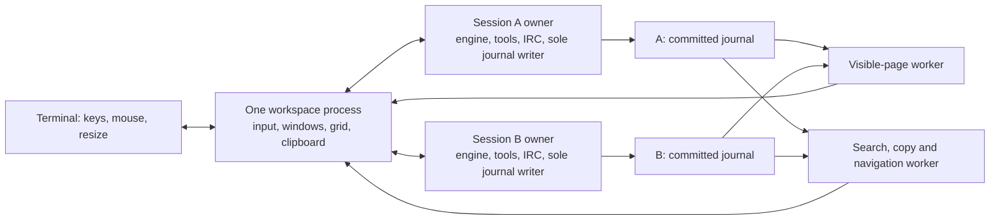

<!-- SPDX-License-Identifier: GPL-2.0-only -->

# Pager retention and the Vim workspace

A **session** is one agent run, with its own owner, model context and history. A
**workspace** is the saved Vim layout containing panes that view sessions and
conversations. A **pane/window** is a view, so two panes can share one session.
Session and workspace names, IDs, lists and detach/resume operations are separate.

Pane interaction: every session pane renders its persistent prompt and draft
through the standalone composer. Owner view snapshots optionally carry the
configured template, values, captured clock and spinner state. Earlier owners
retain model/active-state compatibility with unknown count fields. The shared
terminal animation state renders frames and schedules the next visible
change in both interfaces; idle prompts add no polling. Earlier owners with only
an active flag receive the configured provider activity indicator. Draft cursor,
mouse hits and wrapped editor motions use the same formatted frame and source
mapping. Clicking an attached writable pane enters INSERT immediately, including
empty panes. Prompt clicks also position the draft cursor; body clicks
use its remembered position. Transcript drags enter VISUAL; read-only history and
report clicks retain source navigation. NORMAL
window navigation accepts letters, arrows and Ctrl-held Vim variants, honors
split boundaries and cancels pending history movement.
The focused FOLLOW pane anchors the terminal cursor to its prompt even before
editing begins or history loads. HOLD and visual selection retain the source
cursor. Session prompts carry their name, activity and conversation; session panes
have no separate status bar. The focused prompt uses normal reverse colors;
inactive prompts use the cyan reverse style. Automatic frame updates cover cursor and focus changes
without depending on a later key or a forced redraw.


Presentation checkpoint: transcript projection sends typed journal content through
`render.c`, which supplies the standalone text, wrapping and styles to a typed
workspace sink. The grid consumes inert text and style runs; provider escape
sequences remain text. Display-to-source maps compose Markdown/citation/tab
formatting with redaction maps so anchors, search and selection survive reflow.
New views start at verbosity0; saved explicit levels persist. Channel/query
history stays in its routed view. Transcript-only restore skips the global session
catalogue until a picker is opened. Names lead the workspace form of each session prompt.
Older journals retain their stored content; prompt clock/template snapshots and
transient terminal-only notices were never recorded and cannot be recovered.

Input checkpoint: bracketed paste uses the terminal editor's literal insertion
operation in both interfaces. It normalizes CR to LF, rejects invalid UTF-8 and
preserves complete characters at the existing draft byte limit. Completed paste
is one insertion; Ctrl-C cancels before a terminator arrives. Workstation drops
use the existing receipt-bound terminal command handoff with an explicit literal
request, leaving the session draft independent of the transfer command. Owner
connections progress during terminal output checkpoints, including cancellation
queued behind a partially written draft update.

Display checkpoint: the grid uses semantic ANSI colors under the existing color
policy, with visible split separators and the session prompt carrying status. Growing
a FOLLOW viewport moves its top to retain a full tail; background reads continue
across byte pages until they contain the requested rendered rows or reach the
source boundary. A previous/next page containing no rendered rows extends the
known source boundary while retaining the existing viewport, preventing hidden
metadata at either end from erasing visible output. Raw process output is omitted below verbosity3, where bounded
result previews own its display. HOLD keeps its source anchor through reflow.
Replacing a page-worker request preserves the displaced pane's pending load,
including initial history and report catalogues, so resize and refresh cannot
leave a pane empty with no scheduled work.

Status: implemented in development builds, October 6, 2026.
[QUALIFICATION.md](../QUALIFICATION.md) records runtime coverage and platform
limits. This design documents the supported workflow and ownership boundaries.

History scheduling checkpoint: separate visible-page and scan workers keep other
panes following live output during search, copy and distant cursor motion.
Cancellation and saved motion restoration remain associated with their window.
A permanent two-pane regression and the retained 2 GiB Linux fixture cover live
completion, cancellation, tiny resize and idle behavior; measurements are in
[QUALIFICATION.md](../QUALIFICATION.md).

Windows adapter checkpoint: the private in-process channel and direct semantic
server share SV/1 framing, validation, draft revisions and admission receipts with
native owners. One queued frame per direction preserves backpressure; peer loss
requests shutdown of the workspace-owned engine. Capabilities identify the direct
lifetime and exclude detach and whole-terminal takeover. Portable C tests cover
fragmentation, backpressure, thread ownership, close, receipt ordering and these
restrictions. The engine/UI and VM client now use this channel without console
I/O from the presenter. Native integration tests cover /fast, a real HTTP request,
newer draft retention, resume, startup failure and cancellation during a held
provider request. Windows workspace wiring owns one engine, retains it when hidden
and requires explicit quit before workspace exit or switching. The actual Windows
x64 executable passes all five engine cases and all three workspace lifecycle
cases through Wine 10, plus workspace storage and console-key tests. Wine's Unix
console does not qualify desktop rendering; native Windows desktop and other
platform execution scope are tracked in [QUALIFICATION.md](../QUALIFICATION.md).
Blocked private writes assemble at most one incoming message before dispatch,
allowing simultaneous fragmented sends to make progress. A permanent threaded
regression reproduces the original write/write stall and verifies both messages.

IRC recovery checkpoint: selection-only /query, /chat, /join and /connections
use the current connection scope when entered from an obsolete Vim pane.
Message-bearing commands and drafts retain the pane's captured generation.
An uncertain body can be selected in retained history, yanked, pasted into an
explicitly reopened query and submitted after review. Resume, copy and reselect
never replay a chunk; a subsequent nickname change rejects the recovered draft.
Owner admission recovery remains the existing :recover operation.

File-transfer checkpoint: /receive and /attach use the existing whole-terminal
transaction and return on completion or cancellation. /attachments and /detach
run as native reports. The owner retains files for its next private submission;
IRC conversation submissions leave them pending. Workspace splits and retained
output return after the exclusive transaction.
The workstation picker checks transport lifetime while waiting for a filename;
transport exit returns local terminal ownership without requiring input. A resumed
workspace reconciles the existing command receipt and retains its newer draft and
previous attachments. Resize continues through the terminal transaction and back
to the split layout.
When Screen or tmux retains the VM after tunnel loss, a new native wrapper can
reattach to that same workspace. Ctrl-C ends the previous terminal transaction;
its receipt resolves before an explicit new /receive. Both splits and the newer
draft survive; the successful retry retains its file until private submission.

Cross-session command checkpoint: qualified /query, /msg, /notice, /chat, /join,
/part and /connections resolve a saved session name or unique ID prefix in the
workspace. The addressed session must already have a controller in this workspace;
an unattached or externally controlled session leaves the source command intact.
Dispatch uses the target rollout mailbox without consuming its existing draft.
The pending record retains the originating session and route, so feedback,
selection and :recover return there. New typing and focus changes suppress automatic
selection. Successful /msg and /notice preserve the window. Version14 snapshots
retain forwarded submissions, queued intent, draft-preserving upload requests
and inline report references and read versions1–13; resume queries their receipts
without resubmission. Owner admission recovery remains separate from IRC chunk
delivery receipts. Older owners accept exact saved names and full session IDs;
abbreviated IDs in forwarded slash commands require the updated owner parser.

Activity checkpoint: :buffers groups stable rows by session, endpoint and kind,
with unread counts, connection state, draft/pending flags and local message time.
Empty obsolete routes leave the directory once no window displays or selects them; retained
drafts keep their pinned send route. The owner derives message/notice counters
outside model admission, excluding historical replay, local and outgoing events.
An optional checkpoint field preserves the unchanged conversation-directory
schema for older readers. Its sequence basis records missing older accounting.
Owner state publishes the counters as advisory metadata; older owners show unknown.
Version11 workspace read markers keep sequence, received count and accounting basis.
Only a successfully flushed focused FOLLOW pane at its loaded tail marks read;
HOLD, hidden/background panes, terminal focus loss and interrupted painting preserve
unread counts. Public channel and connection views share the history's local-role
scope; private queries remain role/conversation scoped. Draft routes never refresh
as a side effect of reading. Earlier workspace formats remain readable.

Connection checkpoint: five-field connection routes carry endpoint, connection,
conversation, generation and operator identity under an independent
irc_connections capability. Classic /connections lists connection status and
children or selects an explicit endpoint. Opened connection tabs join Tab cycling;
unopened server traffic does not add tabs. Vim trailing-slash addresses use the
same owner, composer and reader path. History includes both identities' connection
events and excludes public/private messages. Server notices and otherwise
unhandled numeric replies stay outside model context. /whois and conversation
/nick validate the captured operator generation, and ordinary connection text
keeps its draft. Version11 snapshots retain connection routes and read versions1–10.
The presentation thread owns heap-allocated display state, allocated before
thread creation and freed after its workers and terminal close. Queued private
message rendering therefore retains stack space for its input checkpoint on musl.

History checkpoint: typed channel replay accepts the same channel syntax as
live membership, including server-advertised prefixes and colons within names.
Checkpoint members/cursors retain those names; legacy untyped events keep their
original validation. Incoming public CTCP actions retain their body and action
flag through live, ordinary history and native catch-up receive paths.

Completion checkpoint: runtime owners publish immutable channel rosters when
membership, names, aliases or case rules change. The UI receives independent
snapshots, scoped by connection, generation and membership, outside the model
journal and workspace snapshots. Classic Tab uses the selected room's members
or a query's peer/local identity; an unmatched mention can cycle conversations.
Vim INSERT uses the standalone Tab completion, Ctrl-P/Ctrl-N history and Ctrl-R
reverse search through the shared terminal input engine.
Roster changes beyond abbreviated status text still reach completion.

External channel-state checkpoint: each client identity keeps separate channel
membership, names and topics. JOIN/PART/KICK are channel-scoped; NICK/QUIT update
all common channels. Advertised CHANTYPES and CASEMAPPING govern names, and agent
mentions use the agent link's mapping. Requested membership survives network
reconnect, while explicit leave/kick clears it. Native catch-up's initial NAMES
confirmation remains supported. Live member lists grow as needed; the existing
bounded owner status summary abbreviates overflow without disconnecting. Channel
errors remain visible on their target and preserve unrelated traffic. Named
channel actions now have an owner-mailbox API: selection/JOIN captures connection,
role, stable conversation and membership token; PART/NAMES/TOPIC reject stale
memberships. Pending PART invalidates the old route and blocks rejoin until its
server acknowledgement. Durable local channel state retains rejoin intent and
conversation IDs across session resume, with fresh generation/membership tokens.
These lifecycle records stay outside model admission and channel replay. Legacy
channel records remain readable. External operator channels now use the common CLI and VM frontend described below.
The built-in server exposes its configured room through the same selectors.
Local PART/rejoin rotates membership and preserves the other identity; resume
retains each role's join intent. Other channel names are rejected.

Model channel checkpoint: irc_state lists agent channel IDs and joined status;
irc_send/irc_topic accept exact IDs and session/endpoint/#room addresses.
Request snapshots pin connection, generation, conversation and membership through
the existing send/action validator. A replaced membership fails without resolving
a new target or falling back to the default room. Channel NOTICE and CTCP actions
use the same path. Numeric/all targets retain default-room behavior, while
additional channel context requires an explicit destination. Incoming channels
carry typed routes. Shared channels use the operator link's copy; agent-only
channels also enter model context. Local-operator mentions capture the agent's
conversation and membership, or an explicit unavailable result, in optional
reply_to metadata. Admission and replay share private-query reply tracking.
Requests list outstanding exact targets; only matching successful messages clear
them. Notices, other rooms, failed sends and newer memberships leave them pending.
Historical records without reply_to keep their legacy default-room behavior.

Channel send checkpoint: the external owner API now queues messages, notices and
actions through the private-query frame writer. The common writer preserves UTF-8
boundaries within advertised LINELEN, records chunk IDs before writing and validates
channel membership and local identity on every write. An unwritten stale frame
fails; a partially written stale frame closes its link with an uncertain outcome.
Other channels survive cancellation of an entirely unwritten frame. Negotiated
labeled-response plus batch now correlates server ACKs, errors and echoes by the
durable chunk ID. Nested and interleaved response batches finish at their root;
a late error after PART/KICK cannot change a new membership. Correlation metadata
shares the existing pending-memory budget. Required capability loss cancels
unwritten frames and marks started sends uncertain. Public unlabeled echo order
remains insufficient to confirm a channel send. These outgoing records remain
outside public replay. A successful operator receipt admits its final message
once; failed, uncertain and agent receipts stay outside model input.
Hosted sends publish one canonical public event after durable acceptance and
record a separate outgoing receipt. The canonical copy supplies model input; the
receipt does not add it twice. Hosted public history carries channel routes and
actions, and checkpoint readers accept both legacy and routed public entries.

Receipt bodies retain the server's final text/action and optional source ID.
The optional v2 routing flag revised marks a correction to the local pending body;
classic and Vim views show that correction with its send ID. Ordinary status
updates display once without repeating the body; historical rendering uses the
same states. A send to the local nick suppresses its separate delivered self-copy
when echo-message supplies the receipt. Operator queries remain private in both
interfaces, including builds with WITH_VM=0.

Conversation frontend checkpoint: version11 workspace snapshots retain exact
query, channel and connection routes per window and separate draft/editor/pending state per buffer,
with one owner connection per session. Earlier flat rollout snapshots remain
readable. Owner conversation metadata populates :buffers without changing focus; agent
conversations are read-only. /query, /chat and /join select its originating focused window only while
its composer remains current and empty. :buffer accepts known qualified addresses
or picker IDs; :sp/:vsp can open them in a new window, and :bn/:bp cycle buffers.
Successful private sends retain the current pane while retaining command reports.
Query projection, search, navigation and copy filter stable connection/conversation
IDs and local identity across retained epochs. Empty filtered journal pages advance
until matching events or the pinned boundary; every read remains cancellable.
Complete remote qualification remains in the delivery plan below.

Operator channel checkpoint: a shared presentation selector and tab/draft path
serves queries and channels; runtime sends keep kind-specific validators. Channel
selectors capture room/membership and server case mapping alongside the connection,
conversation, generation and identity. The irc_channels capability is separate
from irc_queries. /join controls only operator membership; /chat opens retained
history without joining. /part immediately invalidates queued sends. /names shows
cached state and requests refresh; /topic, /msg, /notice and /me use captured scope.
Classic tabs keep drafts through both cycle directions. VM channel history includes
both local roles and compatible legacy room records while excluding private queries.
Version11 reads earlier snapshots; exact five-key query routes remain compatible.
Qualified buffer addresses resolve saved session names and select operator buffers.

Selection checkpoint: character, line and rectangular transcript/report selection
now uses original source endpoints and a pinned history boundary. The background
reader streams projected pages into the shared register; empty motions and
failed/canceled work preserve its previous contents. Registers spill after a64KiB memory quantum and
carry character/line/block type without imposing a history quota. Character and
line copies retain logical bytes, rectangles pad short lines, and controls remain
inert. Constant-size Unicode boundary/width state joins graphemes across source
fragments, including combining marks and emoji sequences. Visual endpoints
survive resize; verbosity changes end selection. Numbered gg/G, counted logical
motions and wrapped-row/page movement cross cold pages through cancellable reader
work. Logical motions join contiguous source fragments. Nearby motions use loaded
text; distant backward movement can rescan a pinned prefix with constant-sized
navigation state. Wrapped-row movement preserves its display column. An interrupted
move restores the original cursor and viewport. Redaction placeholders count as one
source-addressable unit. Input received during a move or yank is queued in order,
including decoded bracketed-paste events; Ctrl-C or Escape cancels that operation.
The queue shares the direct-input size bound. Rectangular registers insert columns
into existing draft lines, expand intersected tabs, pad short lines, extend the
draft and form one undo group. Mouse hit testing shares the renderer's grapheme,
tab and source mappings. Attached writable pane clicks enter INSERT; read-only
history/report clicks place source cursors;
transcript/report drags select within their original window. The wheel scrolls
its hovered window while retaining keyboard focus. Separator drags use the same
geometry as layout placement and save proportional sizes; stale drags cannot
retain pointers to edited trees. SGR button-motion reporting is runtime-toggleable
with :set mouse/nomouse and is restored through terminal handoffs.
Clipboard publication and IRC/remote integration are implemented below;
platform qualification remains active.

Implementation checkpoint: asynchronous pager ownership and retained rendering
are implemented in this branch. Held-pager regressions cover IRC delivery and
provider completion; interaction tests cover failures, tools and queued downloads.
History cursor reads now validate checkpoint bodies through a streaming parser
and return display metadata. Read-only snapshots preserve unfinished tails, and
refresh validates file identity and each appended record before extending a view.
The background reader returns bounded public event pages, cancels obsolete
requests and wakes the frontend only when a current result is ready.
The grid composes UTF-8 graphemes into a back frame and publishes differences
only after successful output. Unicode 17 tables supply shared cluster boundaries
and width policy; all 766 official grapheme-boundary cases pass locally.
The build switch `WITH_VM=0` omits these optional workspace objects.
Private workspace storage now supports atomic snapshots, unique names and ID
prefixes, exclusive ownership and open-first activity ordering. Probes preserve
existing locks; a lost frontend leaves a resumable snapshot.
The typed agent-session catalogue shares the classic list's collection, live
status probes, ordering and stored-row selection, and retains full session IDs.
Catalogue loading now runs on the background reader with the same cancellation
and redaction snapshot as history. Checkpoint restoration preserves cancellation
through the remaining journal, and in-process writer ownership survives probes.
The split tree now supports horizontal/vertical division, proportional resize,
equalization, collapse on close and strict round-trip snapshots. Terminal shrink
hides unfocused branches temporarily while preserving the tree for expansion.
Its depth stays within the shared JSON parser's nesting budget.
The independent input decoder recognizes UTF-8, cursor keys, modifiers, SGR mouse
and focus reports across fragmented reads. Bracketed paste is a literal stream
with explicit edit boundaries; lone Escape resolves through a timer without
waiting for another key. Oversized or unsupported control sequences are consumed
as unsupported input, and malformed ordinary UTF-8 is visibly replaced.
Rendering, wrapping and byte/cell navigation now share one source-unit policy,
including whole graphemes, inert controls, tab stops and ambiguous widths.
Wrapped rows retain logical tab columns and complete source anchors, including
units clipped by a one-cell viewport.
Public response projection now merges fragments by response ID and public-item
ordinal, independently of final graph local IDs or interleaved tool calls.
Terminal snapshots replace matching streamed text; unmatched observed text stays
labelled unconfirmed. Original byte counts survive redaction, and joined text is
redacted again to cover credentials split across fragments.
The shared IRC address parser handles qualified buffers, short message targets,
quoted operands and percent escaping before owner-specific route resolution.
It remains available when VM is compiled out.
The `vm` frontend now integrates terminal/grid/input ownership with asynchronous
agent catalogues, workspace listing/resume, metadata filters, mouse selection,
Vim-style splits/focus and help. A strict versioned state records window kinds,
stable selections, filters, focus and layout. Destination validation completes
under its own exclusive lock before switching; a failure preserves the current
workspace. Real PTY tests cover normal/signal exit, blocked output, suspend,
small-terminal restoration, exclusive ownership, failed switches and literal
paste on Mac and Linux. The frontend also builds out to a diagnostic stub.
Typed transcript projection now joins decoded process streams before redaction,
merges public response fragments, and formats tool/input/IRC events. A sparse
wrapped-row index is built on the reader thread and preserves source anchors
through width and verbosity changes. The frontend opens read-only retained
history from the picker or :history, with bounded pages and oldest/newest jumps.
Workspace state v2 retains transcript anchors while accepting v1 picker layouts.
FOLLOW now observes appended records without rereading an unchanged complete
checkpoint or reprojecting an idle page. Verified descriptors remain cached for
open buffers; HOLD retains its viewport and reports newer output. Source identity
failure stops polling until explicit retry. Version2 workspace state accepts the
optional follow flag, defaulting older transcript snapshots to HOLD.
The native semantic owner backend now exposes a private, independently framed
view endpoint. It shares the classic controller lease, publishes committed-tail
snapshots, and admits plain rollout input through the existing engine queue.
Receipts identify the existing durable event and survive reconnect to that owner;
the journal schema stays unchanged. Tests cover active steering, cancellation,
classic return and malformed/stalled peers. See [SV/1](session-view.md) for the
implemented capability and framing contract. WITH_VM=0 omits this endpoint.
The backend now accepts typed rollout commands through that mailbox and retains
command echoes/results as immutable private presentation files. Completed command
receipts survive live-owner reconnect; commands needing terminal adapters
return a terminal requirement before effects. The frontend now submits typed
commands and appends their immutable reports at the acknowledged journal boundary
in the originating transcript. Submission returns that pane to FOLLOW and keeps
INSERT active. Explicit :report opens a separate report view. `:reports` lists saved
references; `:report [ID]` reopens one. Version6 workspace snapshots retain report
metadata and positions while accepting earlier layouts. Background reads verify
private regular-file access, exact bytes and SHA256, then redact and build the
wrapped document. Loaded reports support splits and navigation without rereads.
The terminal-command adapter now releases semantic controllers, binds the owner's
classic terminal and sends a saved command reference, preserving both drafts.
It checks owner identity, deduplicates dispatch and gates later keyboard input on
admission. Saved workspace requests require explicit recovery or :classic.
/config and /send return automatically after their finite external operation;
their receipt stays pending and includes deferred configuration output. Completion
can detach only its original terminal generation. /s d returns from other terminal
commands. Semantic deferred controls now publish separate completion reports.
The frontend subscribes to live-owner report replay and deduplicates IDs across
reconnect without changing focus or newer drafts. Coalesced requests share one
completion result. Private ordered catalogue entries now recover missed references
after owner restart through background :reports/:report reads. Complete rows are
validated; a partial final append remains distinguishable from committed entries.
Native /cat copies an open regular file into a retained snapshot in cancellable
chunks. New captures preserve older report bytes; classic /cat keeps its pager.
The frontend connection manager shares one owner lease per session across split
windows. The original rollout composer now lives beside separate query composers;
windows displaying the same exact route share its editor and undo history. Workspace state v3 adds drafts and pending request identities,
accepts v1/v2 layouts, and saves before transmitting a submission. Reconnect queries
receipts; unknown outcomes retain text for explicit recovery. Newer drafts survive
older receipts. The composer supports grapheme edits, multiline literal paste and
basic NORMAL/INSERT motions. Poll includes owner sockets and progress deadlines;
idle connections do not trigger redraws. Quit/detach use the normal owner lifecycle.
The owner now stores revisioned rollout drafts, rejects stale replacements, and
accepts submissions tied to an exact draft revision. Successful admission clears
only that revision; newer drafts survive, including edits from a new controller.
Draft notifications require an explicit bound-controller subscription.
The frontend now reconciles saved and owner drafts against a shared text digest
and owner instance. Workspace state v4 retains that baseline and conflicting
owner text while accepting v1/v2/v3. One in-flight revision check coalesces newer
edits. Acknowledgements never replace newer local typing; conflicts offer
`:draft local` and `:draft owner`. Clean detach, window close, workspace switch
and suspend flush the final edit asynchronously before releasing the lease.
An unknown submission receipt blocks automatic draft replacement until recovery.
Revision-aware submission waits for its captured text to be acknowledged, and
the admission receipt's exact clear revision advances the baseline before a
fresh snapshot is reconciled. Terminal loss retains any unacknowledged suffix
in the private workspace snapshot. Classic editor draft bridging remains separate.
The composer now supports multiplied counts, Unicode word/grapheme and logical/
display motions, line opening, delete/change/yank operators, a workspace register
and per-conversation undo/redo. Undo records changed ranges, with one temporary
pre-edit snapshot while grouping typing; bracketed paste has independent boundaries.
Submission/recovery and adopted owner text clear local undo state. Splits share
the session editor and keep separate composer viewports. Register and undo state
are frontend-local; large transcript registers spill to private temporary files; draft text remains in workspace snapshots. Native owner status
supplies provider/model/effort and working/idle fields. Mac/Linux PTY regressions
cover editing, Unicode, counts, undo boundaries and owner reconciliation.
Live history now opens a read-only semantic observer and uses validated committed
positions without reserving control. Reader mode changes retain the pinned source
descriptor. A newer snapshot survives a lagging owner notification and remains
labelled snapshot until certification catches up. The previous displayed tail is
separate from the requested committed bound, preserving coalesced updates.
State parsing rejects malformed/unsupported or regressing owner boundaries.
Canceling a page preserves its verified source; canceling an unfinished initial
open discards that unverified descriptor. Same-content replacement is tested
across canceled checkpoint reads and both certification-mode transitions.
The explicit :classic command now saves and asynchronously flushes semantic
connections, then leases the whole terminal to the existing native client.
It retains terminal profile negotiation, transfer/switch framing and suspend
behavior. `/s d` returns to the saved layout and restores visible connections'
control intent. Same-read keys after Enter remain raw until BOUND and precede
new terminal input. Complete transmitted frames consume that prefix; failed
attachment retains it with its exact destination. Workspace state v5 persists
the prefix while accepting v1..v4; restored input requires explicit literal
draft recovery because delivery may have preceded a lost snapshot update.
Classic and semantic drafts remain separate. Input stays raw across both
handoff directions, with cooked modes restored for suspension and final exit.
Signal exit restores the outer workspace handlers without reopening controllers.
The classic editor also consumes a completed UTF-8 scalar before redraw can
reenter input, preserving following bytes during long Unicode pastes.
Explicit :new, :session, picker Enter and vm --session now launch fresh owners
or resume stopped sessions asynchronously. The workspace blocks signals around
fork; the child resets inherited handlers and uses only async-signal-safe setup
before executing the same binary. This supports older BSD SDKs without spawn.h.
The fresh executable starts the normal native owner before any application
threads exist. A temporary PTY preserves
cooked launch modes and geometry through frontend loss; the surviving owner
creates its usual private controlling PTY. A private inherited stream reports
readiness only after endpoint publication and initial orientation, or reports
startup failure. The workspace polls launches alongside its existing connections,
reaps only short-lived bootstrap children and never signals launched owners.
Each pending launch targets its requesting window until that window is closed or
repurposed. Workspace restoration keeps launch requests inert; new owners remain
in the agent catalogue when the frontend disappears before readiness.
Projected tool events now resolve their call metadata through earlier verified
records, matching the nearest response by original turn/call identity before
redaction. Missing metadata keeps its call ID. Level2 loads a bounded prefix of
referenced stdout/stderr by verified journal offsets, decodes interleaved chunks,
redacts across chunk boundaries and applies the existing512-character preview.
Dependency reads run on the cancellable worker and preserve the page cursor.
Version7 snapshots use original text-byte anchors for transcript and report bodies.
Compact replacement runs map redacted text and escaped binary back to source bytes;
plain spans remain implicit. Reflow and temporary verbosity filtering preserve the
original anchor until explicit navigation. Version1..6 snapshots remain readable,
with earlier display-byte positions converted when the document is loaded. Public
stream fragments mask partial protected values at both loaded-page boundaries,
including unconfirmed output after a failed response.
Response pages resolve matching terminal public snapshots on the worker. Each
streamed range uses its canonical slice; terminal records contribute the remaining
tail after earlier streamed prefixes. Revised UTF-8 boundaries align consistently,
and omitted terminal items remain unconfirmed. Each pinned source caches the last
response crossing a page edge; adjacent pages reuse its verified snapshot, and an
unfinished-response scan resumes from the previously inspected position. A verified
sequence-to-cursor seek preserves the visible page cursor. Both scan directions
cover all bytes once, including bodies larger than the4MiB scheduling quantum.
Whole-history/report search now runs on the cancellable reader, with /, ?, n/N,
local /search command entry, source positions, wrap feedback and byte/event
progress. Each scan pins its first verified boundary and preserves its original
committed/best-effort certification. Streaming literal matching retains overlap
between adjacent fragments of one public item or process stream, independently
of page boundaries; unrelated fields remain separate. Unicode 17 default full
case folding is explicit through :set ignorecase/noignorecase, with complete
source-codepoint boundaries and no normalization. Search memory scales with the
query; it does not retain the scanned journal in RAM. Cold scans inspect the
whole active buffer in chronological order, choosing the nearest directional
match or wrap candidate. Reports stay scoped to their immutable snapshot.
Visual selection and clipboard publication are connected to explicit transcript,
report and composer yanks. Clipboard protocol and PTY qualification are recorded
in section 10. Development builds include IRC conversations and file transfer
through SSH/Mosh with Screen/tmux, including retained workspace recovery after
outer-transport loss. Platform coverage is recorded in QUALIFICATION.md.

## 1. Outcome and decisions

Keep receiving and retaining session output while a pager, editor or transfer
owns the terminal. Add an optional full-screen workspace with Vim-style input,
history navigation, search, selection, splits and mouse controls. History comes
from retained session events and remains navigable across context compaction.
Verbosity changes apply to the historical text currently being viewed.

October 6 amendments make IRC conversations first-class buffers and give the
workspace its own saved-session namespace. A split can show a session's IRC
connection, channel or direct query independently of its agent transcript.
Qualified conversation addresses use `session/endpoint/target`. Workspace names
and `vm --resume` refer to saved layouts, separate from agent session names.

The main decisions are:

- `snajpagent vm` explicitly enters the workspace. Plain `snajpagent` keeps its
  current interface. Output height never activates full-screen mode.
- One workspace process owns the terminal and every window. Existing session
  owner processes continue owning their engines, tools, IRC and journals.
- Windows display buffers: agent transcripts, IRC connections, channels, direct
  queries and reports. Several buffers share one session owner/IRC connection.
- Named workspace snapshots retain the layout and buffer state. `vm -l` lists
  these workspaces; `vm --resume` restores one without submitting saved drafts.
- The workspace renders semantic history. It does not reconstruct history by
  interpreting the current terminal byte stream.
- A new private semantic attachment shares controller ownership with the
  existing terminal attachment. Existing owners and terminal clients remain
  usable throughout the transition.
- All retained journal history is addressable. RAM contains working pages and
  visible layouts; cache eviction never deletes history.
- Explicit yanks update an internal register and attempt workstation clipboard
  delivery. Remote delivery uses the existing negotiated wrapper transport.
- `:q` / `:x` / `:wq` save and detach the workspace; `:w` saves it. `:q!`
  stops all controlled sessions and exits with recoverable layout/drafts.
  `:session quit` stops one session; `:detach` releases its controller; `:close`
  closes a window. These meanings hold in every buffer and picker.
- `WITH_VM=1` includes the module in ordinary and release builds. `WITH_VM=0`
  removes its implementation. Runtime activation remains explicit.

This is a terminal workspace, with a supported Vim subset defined here. It does
not embed Vim, add a scripting language or turn transcript text into an editable
file. The first implementation has one session-host connection domain per
workspace. A remote workspace runs on its session host through the existing
`remote` wrapper.

### Input and presentation contract

The frontend edits and echoes its local draft before any owner acknowledgement.
The owner receives revision-checked, coalesced draft updates independently. Input
polling services keyboard, owner channels and worker wakeups; owner framing takes
one transport fragment per step. History parsing, report-file validation, search
and source reflow run on reader workers. The grid paints the current draft and
cursor in the same frame. Input received during output backpressure marks another
frame dirty. Saving and JSON construction remain synchronous; the qualification
checks cover their interaction with typing and detach.

Clicking a controlled pane enters INSERT immediately, including when history is
loading. Escape returns NORMAL; i/a/I/A re-enter the composer. Escape prefixes
batched with text or control keys take the same mode-exit path as a separate
Escape event before dispatching the next key. COMMAND-LINE uses
colon commands from NORMAL. History navigation owns only keys interpreted in
NORMAL. A requested report claims NORMAL when admitted; navigation arriving before
its first document is queued in order. Cancel, pane focus and composer entry remain
available and cancel obsolete queued navigation. Editing a transcript also cancels
an outstanding report takeover. Worker errors release the affected input queue.
Commands retain their output in the originating conversation transcript;
report IDs and journal anchors survive workspace resume without adding operator
commands to model context. Coalesced controls publish one completion per command
kind; ordered catalogue groups identify its originating retained command reports.

Mosh predicts edits across an entire terminal row and cannot infer split bounds.
The workstation wrapper therefore selects --predict=never for direct remote
snajpagent vm commands unless the operator supplied a prediction policy. Nested
shell/multiplexer launches can specify that option explicitly. The confirmed
screen includes network round-trip time; local draft echo remains independent
of provider activity and native draft acknowledgements.

## 2. Pre-implementation baseline and pager failure mechanism

The initial inspection found this durable foundation and the gaps addressed by
the implementation. The checkpoints above describe the current behavior.

| Area | Behavior before this work |
| --- | --- |
| Session execution | `session_host.c`, `session_relay.c` and `session_client.c` separate a surviving POSIX owner with a private PTY from its terminal frontend. Windows currently lacks this native-owner backend. |
| Local attachment | `terminal.sock` uses version-5 framing, one controlling terminal, reservation generations and physical-write acknowledgements. STATUS probes do not attach. |
| Detached display | The relay drains and discards raw PTY output. Reattachment reconstructs a bounded semantic catch-up; raw bytes are not a history store. |
| Public model output | `snag_app_flush_public()` commits complete UTF-8 `response_output` fragments before presentation. |
| Tool and IRC output | `snag_app_tool_output()` commits `process_output`; `snag_app_irc_event()` commits `irc_event` before presenting it. |
| Existing renderer | Render records contain typed content and source references, but `snag_render_flush_view()` consumes records after printing. They are pending queues, not a random-access transcript. |
| Old-history reads | `snag_session_history_open()` opens a verified committed prefix without a writer lock or recovery mutation. Forward/reverse iterators provide bounded work and cursors. |
| Existing `/history` | A report reads a bounded page, currently 4 MiB, and reports earlier history. This is not an all-history viewport. |
| Remote terminal | `remote.c` owns a local PTY wrapper. `screen_wire.c` supplies checked, acknowledged title-state framing for Mosh and a negotiated byte-stream path. Clipboard delivery is absent. |
| IRC targets | `server_chat()` accepts only the hosted room; incoming client `PRIVMSG`/`NOTICE` handling filters to the joined room. Nick-target routing and `/query` are absent. Agent/operator identities use separate links; channel event emission uses the operator link to avoid duplicates. |
| IRC history | `irc_event.c` validates an exact field set including endpoint, room and nick. Receiving identity and direct recipient are absent. Durable direct messages need a schema extension. |

Source entry points: [app.c](../src/app.c), [app_stream.c](../src/app_stream.c),
[app_events.c](../src/app_events.c), [ui.c](../src/ui.c),
[render.c](../src/render.c), [store.h](../src/store.h),
[session_host.h](../src/session_host.h), [session_relay.c](../src/session_relay.c).

The pager problem has a concrete source-level path. `SNAG_UI_EXTERNAL` stops
terminal input and sets the suspended flag. While the pager waits,
`service_external()` continues servicing tools and IRC. `SNAG_UI_IRC` can still
call the renderer immediately, and the presentation loop's pending-render flush
checks the native attachment barrier without checking external suspension.
Consequently, a record can be printed and consumed while the pager owns the
screen. The pager can overwrite those bytes, and closing it does not replay the
consumed record.

This identified a defect in display ownership. The original incident had no
capture identifying its lost bytes. Permanent held-pager fixtures now reproduce
the display failure and verify continued provider/tool progress, retained IRC
events and catch-up after return; the qualification ledger records their scope.

There is also a scheduling constraint: the current pager call blocks the app
controller and runs a limited service callback. That callback does not run the
ordinary provider-turn loop. The fix must cover both display retention and
continued engine progress, without recursively invoking the app controller.

## 3. Fix pager retention first

### 3.1 Separate acceptance from painting

Introduce an explicit terminal lease in the presentation owner. Its states are
`PRESENTING`, `EXTERNAL`, `CATCHING_UP` and `DETACHED`. Only `PRESENTING` and
`CATCHING_UP` may issue ordinary renderer writes. Pager, editor and transfer
protocol output use the current external lease instead.

Retaining an event and painting an event have separate cursors. Acceptance
records a durable source reference, or retains a presentation-only item. Painting
advances only after the output sink accepts the complete logical range. A
partially written range retains its write offset. Code must not mark a render
record displayed merely because an external child is running.

On external entry:

1. Finish the current renderer write boundary, save the presented cursor and
   stop ordinary painting, including IRC, warnings, feedback and delayed flushes.
2. Preserve the composer and stop its input consumer. Transfer terminal modes
   and input ownership to the external child or transfer implementation.
3. Continue journal admission and engine service. Retain newly available ranges
   by source cursor instead of accumulating a text copy for every token.

On external return, restore terminal modes and geometry, enter `CATCHING_UP`,
render through a captured committed tail, then join live output. Events arriving
during catch-up extend the pending range; they cannot overtake it. Work is sliced
so resize, cancellation and attachment controls remain responsive. A long
backlog remains available even if the user interrupts catch-up and opens history.

Classic catch-up can still exceed a terminal's visible height, and Mosh may skip
intermediate screen states. Retained source history is the recovery mechanism;
VM supplies the navigable viewport over it. Successful physical writes alone do
not prove that every historical line reached a client's terminal scrollback.

Generated command reports already have a private temporary-file path for the
pager. Retain that snapshot through its display lifecycle. Presentation-only
notices that lack a journal source use a private spill file during suspension;
the in-memory queue holds offsets. This spool is transient presentation data,
not a second session journal. Close it after successful catch-up. Allocation or
disk errors produce an explicit retention failure through the available status
path; the implementation must never silently advance over dropped records.

### 3.2 Make external jobs asynchronous to the engine

Split the platform external-program primitive into start, poll/service and
finish operations. Preserve its existing process-group, foreground-terminal,
suspend/resume, temporary-file and error-restoration behavior. The app controller
stores the job handle and continues its usual provider/tool/IRC scheduling.
Only terminal interaction is suspended. A worker running the old callback loop
would introduce competing access to the app state and is not an acceptable fix.

Pager spawn failure, child failure, Ctrl-C, Ctrl-Z, terminal loss and an owner
shutdown all converge on one lease cleanup path. A normal external-job cancel
affects that job; the existing explicit session-interrupt action remains
separate. Detach or connection loss releases the actual terminal and preserves
the session owner. Raw external-program screen contents need not be replayed.
Their generated report snapshot and the session transcript remain available.

Keep current pager selection: when available, unset `PAGER` and bare `less` use
`less -FX`; explicit pager commands retain their arguments. The retention fix
applies with the VM module compiled out.

## 4. CLI, workspace persistence and session selection

A **workspace** is the Vim-style application session: its name, windows, displayed
buffers and view state. An **agent session** owns a model engine and its journal.
A workspace can display several agent sessions and their IRC conversations. Each
namespace has independent names and IDs; identical names across namespaces are
valid and never imply the same object.

### 4.1 Commands and startup

```sh
snajpagent vm                         # new workspace, agent-session picker
snajpagent vm -N operations           # create a named workspace
snajpagent vm -l                      # list saved/open workspaces
snajpagent vm -l 30                   # include up to 30 stored workspaces
snajpagent vm --resume operations     # restore that workspace
snajpagent vm --last                  # restore the most recently active workspace
snajpagent vm --session SESSION_ID    # new workspace opening an agent session
snajpagent remote ssh -t host snajpagent vm --resume operations
snajpagent remote mosh host snajpagent vm --resume operations
```

Dispatch `vm` beside `remote` before normal session startup. `vm -l`, help and
version perform no provider/IRC startup and do not enter the alternate screen.
Workspace selectors accept exact names and unique ID prefixes; ambiguity lists
candidates. `-N` names a new workspace and rejects an existing workspace name.
`--resume` requires a workspace selector; `--last` resolves by activity. A bare
launch creates a workspace only when there is state worth saving; leaving an
untouched initial picker does not accumulate empty records.

`vm --session ID` explicitly uses the normal agent resume behavior: attach a live
owner or start a stopped one. Restoring a saved workspace is more conservative:
reconnect its live owners, show stopped sessions as stored history and offer
explicit resume for those sessions. Restore never replays prompts, sends saved
chat text, reconnects an explicitly removed IRC endpoint or automatically starts
all previously open model engines. Existing ordinary `snajpagent -l`, `--resume`,
`--attach` and `-N` retain their agent-session meanings. `vm --attach` is not
introduced: `vm --resume` restores workspace state and `--session` selects an
agent. This supersedes the initial design's `vm --resume AGENT_SESSION` examples;
that CLI was proposed, not shipped.

Inside VM, `:workspace` shows its name, full ID and save status; `:workspace name
NAME` renames it and `:workspace save` writes a snapshot immediately. `:workspaces`
opens the workspace picker. Selecting another workspace saves and detaches the
current one, then restores the destination; a failed destination open keeps the
current workspace usable. `:sessions` opens the agent-session picker, `:new [NAME]`
creates an agent session, `:session [ID]` explicitly resumes the current or selected
agent, `:buffer ADDRESS` selects a buffer and `:help` shows the
supported controls. Session names, endpoint names and peer nicks in examples are
ordinary user-selected identifiers, never special roles.

On native POSIX backends, `:workspace detach` (or `:workspace d`) saves the complete
workspace and releases all controllers after their draft/detach acknowledgements.
The owners continue, including owners shared by several splits. Direct in-process
backends keep their existing lifetime restriction and explain why the workspace
must stay open. Tab/Shift-Tab cycle matching colon commands and fixed options;
editing resets the completion prefix and only Enter executes the result.

Normal workspace exit prints a shell-quoted `vm --resume` command after
terminal restoration, using the active workspace's full ID and any nondefault
dotdir. An untouched picker has no saved workspace or return command. Within
the workspace, `:session detach` (also `:session d` or `:detach`) releases only
the focused session and shows `:attach SESSION_ID` after acknowledgement.

### 4.2 Saved state and workspace listing

Store workspace state privately under `$DOTDIR/workspaces/<workspace-id>/`,
separate from `$DOTDIR/sessions/`. A versioned `workspace.json` contains the name,
last meaningful activity, referenced agent IDs, buffer descriptors, split tree,
focus, cursor/top anchors, per-window verbosity/follow state and draft recovery
state. Connection descriptors reference their owning session and stable endpoint
identity. Credentials, sockets, controller generations and serialized engine
state are not copied into this file.

Write snapshots atomically through a private temporary file, file sync, rename
and directory sync using existing platform helpers. Debounce editing/layout
updates to avoid syncing every key; explicit save, detach, switch and clean exit
flush them. Report save failure without discarding the working state. Recovery
may lose the edit suffix since the last successful save after a hard process or
machine failure. A live owner's newer acknowledged draft takes precedence over
an old workspace snapshot; retain conflicting unacknowledged local edits as a
recovery draft for explicit selection. Never silently replace a live draft.

One frontend may actively use a saved workspace at a time. A private lock provides
that authority; a PID file alone does not. `vm --resume` reports an already-open
workspace rather than stealing it. A dead frontend leaves a resumable snapshot
and surviving agent owners. An old half-open SSH frontend remains open until its
normal transport detection releases it; resume must not kill it behind the user's
back. Saved workspaces are host/store-local. Running `vm` through `remote` lists
and restores the remote host's workspace namespace.

`vm -l` shows ID, name, `open`/`stored` status, last meaningful activity and
window/session counts. List all open workspaces first, then newest stored ones;
the default stored count is ten and `-l N` changes it, including zero. Timestamp
means user/layout/session activity, not filesystem atime, a repaint or a probe.
The listing reads snapshots and probes ownership without reserving a workspace
or attaching any agent. Preserve the last good snapshot on corruption; report
its error and never repair an unrelated file during listing. Unknown newer
snapshot versions fail explicitly.

### 4.3 Agent-session and buffer pickers

The agent picker keeps the same data and comparator as `snajpagent -l`: attached,
detached, running with unknown attachment state, then stored; newest journal
activity within groups and the existing ID tie-break. Initially show the CLI's
ten stored rows and load more on demand. Keep selection anchored to ID while
activity reorders rows. Enter attaches/resumes, `o` opens read-only history,
`n` creates, `/` filters metadata and `R` refreshes. Preview columns collapse on
narrow terminals while ID/name and state stay readable.

`:buffers` shows a tree of sessions in the workspace, their IRC connections,
channels, operator queries, agent queries and reports. Selecting a child changes
only the focused window. Agent-query buffers are labelled with the agent's IRC
identity and are read-only for operator sending. Buffer activity does not create
a second session or connection. Closing/replacing the last window associated
with a controlled agent detaches that agent; another window of any of its IRC
buffers keeps the shared controller alive. Drafts survive the detach path.

An agent already controlled elsewhere opens read-only. Explicit attachment may
report busy and never steals its frontend. Metadata/history inspection acquires
no controller. An unreachable owner remains unknown/running; failed probes do
not classify it as detached. Runtime VM activation stays explicit. A local alias
for plain startup remains a preference, independent of workspace persistence.

## 5. Process, thread and ownership model



The workspace has one event loop owning terminal reads/writes, window layout,
mode transitions, selection and control connections. Two fixed background workers
separate visible-page reads/projection from one active search, copy or distant
cursor motion. A measured full-history scan starved live-pane refresh with the
original shared worker. Each reader owns its source views, immutable redaction
snapshot, request generations and cancellation; both join before store teardown.
Starting a scan cancels an older page request for its own window. Other visible
panes continue following committed output. Canceling a scan preserves their reads.
Results stay associated with their request and window so obsolete results cannot
move a newer viewport. POSIX polls both wake descriptors; the Windows console
wait checks scan progress at 20ms intervals only while that worker is active.

Each agent session has one backend connection/controller shared by all its
buffers. Each writable conversation buffer owns a distinct draft and submission
state. Windows independently own viewport, cursor, verbosity and follow state.
Two windows of the same conversation share its draft; different conversations
never share a draft or implicit target. Splitting a buffer creates no additional
engine, IRC connection, writer or controller.

The existing engine remains the sole journal writer. UI navigation does not
replay tools, trigger model requests or enqueue IRC messages. Existing synchronous
`snag_ui_send()` uses borrowed data and an engine/UI rendezvous; its pointer must
not be retained in a new asynchronous queue. New notifications own their small
payloads or refer to immutable committed ranges.

When used remotely, the workspace and history workers run on the session host.
The tunnel carries terminal state and input; multi-gigabyte history remains on
the host and is read there. The workstation wrapper handles workstation effects
such as clipboard publication. Multiple host domains can use separate workspaces
or an existing terminal multiplexer; a new network session daemon is unnecessary.

### 5.1 IRC connections, channels and direct queries

#### Buffer identity and addresses

A window is a view onto a buffer. A session owns a set of buffers, and its IRC
runtime owns the connections underneath them. Opening a window never implicitly
creates another network connection or changes another window's destination.

| Address / buffer | Meaning |
| --- | --- |
| `SESSION` | Agent transcript for an exact name or unique session-ID prefix. |
| `SESSION/ENDPOINT/` | Connection status, notices and conversation directory; trailing slash makes this a connection address. |
| `SESSION/ENDPOINT/#CHANNEL` | One channel conversation on that connection. |
| `SESSION/ENDPOINT/NICK` | Operator direct-message conversation with that nick on that connection. |

The session component names an agent session, not the saved Vim workspace.
Example: `:vsp work/localhost:6667/peer` opens a query beside the current buffer.
An equally useful sequence is `:vsp`, then `/query peer` in the new window.
Names such as work/peer are examples. Completion lists real session names/IDs,
endpoints and conversation targets, and the header always shows the resolved
session, endpoint, accepted sending nick and target.

`ENDPOINT` resolves an existing connection within that session. A displayed
connection label must resolve uniquely; the canonical host:port form remains
available, including bracketed IPv6. A label such as `local` in an example means
one exact connection, never the old fan-out meaning of an aggregate local route.
Queries resolve one exact endpoint and peer. Address parsing never expands `all`
or wildcard text into multiple destinations; a literal nick such as `all` remains
a unicast target. The existing `/all` command retains its separate channel scope.
Opening an unknown endpoint reports an error; `/connect` is an explicit action.

The client keeps joined-channel state per connection so an external server can
have several channel buffers without extra sockets or losing an existing join.
The built-in server may retain its configured single room; its new DM support
does not require general multi-channel hosting. Its unsupported JOIN response
is displayed normally.

Split address components before percent-decoding them. Escape literal slash and
percent inside a component as `%2F` and `%25`; quoted command operands can contain
spaces. Use a full session ID if its name would be awkward. Treat `#` as channel
text inside this command parser, not a shell comment. The endpoint's advertised
channel prefixes determine channel versus nick targets; `/query` rejects a
channel target. Parsing and completion share this grammar.

Internally identify a conversation by owning session UUID, stable connection ID,
local identity role (operator/agent), conversation kind and conversation ID.
Connection generations and accepted nick aliases are live routing data, not its
permanent identity. Titles can change on a verified NICK event without losing
history, draft or viewport. Reconnect/removal cannot silently bind an old queued
send to a new connection occupying the same numbered list slot. Two sessions
connected to the same server still have distinct identities and buffers.

The buffer tree also exposes queries addressed to the agent identity, labelled
`agent` and read-only for operator sending. `:buffer --identity agent ADDRESS`
selects one explicitly. The ordinary three-component address and `/query` select
the operator identity. Operator input never impersonates the agent nick.

#### Commands, focus and sending

These IRC commands belong to the common application/IRC layer and work in the
classic interface too. VM supplies the per-window buffer and draft. The classic
interface includes opened queries in its Tab destination cycle, alongside the
rollout and channel destinations. Each conversation keeps its own draft.
Incoming activity preserves focus. Classic prompts omit unread counts and hide
the channel label for a single operator channel without queries. A
compile-out build retains functional direct messaging and query tabs without VM.

In VM, conversations are buffers displayed in windows (split panes). A window
keeps its selected conversation when another window opens or changes a query.
The buffer picker includes open queries and their unread counts; each window's
composer remains pinned to its displayed conversation.

| Command | Behavior |
| --- | --- |
| `/query NICK [TEXT]` | Open/focus an operator query in this window using its pinned session and endpoint; optional text sends once. Opening without text sends nothing. |
| `/query ENDPOINT/NICK [TEXT]` | Use an explicit endpoint in the focused agent session. |
| `/query SESSION/ENDPOINT/NICK [TEXT]` | Select the fully qualified query, including a different session owner. |
| `/query` | Pick an existing query in the current session; never invent a target. |
| `/msg ADDRESS TEXT` | Send once to a nick or channel using the same resolution rules, without changing the selected buffer. Retain its result in the target conversation. |
| `/notice ADDRESS TEXT` | Send a NOTICE explicitly as the operator identity. |
| `/me TEXT` | Send an action to the current channel/query, preserving its target and identity. |
| `/chat [ADDRESS]` | Select the current/default channel, or an explicit channel address. If there is no unique channel, open a picker. |
| `/connections [SESSION]` | Show connection status and child conversations for that session. Selection opens its connection buffer. |
| `/join CHANNEL` / `/part [CHANNEL]` | Explicitly join/leave a channel on the pinned connection; window close does neither. An unsupported channel reports the endpoint's result. |
| `/whois [NICK]`, `/names`, `/topic` | Query the appropriate peer/channel/connection; unsupported operations on a query report their scope without falling back to a channel. |
| `/nick [NICK]` | Inspect/change the operator nick on the pinned endpoint. Agent nick changes retain their separate tool semantics. |

A short `/query nick` inherits an endpoint only from the focused conversation,
connection buffer or an agent session with exactly one eligible connection.
Ambiguity opens endpoint selection and sends nothing. Once resolved, the buffer
pins the route. Creating or focusing a split cannot retarget another window's
composer. Plain text in a query goes to that peer; in a channel it goes to that
channel; in a transcript it remains normal agent input. A connection-status buffer
requires an explicit target before ordinary text can send. All entered commands,
resolved routes and failures remain visible.

For cross-session commands, attach the addressed session in another split before
sending. Dispatch preserves its draft and retains the source composer for receipt
feedback and :recover. A session controlled elsewhere stays read-only; the command
remains in the source draft. The workspace never claims that controller implicitly.

Keep a draft per conversation and reuse it when returning to that buffer. At
submission, freeze session, connection identity/generation, local identity,
conversation/target, draft revision and request ID. Validate them at the owner.
A focus change while the request waits does not change its target. A stale,
removed or disconnected route yields a visible unsent/uncertain result and
retains recoverable text. A reconnect can restore the same buffer; it cannot
silently submit its draft. `/all` keeps its existing explicit channel-destination
scope within the selected agent session and never includes private queries.

The existing one-controller-per-agent contract applies across all its buffers.
Another session's connection can be displayed read-only without taking control;
sending requires that session's controller. A busy owner is reported rather
than stealing its existing terminal or creating a replacement connection.

#### Incoming messages, identity and attention

Incoming operator DMs create/reopen the corresponding hidden query buffer and
add an unread indication without moving focus or submitting a model turn.
Unread state is per conversation. A focused window following its latest painted
message advances the presentation read cursor; held/background views do not.
This UI cursor is independent of IRC delivery, model admission and compaction.
Closing a query view preserves history, draft and connection; later traffic
continues to accumulate and can make it visible in the buffer tree again.

IRC `PRIVMSG` can target a nick or a channel; `NOTICE` must not trigger automatic
replies. Match nick/channel spellings with the endpoint's advertised CASEMAPPING,
with the protocol fallback when it is absent.
See the [IRC client protocol reference](https://modern.ircdocs.horse/).
Follow verified peer NICK events within a connection, preserve old nick markers
and distinguish unrelated peers on different endpoints. After a disconnect or
nick reuse, retain the prior conversation as history with a discontinuity marker;
a matching nick alone does not establish persistent identity. Reconcile known
account metadata when actually negotiated, without treating it as task authority.
Keep uncertain queued sends unsent rather than delivering them to a reclaimed nick.

The local operator and agent already have distinct IRC identities. Preserve that
separation in the client and hosted server. Channel traffic seen by both links
is admitted once; direct messages to each identity must be received from its own
link. The current operator-only emission filter therefore needs a target-aware
replacement. Query lookup cannot require shared-channel membership.

DMs addressed to the operator remain operator conversation history and are
excluded from automatic model input, IRC compaction and default model-facing
history reports. Explicitly sharing one with a model uses normal operator input
and provenance. DMs addressed to the agent are admitted as targeted IRC input and
wake `irc_sleep` like an accepted direct mention. Preserve existing cancellation,
paused-goal and scheduling rules; a UI unread flag cannot alter them. Historical
replay and NOTICE do not generate automatic replies. Summaries keep private
conversation boundaries and never project private text into a public reply route.
This is an admission/projection rule within the existing same-user process/store
boundary, not a new filesystem access-control boundary.

The existing `irc_send` destination accepts `query:CONVERSATION_ID` for an exact
reply, or `endpoint/nick` and `session/endpoint/nick` to open/send a query.
A bare nick requires a unique endpoint. Model `irc_send` and `irc_topic` also
accept `channel:CONVERSATION_ID`, `endpoint/#room` and `session/endpoint/#room`
for an already joined external agent channel. Bare channel names require a unique
endpoint. Resolve against the immutable request directory, preserving the exact
connection, generation, conversation and membership through runtime validation.
PART/KICK/rejoin during the request rejects the old handle. No implicit JOIN or
default-room fallback occurs. Numeric destinations select endpoint default rooms
and `all` broadcasts to those rooms. An implicit channel send is rejected when
private query or additional channel context exists. `irc_state` reports agent queries
and channel IDs with membership status;
model sends always use its agent identity. Freeze reply provenance through a turn;
concurrent channel and DM inputs never turn a private reply into a public send.
Tool schemas, context labels, summaries and tests must include the recipient and
local identity. An operator-focused window is never a model routing instruction.

#### Hosted delivery, receipts and durability

Add nick lookup and private delivery to the hosted server. Resolve connected
registered recipients independently of room membership, apply normal text/line
validation and send only to the intended peer plus a negotiated sender echo.
Private delivery must bypass the channel broadcast/history path. Third-party
peer-to-peer bodies never enter the hosting agent's conversation journal or the
room's replay. Only local participant identities retain their own DM history.
Error replies name the actual target; a missing nick, denied send or away notice
stays in the relevant conversation rather than forcing a channel reconnect.
Existing endpoint authentication/encryption properties apply to direct traffic.

Use a stable local send ID and explicit states: pending locally, written to the
connection, server-acknowledged where supported, failed or uncertain. Split long
messages on UTF-8 boundaries within the actual negotiated line budget and retain
per-chunk outcomes. Disconnection never automatically replays an uncertain chunk.
Explicit retry uses a visual copy from the original buffer, a fresh selection
of the intended peer, and paste/submit after review. Keep the copied body separate
from delivery-state rows and require a new submission after revalidation.

Negotiate `echo-message` and applicable correlation capabilities where supported.
A server echo acknowledges the server's handling, not the human recipient reading
it; servers may alter or filter a message. Correlate by supported labels/IDs and
stream order where unambiguous; identical text alone cannot deduplicate distinct
sends. Retain uncertainty where a unique match is unavailable.
See [IRCv3 echo-message](https://ircv3.net/specs/extensions/echo-message).
The built-in server can provide exact local send receipts. Incoming replay uses
real source IDs when available and marks uncertain historical duplication rather
than deleting legitimate repeated text.

Persist participant DMs before publishing them to the UI or admitting them to a
model. Introduce `irc_event_v2` with explicit connection ID, local identity,
conversation ID/kind, sender, target, direction, source message ID when available,
send ID/state, timestamp and text, in addition to existing IRC provenance needed
for replay. Normalize legacy `irc_event` records as channel events; never pretend
a nick is a channel in the old `room` field. Persist conversation/connection
identity and alias changes needed to recover the same buffers after resume.

The event codec now has a strict v2 reader and a nested `routing` object:
`connection_id`, `conversation_id`, `generation`, `identity`, `conversation_kind`,
`peer`, `target`, `direction`, `send_id`, `state`, `source_message_id` and `action`.
`peer` identifies the query counterpart; `target` retains the actual wire
recipient, including the local accepted nick on incoming DMs. The decoder rejects
operator-query model admission, invalid send states and mismatched record versions.
Channel membership uses routing fields `membership`, `joined` and `rejoin`.
A classified channel reply may also carry top-level `reply_to`: either an object
with the captured agent `conversation_id` and `membership`, or null when that
identity has no joined counterpart. Its connection and generation come from the
source route. Older v2 records may omit this field; legacy records reject it.
The model projection and model-facing history tool omit operator queries and
connection notices, including explicitly filtered history calls. Typed store,
context and presentation readers accept both revisions. A copy-on-write
conversation directory retains the latest event and its source sequence per
conversation, grouped by stable connection ID. Connection entries retain their
endpoint, generation and separate operator/agent connection status. The complete
conversation remains in the journal. Suffix replay and failed commits preserve
the saved checkpoint. Conversation IDs bind the connection, local role and kind;
peer renames require a matching NICK event within the same generation.
The first routed event activates checkpoint revision 3; unaffected sessions
retain revisions 1/2.

The protocol runtime now relays registered peer-to-peer queries independently
of room membership, including negotiated echoes, NOTICE error suppression and
private-body masking in raw traces. Its session binding initializer restores
connection IDs/endpoint spelling from the conversation directory and advances
the network generation. Each receiving identity has a separate query directory;
verified NICK events preserve a query and QUIT/disconnection ends continuity.
ASCII, RFC1459 and strict RFC1459 query matching follow the advertised mapping;
unknown mappings use exact spelling. Query history, actions and source message
IDs retain their provenance. Private records bypass channel replay/cursors, and
hosted local-participant echoes wait for the engine's durable callback.

The runtime now opens queries without sending and validates frozen send handles
against connection ID, generation, identity, conversation and peer. Private frame
queues retain per-chunk send IDs and delivery outcomes under the existing pending
memory budget. A chunk's pending record is admitted before its bytes can leave.
Hosted local delivery and native ordered PRIVMSG echoes yield acknowledgements;
external unlabeled writes remain unconfirmed. Standard labeled-response support
requires batch negotiation and uses per-chunk send IDs, including NOTICE and
actions. An ACK or echo confirms server handling; a complete batch can report
failure after an earlier echo. Ambiguous or missing results retain uncertainty.
The optional revised routing flag carries server text/action changes through
durable receipt records and both renderers. See the
[labeled-response specification](https://ircv3.net/specs/extensions/labeled-response)
and [batch specification](https://ircv3.net/specs/extensions/batch).
Channel-send admission uses the successful operator receipt once, including its
final server text and action. Pending/failed/uncertain sends and the agent's own
receipts cannot become input. Ordinary external writes without exact receipts
use their written record, explicitly labelled with that unconfirmed state;
native catch-up instead supplies its public source event. The typed input and
its delivery label survive checkpoint/resume. NOTICE receipts add context at
the next natural request, without starting an automatic reply. Channel tabs and
panes, including hosted rooms and connection views, are implemented.
A nickname discontinuity or disconnect cancels unsent chunks,
retains uncertainty for started writes and never replays the private queue.
Endpoint removal finishes those outcomes before stopping its owner. UTF-8 chunks
respect the negotiated line budget, including action and recipient overhead.

Wire fixtures cover both local identities, third-party privacy, failed admission,
resume generations, nickname reuse, UTF-8 chunks, external registration without
a room, multiline capability negotiation, native receipts and explicit removal.
Deterministic partial-write fixtures exercise interleaved protocol replies,
unsent cancellation and socket closure when a recipient changes mid-frame.
Application startup now binds this directory before restoring IRC history.
Typed admission/replay preserves pending and active private reply obligations.
Operator queries stay out of provider input; agent NOTICE/history and proven
nick changes add context at the next natural request without waking a turn.
Request-time directory and connection snapshots pin model query sends, including
new peer lookup. Live query messages carry a private reply obligation and wake
IRC sleep. Model actions and explicit query/address sends use the frozen API.
Real PTY/fake-provider fixtures cover identity isolation, private replies,
implicit destination rejection, nickname changes during requests and resume.
Classic query tabs now use separate render queues keyed by conversation UUID,
independent drafts/cursors and frozen input routes.
Rollout and each channel destination also retain their own draft/cursor.
Tab includes opened queries; Shift-Tab cycles backwards with drafts. Agent
queries reject operator sends. Incoming events preserve focus, and restored
conversation metadata recreates tabs.
Drafts remain process-local; history stays in the journal and /history.
The common operator `/query`, `/msg`, `/notice` and private `/me` paths now share
query resolution with model tools. UI admission captures connection scopes and
known peer handles before queued commands can observe later NICK/QUIT events.
`/query` without operands lists existing operator-query selectors. Explicit
addresses stay within the current session owner. Channel address commands and
panes, connection buffers and the grouped activity directory are implemented as
described in the current checkpoints. Cross-session command selection uses the
addressed owner already controlled by the workspace and preserves origin receipts
and drafts. The semantic owner accepts frozen conversation
routes, independent revisioned drafts and scoped commands. Request IDs bind
route and text; private admission clears only its exact draft revision. Query
selection returns to the requesting frontend while preserving classic focus.
The compact query catalogue excludes bodies, and incoming metadata stays current
while the semantic controller is attached. Vim now provides per-conversation
composers, reader filters and origin-window selection. External receive state
tracks multiple joined channels. Operator channel routes and agent-only channel
admission and hosted-room actions are implemented. The nickname mapping
helper follows the
[IRC CASEMAPPING definitions](https://modern.ircdocs.horse/#casemapping-parameter).

This expands the original UI-only storage scope. Implement compatible readers,
checkpoint projection and context filters first. Direct-message-capable writers
use a new checkpoint snapshot revision when this schema becomes active; existing
records remain unchanged. Older binaries cannot resume a journal containing the
new DM schema and must fail on its unsupported event/checkpoint, before mutation.
Test that failure explicitly; a binary rollback is not a journal downgrade.
Keep prior binaries for unaffected sessions and retain the matching new reader
for DM-enabled journals. Announce this concrete compatibility boundary in the
manual and development delivery notes. No existing owner or journal is converted
merely by installing or opening the workspace. Old owners without the negotiated
DM capability offer inspection/classic attachment and a clear unsupported-send
result, never a channel fallback.

## 6. Semantic attachment and compatibility

### 6.1 Endpoint and authority

Add `view.sock` under the same private session directory on POSIX. It uses the
existing ownership and peer-credential checks. A session writer publishes and
cleans it up under the same endpoint-identity rules as `terminal.sock`.

A separate endpoint is justified by the different contract: terminal clients
receive bytes to display; workspace clients receive stable history boundaries,
status and command results. Keep the version-5 terminal framing intact so a new
binary can still attach to an old running owner. Do not send JSON controls into
the old PTY input path or turn ANSI parsing into a history API.

Both endpoints share one controller reservation and generation. A legacy terminal
and a workspace cannot control a session simultaneously. Read-only subscriptions
do not reserve input or change `-l` attachment status. A committed workspace
controller counts as attached even when its window is unfocused. Socket loss
releases its lease and leaves the owner running.

Committing a semantic controller switches the owner's presentation sink from
classic PTY painting to typed notifications and report retention. It keeps
canonical draft/route state but does not render a second, discarded transcript
for every live fragment. Read-only observers leave the existing sink alone.
Switching back to a classic controller restores its normal catch-up boundary.
An external terminal transaction temporarily bridges the owner's existing PTY
to the workspace's whole-terminal lease, using the current transfer framing;
ordinary semantic updates continue to accumulate by committed cursor.

### 6.2 Protocol contract

Use an independently versioned, length-delimited control envelope with checked
partial reads/writes. Reuse the existing 16 KiB transport slice where practical;
chunk long input and reports with offsets and a declared total. This is a frame
size, never a prompt, transcript or session quota. Unsupported protocol/schema
versions fail explicitly before acquiring control.

| Exchange | Required information and effect |
| --- | --- |
| `HELLO` / `CAPABILITIES` | Version, session identity, owner instance, supported history schema, observer/control and external-I/O capabilities. |
| `OPEN` / `SNAPSHOT` | Observer or controller intent; committed sequence, byte end and digest; status, model, effort, priority, connection/conversation catalogue and revisioned drafts. Snapshot and subsequent changes share one ordering boundary. |
| `RESERVE` / `COMMIT` / `BOUND` | Reuse the existing reservation-generation semantics and exclusive controller arbitration. Input starts only after BOUND. |
| `TAIL` / `STATE` | Coalescible committed-tail watermark and revisioned ephemeral status. They never contain an uncommitted journal suffix. |
| `DRAFT` | Controller generation, stable buffer/route identity, expected revision and replacement draft or edit. Accepted revisions are retained by the owner for later attachments. |
| `SUBMIT` / `RESULT` | Connection request ID, controller generation, stable buffer/route identity, draft revision and result, including the durable input/send identity once admitted. |
| `COMMAND` / `RESULT` | Existing command dispatch with explicit scope; report, error, state change or exclusive-terminal request as a typed result. |
| `CANCEL`, `QUIT`, `DETACH` | Distinct operations against the controlled session. Quit acknowledges intent and then completion through normal owner shutdown. |
| `REPORT` / external lease | Immutable report handle and metadata, or an attachment-bound terminal transaction. Workspace receives no arbitrary owner-supplied workstation command. |

The owner exposes a committed tail after its journal commit. Register the
subscription and capture its initial snapshot atomically with respect to tail
publication. On a slow subscriber, replace pending watermarks with the newest;
the complete event range still lives in the journal. Bound only the transport's
working buffers. Disconnect an unresponsive observer without blocking the engine.

The workspace opens the exact prefix through the existing read-only history API.
Add a refresh operation that verifies journal identity and the new committed
boundary before extending the reader. Replaced files, truncation, invalid hashes
or changed lineage invalidate cached pages and stop the read with a visible
error. The workspace never repairs, truncates or takes the session writer lock.
Opening stopped history obtains a verified final complete boundary read-only.

Commands use a serialized owner mailbox, with heap-owned input, separate from
the UI's existing synchronous request slot. A submission is acknowledged only
after existing admission commits succeed. Retain a receipt for each request
through the live owner connection/reconnect window. On lost acknowledgement,
query that receipt; never automatically resubmit an uncertain turn. If the owner
restarted and cannot establish acceptance from the durable input identity, show
the uncertainty and retained draft for explicit recovery.

Draft text stays local until an owner acknowledgement. An older draft reply
cannot overwrite newer typing. Detach flushes acknowledged draft state before
releasing control; sudden connection loss can lose only the unacknowledged edit
suffix, which the still-running workspace retains. Clean workspace exit warns
about an unsaved draft through normal command feedback, without discarding it.

### 6.3 Old owners, external I/O and operator context

Owners without `view.sock` offer read-only history and a clearly
labelled classic attachment action. Classic attachment temporarily hands the
workspace terminal to the existing frontend; its normal detach returns to the
workspace. Never restart an owner to obtain a capability. An old live owner
cannot advertise the new committed-tail boundary. Its observer therefore shows
a labelled best-effort snapshot of complete, hash-verified records, refreshing
on an idle timer rather than every frame. It must detect a subsequently rolled
back suffix and invalidate that range. Only a new owner snapshot or a stopped
session's verified final prefix receives the committed-boundary guarantee.

Generated `/status`, help, model lists and similar reports open immutable report
buffers inside the workspace. `/cat` opens a file snapshot with explicit refresh;
it must not treat a mutable pathname as immutable history. External editor/pager
and upload/download commands acquire the entire terminal, temporarily suspending
workspace painting. Reuse the existing attachment-bound transfer protocol and
terminal profile. Only one exclusive transaction may own the terminal, across
all windows. Cancellation and focus changes cannot redirect its protocol bytes
into a different session's composer. Owners continue working throughout.

The model-facing presentation hint needs a truthful workspace adapter. Send a
small controller snapshot indicating focused/unfocused, view, verbosity and
whether the user is following live output. The next provider request may use
that snapshot under the existing hint policy. Read-only observers, search terms,
selections and clipboard contents do not enter model context. A multi-window
hint must not claim that every tool output is visible or read.

## 7. History, projection and retention

### 7.1 Source and identity

Use the current JSONL history readers. The proposed
[binary storage format](session-storage.md) is a separate migration; VM neither
depends on it nor creates a parallel authoritative event log. Put history access
behind a small reader interface so that future storage can supply the same
committed-range and seek operations.

A display block has a stable identity based on session ID, source event sequence,
item identity and logical UTF-8 offset. It also has type, stream/channel, style,
verbosity policy and source ranges. View anchors use these identities and an
affinity at boundaries. Wrapped screen row numbers are derived and disposable.

Projection must merge streamed `response_output` with completed response items
without rendering the final response twice. Apply output corrections by identity;
retain interruption/failure markers. Reassemble tool stdout/stderr by their
recorded stream offsets, preserving the journal's interleaving order. Show an IRC
source event once; model-admission events are not a second chat message. Model
compaction changes the model's input projection and adds visible compaction
markers, while previous operator history remains available.

Ordinary history applies the existing visibility/redaction policy and renders
control bytes inert. Wire/debug views retain their explicit verbosity rules.
Model or tool text can never become a live terminal escape, clipboard request,
file-transfer control or Vim command. Binary output has a labelled representation;
copying its displayed text does not claim to recover original binary bytes.

### 7.2 Paging and caches

Keep a bounded cache of decoded event pages and a separate cache of laid-out
visible blocks plus nearby pages. Budgets govern regenerable working memory,
not history retention. Select initial budgets from measured fixtures and expose
their usage in developer diagnostics before adding user configuration knobs.

Fetch around source anchors through bounded forward/reverse reads. Reuse the
current 4 MiB read quantum as a starting scheduling unit; individual valid records
can exceed it. Parsing a large checkpoint may still be expensive. Perform it in
the worker, cancel at available parse/read boundaries, and avoid repeating it on
every motion. Never call full-session reducer replay to paint or search a page.

History cursor readers stream checkpoint records: validate canonical JSON and
envelope fields, compute the existing digest with `event_sha256` omitted, and
consume the payload without constructing its state tree. Callbacks receive only
format, snapshot version and provider-view presence. Full state loading and native
recovery retain their existing path. Hash-chain checks and rejection of malformed
or noncanonical data remain in force. Ordinary display records retain their
existing record-size contract.

Canonical equivalence tests cover both record versions, UTF-8/escaped keys,
integer bounds, tiny read chunks and hash boundaries. The storage test traverses
a 17 MiB checkpoint forward and backward with only 12 MiB of additional address space
available on Linux. Read-only readers check a caller-owned cancellation hook at
each filesystem read, including checkpoint parsing. Cancellation returns
ECANCELED, preserves verified cursors and never changes native writer ownership.
Tests interrupt open, snapshot, forward/reverse paging and refresh within a large
checkpoint, then continue the same verified view. Worker scheduling and measured
cancellation latency remain part of the workspace integration below.

The store exposes a read-only snapshot for stored sessions and old owners. It
captures the last complete record, reports an ignored unfinished suffix and
never acquires the writer lock or repairs journal bytes. A live old owner cannot
certify its committed boundary; label that view best effort. New owners provide
the committed cursor through semantic attachment. A refresh validates the old
boundary and appended hash chain before extending a view. Directory/journal
replacement or truncation invalidates cached pages; failure preserves the prior
bound. An unchanged tail needs only an identity check; its verified checkpoint
is reused across page requests. Tests keep the native writer active, preserve
partial tails and reject a byte-identical journal replacement as a different source.

The background reader owns its read-only journal view and immutable redaction
snapshot. It processes one visible-page request at a time, cancels superseded
work at read boundaries and publishes only the current request generation.
Results own their public event payloads and verified cursors. Pages use the
existing 4 MiB read quantum, allowing one larger valid record; large checkpoints
still produce only small metadata. The worker sleeps on a condition variable
between requests and wakes the frontend through the existing portable wakeup
channel. Refresh and source failure invalidate its cached view. The independent
scan reader supplies search, copy and distant motion while the page reader keeps
visible panes current.

Tool metadata resolution walks the page backwards, then reads older verified
records only for unresolved calls. It matches original turn/call identities and
retains only their metadata; missing definitions stay explicit. Level2 output
previews verify the output reference's start/end record boundaries in the pinned
journal and scan forwards from that start. Sampling keeps a prefix per stream:
four bytes per allowed display character plus the longest redaction value and
UTF-8 lookahead, rounded up to complete16KiB output records. The normal transcript
decoder joins interleaved streams and redacts before the512-character display
limit is applied. These reads leave page cursors and journal bytes unchanged.

Maintain sparse offsets for visited pages. They are a disposable acceleration,
not a new required on-disk index. `gg` seeks the earliest displayable event and
`G` seeks the current tail. Neither requires knowing a total rendered line count.
Show source position/sequence and loaded-range information when an exact global
line count is unavailable. Do not invent a scroll percentage from loaded pages.

“Endless” means navigation through every retained committed event, subject to
the actual journal still existing. Cache eviction, model context limits, pager
lifetime and terminal height do not truncate that range. Pre-upgrade output
never recorded in the journal cannot be reconstructed. Command report snapshots
remain in private session files across process restarts. Other presentation-only
diagnostics need their own retention decision; neither is durable model history.
Arbitrary external programs' private screens are outside the transcript.

Keep report snapshots in private spill files while referenced, including a
command-result entry from which the buffer can be reopened. Do not silently
delete a report while a window or selection references it. Presentation reports
add no journal event type. The newly requested durable direct messages do require
a typed IRC schema extension, covered in section 5.1. Current reducers reject
unknown types, so that extension needs an explicit reader/writer compatibility
transition; it cannot inherit the original UI-only rollback promise. Persisting
presentation-only reports across restarts uses private immutable session files:
`.view-report-ID`, with random ID, exact length and digest in the command receipt.
They remain until explicit session deletion. Workspace references and the reader
validate identity and digest before display; no report bytes enter model events.
The private .view-reports.jsonl catalogue records ordered references after report
bytes are synced. Background discovery handles complete-prefix reads, partial
final appends and notifications arriving during a read. Missing older catalogues
leave saved references usable. Catalogue corruption preserves the loaded view.

### 7.3 Verbosity, following and selection stability

Each window has its own verbosity. Changing it invalidates that window's
projection/layout and re-renders both historical and future output. Preserve
the nearest stable source anchor; if its block becomes hidden, anchor to its
containing visible heading or nearest visible neighbor and show that adjustment.
Keep the original source anchor so restoring detail can recover the position.

An older saved canonical anchor retains journal coordinates while held. Its
page reads, search, motions and selections use the same canonical projection;
resizing and verbosity changes preserve the original byte. G enables FOLLOW
and selects the current presentation tail. A loaded mixed-history page retains
its presentation tail when navigating through the canonical prefix. Canonical
journal bounds remain separate from presentation ordinals, including owner
notifications and read receipts.

The existing `/verbose [0..6]` command reads or changes the focused window's
verbosity in VM. `/chat` selects a channel buffer and `/rollout` the associated
agent transcript in that window. These are frontend presentation settings; other
windows of the same session retain theirs.
The controlling window's next presentation hint communicates the applicable
setting to the owner without rewriting durable session history.

`G` places the cursor at the newest visible text and enables FOLLOW. Navigation
away from the tail, search and visual selection enter HOLD. Incoming events add
a “new output” indicator without moving a held viewport. Returning to the tail
with `G` resumes following. Resize/reflow preserves the logical anchor, not its
old row number. A verbosity change preserves FOLLOW/HOLD state.

A selection pins a committed source boundary and the selected text projection.
New output cannot extend it. Resize can reflow its highlight. Verbosity changes
end visual mode with a visible notice and leave the existing register unchanged;
this avoids copying text that no longer matches the highlighted view.

## 8. Interaction contract

The transcript is a read-only buffer. The composer is an editable draft. The
command line identifies `NORMAL`, `INSERT`, `VISUAL`, `VISUAL LINE`, `VISUAL BLOCK`
or `COMMAND-LINE` for Ex command/search entry. Session identity, provider/model/effort,
clock and activity belong in the shared session prompt. Its workspace prefix
identifies the session and marks HOLD, loading, history failure or the action
needed to control a viewing-only/stored session. Session panes have no separate
status bar. Engine activity comes from the owner's prompt snapshot; older owners
supply their live active flag.

### 8.1 Movement and composition

The following subset follows [Vim motion conventions](https://vimhelp.org/motion.txt.html)
and [scrolling conventions](https://vimhelp.org/scroll.txt.html). Unsupported
commands report briefly and leave the buffer unchanged.

| Keys | Effect |
| --- | --- |
| `h j k l`, arrow keys | Character and logical-line movement; `gj`/`gk` move wrapped display rows. |
| Counts, `w b e`, `0 ^ $` | Counted motions, word movement and logical-line boundaries. |
| `gg`, `G`, `[count]G` | Beginning, live tail, or one-based logical line. A distant numbered line may require cancellable scanning. |
| `Ctrl-U`, `Ctrl-D`, `Ctrl-B`, `Ctrl-F` | Half-page and full-page movement. |
| `H M L`, `zz` | Top/middle/bottom visible position; center the cursor. |
| `i`, `a`, `I`, `A` from transcript | Enter composer INSERT before/after its remembered cursor, at first nonblank, or at line end. |
| `Esc`, `Ctrl-[` | Leave INSERT/visual/command entry for NORMAL; preserve draft text. |
| `Tab` in NORMAL | Switch focus between transcript and composer. |
| `Ctrl-L` | Force a complete redraw from the current semantic state. |

In composer NORMAL, support the same applicable motions plus `i a I A o O`,
`x`, `d`/`c`/`y` with supported motions, `dd`, `cc`, `yy`, `p`/`P`, `u` and `Ctrl-R`.
Words group Unicode letters, numbers and underscore, or runs of other nonblank
graphemes; Unicode separators and whitespace end words. Operator and motion
counts multiply. Undo is draft-local and shared across splits; changed-range
records group typing/change-plus-insert until movement or leaving INSERT, with
each bracketed paste independent. Submission, explicit recovery and adoption of
an owner draft reset undo. The unnamed register is shared within the workspace;
register/undo state is memory-only. Transcript delete/change commands report “read-only”.
Macros, mappings, arbitrary Ex commands and Vim scripting are outside this subset.

INSERT feeds the standalone terminal editor. Enter submits through normal
command/prompt dispatch and Ctrl-J inserts a newline. Tab completes slash commands
and conversation mentions; an active rollout draft otherwise queues a future turn.
A second Tab lists ambiguous matches in the conversation scrollback. Completion
choices and cancelled drafts follow the same retained presentation route as that
conversation and survive workspace detach/resume.
Ctrl-P/Ctrl-N navigate session/global prompt history, Ctrl-R searches it, Ctrl-G
restores the pre-search draft, and Ctrl-U clears the entire draft. Ctrl-C clears a
nonempty draft before requesting interruption on an empty active draft. These are the existing
bindings; additional modified-Enter sequences require terminal support.
Multi-line bracketed paste
is inserted as one edit and cannot submit, invoke `:q` or execute normal-mode
keys embedded in the text. Completion, history, queued-input editing and file
attachments retain their current commands through the composer adapter.

Normal-mode `Ctrl-C` first cancels a local search/copy/external operation if one
is active; otherwise it performs the current session interrupt. The workspace command line
names the cancelled operation. Existing hard-escape behavior remains a separate
explicit sequence and must be tested through the new input decoder.

Counted transcript row motions locate their saved source position across forward
pages before counting movement. Forward and reverse byte budgets may place page
boundaries at different records; paging preserves the source cursor in either
direction.

### 8.2 Search

`/pattern` searches forward and `?pattern` backward in NORMAL; `n` repeats and
`N` reverses. `/search TEXT` entered as a slash command invokes the same viewer
search, is visibly echoed as a command and never becomes a model prompt.
`/search` without text opens search entry. Slash-prefixed text in INSERT continues
to use the existing command dispatcher, so search cannot steal an ordinary prompt.

The initial search syntax is literal UTF-8 with case-sensitive matching and an
explicit `:set ignorecase` / `:set noignorecase` toggle. Do not advertise Vim
regular-expression compatibility. Search covers the active buffer's current
verbosity/view, across all retained history; a report buffer searches that report.
Use a background scan with overlap across chunk boundaries, progress by source
bytes/events, cancellation and a pinned committed tail. Report wraparound.
Reaching the pinned end offers subsequent live output on the next repeat.
Cold whole-history search is linear in the inspected history; a UI label must
not imply completion while only loaded pages have been searched.
Source-map lookup is needed only for characters that can begin or continue a
match. Skipped prose still checks cancellation and Unicode codepoint boundaries.
Reverse pages include their verified exclusive end, so displaying an interior
match retains correct paging boundaries without a second forward projection.

Search results contain source anchors and excerpts. Opening a result does not
move other windows. Changing view/verbosity cancels an obsolete scan and keeps
the query for a new search. A corrupted historical range produces a visible
incomplete-search result, not “no matches”.

### 8.3 Visual selection, registers and mouse

Use `v`, `V` and `Ctrl-V` for character, line and rectangular selection, following
[Vim's visual modes](https://vimhelp.org/visual.txt.html). `y` yanks the selection;
`yy` and `y` plus a supported motion work in NORMAL. The unnamed register holds
the result and a linewise/blockwise flag. Yanking also attempts clipboard output.
`p`/`P` paste that register into the composer; transcript text remains immutable.

Copy logical text without terminal escapes, status decorations or soft-wrap
newlines. Linewise copy includes line separators. Blockwise copy uses the visual
column rectangle at selection time, pads short rows and never splits a wide or
combining character. The status reports copied bytes/lines and clipboard result.
Very large selections stream through a private file/register backing store.

Mouse mode is enabled inside VM and can be toggled with `:set mouse` /
`:set nomouse`. Use SGR mouse reports: clicking a writable attached pane enters
INSERT; clicking its prompt also positions the draft cursor. Body and status
clicks use the remembered draft position. Read-only clicks place source cursors.
Click focus preserves FOLLOW/HOLD; text dragging and scrolling select HOLD.
The wheel scrolls the hovered window, dragging text enters VISUAL, and dragging
a separator resizes splits. Use one click/drag implementation before adding multi-click gestures.
Terminal-native selection remains available through the terminal's own bypass
modifier or by disabling mouse reporting. Leaving VM restores mouse modes.

### 8.4 Windows and quit semantics

Use [Vim's split and focus conventions](https://vimhelp.org/windows.txt.html):
`:split [ADDRESS]` (`:sp`), `:vsplit [ADDRESS]` (`:vsp`), `Ctrl-W s/v`,
`Ctrl-W h/j/k/l/w`, `Ctrl-W =`, and size adjustments `Ctrl-W +`, `-`, `>` and `<`.
No argument splits the same buffer. A bare agent-session selector opens its
transcript; a qualified address opens its IRC connection/channel/query.

Keep a binary layout tree with orientation and proportions. Terminal shrink
temporarily hides windows that cannot fit their content/status minima, prioritizing
the focused window. Retain their buffers, leases and layout for expansion; show
the hidden-window count. Closing a window does not delete session storage.

Workspace commands have the same scope in every pane, report and picker:

| Command | Effect |
| --- | --- |
| `:w` / `:workspace save` | Save layout, buffers and drafts. |
| `:q` / `:x` / `:wq` / `:qa` / `:workspace detach` | Save and detach the workspace; native owners continue. |
| `:q!` / `:qa!` | Save the workspace, request normal shutdown of all controlled sessions, and exit after acknowledgement. Preserve workspace drafts. |
| `:close` / `Ctrl-W q` | Close the focused window, releasing control when its last view closes. |
| `:session detach` / `:detach` | Release the focused session controller for all its buffers. |
| `:session quit` | Request normal shutdown of the focused controlled session; refuse unsent drafts or unresolved submissions. |
| `:session quit!` | Discard that session's drafts and request normal shutdown. |
| `:sessions quit[!]` | Apply shutdown to all controlled sessions and exit; `!` permits retained drafts. |

Shutdown uses the existing owner protocol and never sends SIGKILL. A slow shutdown
remains visible and allows inspection or explicit detach. Terminal loss, broken
SSH, workspace crash and suspension preserve native owners. Direct in-process
backends must keep the workspace alive until their session stops. A report's
`:close` returns to its originating window without changing the session lifecycle.

## 9. Screen rendering and terminal correctness

Extract reusable typed text/style formatting from the current fd-writing
renderer. Keep the existing streaming sink and add a grid-layout sink. The shared
formatting policy controls labels, redaction and verbosity; each sink controls
placement. Avoid a VT emulator between the old renderer and the workspace.

The workspace builds a complete back grid for the current screen. Each cell
contains a grapheme reference, width/continuation flag and style. Diff it against
the last fully written front grid and emit changed runs with explicit cursor and
style transitions. Swap front/back only after all bytes in that frame complete.
If a newer frame arrives while writing, coalesce future work; finish the current
escape sequence/frame before changing the assumed terminal state.

Invalidation follows events: changed content, input, layout, status, terminal
size or a timed status update. An idle workspace blocks on readiness/deadlines.
It does not repeatedly lay out the transcript or spin to animate a working icon.
Keep pending output bounded to the in-flight frame and newest desired screen.
A stalled terminal blocks presentation, not journal admission or engine work.

Use the alternate screen only on explicit VM entry. Save and restore raw/cooked,
paste, mouse, cursor and screen modes on clean exit, suspend/resume, external
lease transitions and handled signals. `Ctrl-L`, resize, attachment recovery and
external return invalidate the front grid and force a full redraw. Synchronized
terminal updates can be used when positively supported; correctness cannot rely
on them. Redirected output or an incapable terminal gets a diagnostic before
any screen-control sequence, with the classic interface command available.

UTF-8 input decoding, grapheme boundaries, display width and byte-to-cell maps
must be shared by navigation, selection, wrapping and mouse hit testing. Current
UTF-8 helpers alone are not evidence of complete grapheme support. Use portable
tables/helpers for combining sequences and wide characters; test invalid UTF-8,
tabs, wide glyphs at the right edge and ambiguous-width terminal differences.
Preserve logical bytes even when the terminal renders an unusual cluster poorly.

The current helper implements the extended grapheme rules from
[Unicode 17 UAX #29](https://www.unicode.org/reports/tr29/tr29-47.html), checked
against its complete official test file. Generated data and source hashes are
retained; builds do not fetch Unicode data. Width is an explicit terminal policy:
wide/fullwidth characters use two cells, combining marks attach to their base,
emoji sequences/flags/keycaps use two, and ambiguous-width characters accept a
narrow or wide profile. This width policy is separate from normative grapheme
boundaries. The grid clips whole clusters, handles overlapping wide cells and
renders raw controls visibly. A failed output callback retains the prior front
frame and forces a full repaint; unchanged frames and cursors produce no output.
Frontend fixtures exercise backpressure, interrupted painting and terminal-mode
restoration; transport fixtures cover the qualified SSH/Mosh and mux layouts.

Decode escape/key sequences incrementally. Use the existing terminal parser where
possible, extending it for mouse and VM commands. Lone Escape disambiguation must
not require a following key to flush a paste or a partial UTF-8 sequence. Keep
bracketed paste, capability replies, clipboard ACKs and file-transfer input in
their own active transactions before dispatching ordinary key bindings.

## 10. Clipboard and transport behavior

### 10.1 Local copy

Always commit a yank to the internal register first. Prefer a workstation-native
clipboard backend: a native plain-text API or a discovered fixed-argv helper
such as `wl-copy` or `xclip`, with data on stdin. Never interpolate selected
text into shell code. Detect an available graphical session and report helper
exit/failure; a helper name alone does not establish clipboard availability.

Where native publication is unavailable, OSC 52 is an optional terminal fallback.
Its ability to set a selection depends on terminal policy, as described in the
[xterm control-sequence reference](https://invisible-island.net/xterm/ctlseqs/ctlseqs.html).
Do not probe by reading the clipboard. Ordinary OSC 52 emission has no reliable
end-to-end write receipt; report “clipboard sequence sent”, distinct from a
confirmed native write. Respect the backend's size support and preserve the
internal register when external copy fails.

The clipboard worker is implemented as a separate preparation/publication state
machine. It clones a memory selection or retains its immutable file descriptor,
validates UTF-8 and computes SHA256 asynchronously, then waits at a READY barrier.
Cancellation accepted before publication preserves the existing clipboard.
Publication uses a host-utility runner with inherited desktop cwd, environment
and resource limits. Bounded document-converter launch remains separate.

On macOS a fixed JavaScript for Automation program runs through the system
`osascript` executable. It reads only stdin and writes those bytes to the native
pasteboard's `public.utf8-plain-text` flavor. GUI frameworks stay in that helper
process; linking them into the terminal process can make Darwin reject a forked
converter's existing data-segment limit before exec. Wayland uses `wl-copy --type
text/plain;charset=utf-8`; X11 uses `xclip -selection clipboard -in -target
UTF8_STRING`. Helper diagnostics are drained without exposing copied data. A
helper that stops accepting data or completing for ten seconds is interrupted;
publication already begun then has an uncertain outcome. Confirmed native writes,
unavailable backends, preparation failures, cancellation and uncertain writes
have distinct results. Private-pasteboard tests verify literal Unicode and text
resembling rich formats without touching the general clipboard. The frontend now
queues explicit yanks, retains a snapshot when another operation is still
finishing, and consumes private replies before ordinary input routing. Deletes
and changes keep their register semantics without requesting publication.
POSIX output retains partial writes and polls readiness alongside input and
owner sockets. Repainting waits while an OSC sequence is open; owner/history
work continues. Handoffs cancel or settle a pending operation before releasing
input ownership. Interrupted escape sequences use the bounded terminal-restore
writer so a full output queue cannot silently drop their cancellation byte.
Configuration is `[terminal] clipboard = native|osc52|off`,
with native as the default. The lightweight wrapper parser reads this policy
without initializing an agent/provider. Native local fallback is disabled in
an SSH/Mosh environment; an outer wrapper supplies workstation access.

### 10.2 Remote copy

The implemented `CLIP:` operation uses the existing checked title envelope,
separate from file upload/download and the durable file outbox. The existing
9001 probe chooses stream frames when its reply traverses the connection;
otherwise acknowledged retained titles carry 120-byte decoded frames.
BEGIN negotiates native publication, explicit OSC or unavailability. DATA binds
every frame to a 128-bit operation ID and 64-bit source offset plus sequence/CRC.
COMMIT supplies SHA256, and STATUS/CANCEL recover the outcome. Private 9003 CSI
replies bind the full operation and nonce. The frontend consumes complete replies
before command parsing; bracketed paste stays literal. Completed receipts and
pre-BEGIN cancellation tombstones last for the wrapper's lifetime. Only the outer workstation
wrapper publishes the clipboard; inner wrappers relay the operation.

A transfer carries an attachment-bound nonce, operation ID, UTF-8 encoding,
declared byte length, sequenced chunks and final digest. The receiver stages the
selection in a private file and publishes only after verification. Duplicate
chunks are acknowledged without duplication. A completed operation ID returns
its receipt on retry instead of repeating clipboard publication. Receipts
distinguish native success, OSC emission, cancellation and failure.

Before publication, accepted cancellation, a disconnected wrapper, incomplete
staging or a digest failure leaves the old workstation clipboard untouched.
An idle staging operation expires after the file transport's existing20-second
liveness interval, which resets on progress; selection length has no quota.
After publication begins, cancellation returns its actual result or an uncertain
outcome. A successful clipboard
write followed by a lost receipt is reported as uncertain until its receipt can
be recovered. New yanks serialize behind or explicitly cancel the previous
operation; late ACKs cannot finish a different selection. After capability
negotiation, stop forwarding protocol titles and keyboard replies as user text.

Reuse the negotiated byte-stream path over SSH and acknowledged title-state path
over stock Mosh. Mosh synchronizes visible terminal state and can omit intermediate
output, which is also why terminal scrollback is incomplete
([Mosh FAQ](https://mosh.org/)). A one-shot escape sequence is therefore not the
transport contract. The existing Mosh path retains each small frame until its
ACK. Large yanks may be slow on that path: show byte progress, permit cancellation
and keep the workspace responsive. Do not upgrade a missing capability to an
assumed success or a new lifetime quota.

Clipboard writes require an explicit input action such as a yank. Provider/tool
output can contain copied text but cannot trigger a clipboard operation merely
by being rendered. The wrapper remains a trusted-remote-session boundary: its
nonce binds the transport, not proof that a hostile host had a human gesture.
Provide a local wrapper setting to disable remote clipboard writes; no clipboard
read capability is introduced.

### 10.3 tmux, screen and transport matrix

Reuse the current attachment profile and mux routing from
[remote-terminal.md](remote-terminal.md). tmux routing requires a unique eligible
attached client tty; ambiguous or absent clients fail without sending controls
to an arbitrary terminal. GNU screen uses the existing DCS relay boundary.
Never change global tmux/screen settings to make a copy appear successful.
tmux's own OSC clipboard handling depends on configuration and terminal support
([upstream clipboard guidance](https://github.com/tmux/tmux/wiki/Clipboard)).

Qualification must exercise these actual layouts:

| Layout | Expected clipboard destination and mechanism |
| --- | --- |
| Local VM | Local native backend, with labelled OSC fallback. |
| Local tmux or screen containing VM | Current attached workstation; tested mux routing or native desktop access. |
| `remote ssh … vm` | Outer wrapper's workstation backend over negotiated byte stream. |
| `remote mosh … vm` | Outer wrapper's workstation backend over title-state transport. |
| `remote ssh/mosh … tmux … vm` | Correct currently attached tmux client path, then outer wrapper. |
| `remote ssh/mosh … screen … vm` | Qualified screen passthrough/relay, then outer wrapper. |
| Wrapper inside a local mux; remote mux; nested SSH | Test relay boundaries and ensure only the outer endpoint publishes. |
| Plain SSH/Mosh without wrapper | Internal register always; available terminal fallback is explicitly unconfirmed. |

Arbitrary nested multiplexers are not already qualified by the existing transfer
implementation. Each supported nesting needs a fixture and documented wrapper
placement. Missing support reports the failed capability while retaining the
selection. File upload/download must continue working in all qualified VM paths,
including while other panes receive output.

## 11. Module and platform boundaries

Proposed source responsibilities, combined further where implementation stays
clear:

| Component | Responsibility |
| --- | --- |
| Existing `ui`, `render`, `platform` | Pager lease fix, asynchronous external jobs, shared formatting and classic presentation. Always compiled. |
| Existing `irc`, `irc_runtime`, event/store/context layers | Channel/query routing, recipient-specific delivery, common commands/tools, durable DM schema and model/operator projection. Available with VM compiled out. |
| `session_view` | Semantic endpoint, controller arbitration and typed dispatch. Compiled with VM; existing terminal attachment remains independent. |
| `vm` | CLI entry, named workspace snapshots/locks/listing, buffers/windows, input modes, layout and grid output. |
| `vm_history` | Read-only source paging, stable anchors, projection, search and cache ownership. |
| `clipboard` | Register backing and workstation publication; wrapper protocol integrates in existing remote/screen code. |
| `vm_stub` | Helpful unsupported-feature result for a `WITH_VM=0` binary. |

Use `WITH_VM ?= 1` in the existing build configuration and include it in build
input fingerprints. A disabled build omits the VM renderer, history workspace,
editor and register support. The shared pager and client-side remote file/clipboard
transport remain available, so a lean workstation wrapper can serve a VM on
another host. `vm --help` clearly reports the omitted feature.
Feature discovery prevents one side of a mixed installation from sending an
unsupported clipboard or semantic command. All release target recipes include
the module; custom lean builds can explicitly exclude it.

POSIX native owners are the first full live-workspace backend on Linux, macOS
and the supported BSD targets. Reuse their peer authentication and PTY code;
do not describe that existing implementation as Linux-only.

Windows ships the portable VM module too. The initial platform adapter provides
stored-history/report viewing and a single direct live session using the current
engine/UI boundary; splits can show that session and other stored histories.
It must clearly disclose that persistent multi-owner attachment and the `remote`
wrapper are unavailable on that platform today. Direct-engine termination follows
its current platform lifecycle, and cannot claim POSIX detach persistence. Disable
unsupported detach/multi-live controls before executing them. Closing the last
window of a direct live session keeps its buffer/engine hidden in the workspace;
exiting the workspace requires explicitly quitting that session first. A window
close must not silently become an engine exit. Full Windows
persistent ownership requires a separate same-binary owner launch and authenticated
named-pipe backend; it is a platform follow-up, not an implicit requirement to
add a second engine thread inside this workspace. A compiled feature flag alone
never counts as runtime qualification.

The new interface must use existing command and settings authority. `/configure`
explicitly reloads configuration and model cache; opening windows and repainting
do not reread them. Model selection, `/fast`, nick/route changes and command echo
retain their current semantics. All entered slash and colon commands appear in
the appropriate command history/result area, including failures. Viewer commands
remain presentation-only and never create a model turn.

## 12. Verification and acceptance

Use owned session fixtures and the local fake provider. Never test quit, detach,
failure injection or clipboard mutation against an unrelated live owner. Tests
must assert observable behavior and source-range completeness, not implementation
data-structure shape.

| Test family | Required observable result |
| --- | --- |
| Pager regression before/after | Hold a pager open across numbered IRC events, tool output and streamed model output. Demonstrate the old failure where reproducible; after the fix, verify every accepted item is retained and rendered once after return. Assert provider progress while the pager remains open. |
| Pager failure paths | Spawn failure, early/nonzero exit, resize, suspend/resume, interrupt, detach and terminal loss restore ownership and preserve retained ranges. Exercise native and direct frontends, and `WITH_VM=0`. |
| Durable history | `gg`, `G`, page movement and search traverse a multi-gigabyte synthetic journal, older formats, large checkpoints, interrupted responses, compaction and mixed tool streams without a full reducer replay. Corruption yields an explicit incomplete range. |
| Cache and responsiveness | A history scan and live output run together. Record input-to-paint latency, read volume, RSS and idle CPU. Repeated local motion reads cached/adjacent ranges; repeated redraw does not reread the journal prefix. Cancelling search lets a visible-page request progress. |
| View projection | Retrospective verbosity toggles preserve source position; hidden anchors restore predictably. Completion records do not duplicate streamed text. HOLD does not move on incoming output. |
| Input | Slow/fragmented Escape, UTF-8 and bracketed paste; a paste ending exactly at a read boundary appears without an extra key. Pasted Vim commands never execute. Composer edits, undo and queue handling preserve text. |
| Grid | PTY screen assertions cover partial writes, blocked output, resize, wide/combining text, external return and force-redraw. No protocol frame or raw model escape reaches the visible terminal. |
| Windows and lifecycle | Same-conversation splits share one draft; different queries/channels have distinct drafts and frozen routes. Session buffers share one controller. Verify identical workspace `:q`/`:q!` scope in transcripts and queries, `:close`, `:detach`, unsent drafts, failed attach, stale generation and lost acknowledgement without duplicate input or owner kill. |
| Saved workspaces | `vm -N`, `-l N`, `--resume`, `--last`, rename and atomic save use a separate namespace from agent CLI flags. Restore split proportions, buffer addresses and anchors across exit/crash; detect live locks and corrupt/newer snapshots. Retain conflicting newer drafts. Never send saved text or restart stopped agents implicitly. |
| IRC direct routing | Operator and agent DMs work with the built-in and an external IRC fixture, including peers without common channels. Verify exact recipient/identity, same nick on different endpoints/sessions, nick changes/reuse, reconnect, line splitting, errors, NOTICE/actions and mid-send focus changes. Public `/all` never includes queries. |
| IRC privacy and history | Uninvolved clients, channel history and hosting-agent context never receive peer DMs. Operator DMs stay out of model admission/default history and IRC summaries. Agent DMs wake the right admission path. Resume and read-only history retain recipient/provenance; older readers reject the new schema before mutation. |
| Session list | Observers leave status unchanged; VM controllers show attached; disconnect shows detached only after verified release. Newest activity ordering and selected-row identity survive refresh. |
| Clipboard | Exact UTF-8 bytes and line/block selection; large streamed copy, unavailable helper, denied clipboard, digest mismatch, duplicated chunks, cancelled/lost receipt and nested wrappers. Internal register survives each external failure. |
| Remote and files | Real SSH, stock Mosh, tmux and GNU screen fixtures for the matrix above; clipboard and existing upload/download both work with resize, disconnect and background output. Test refusal for ambiguous tmux clients. |
| Compatibility/build | Old owner/new VM, old wrapper/new VM, VM omitted, all production target compile profiles, Windows capability restrictions and ordinary CLI preservation. |
| Context isolation | Navigation, search, copy and report viewing cause no provider requests or added context. A focused presentation hint has the right verbosity/follow state; explicit commands keep their existing journal/context effects. |

Use a desktop clipboard integration check on the actual supported workstation in
addition to a fake clipboard sink that verifies exact bytes. A fake backend
proves encoding and routing, not desktop clipboard access. Record which actual
terminal/mux versions and layouts passed; do not infer the entire matrix from a
single PTY test.

Performance acceptance is structural first: memory stabilizes with the working
set rather than journal age; redraw cost follows visible cells; history work
does not occupy the owner engine thread; idle CPU has no redraw loop. Benchmark
tail open, `gg`, cached page motion, cold search, heavy live output and tiny-screen
resizing on the existing hosts. Record measured timing targets after a baseline;
do not hide a slow linear scan behind an unsupported constant-time promise.

## 13. Implementation and delivery sequence

1. **Pager correction.** Reproduce and add permanent regression coverage; gate
   every ordinary display path under the terminal lease; add retained catch-up
   and asynchronous external jobs. Ship the fix through normal development
   delivery independently of the full-screen workspace.
2. **Read-only workspace.** Add the compile switch/stub, explicit CLI, grid,
   history reader, modes, movement, retrospective verbosity, search and visual
   registers. Exercise large fixture history and tiny terminals before connecting
   live control. Keep the command clearly experimental while incomplete.
3. **IRC conversations and workspace persistence.** Add explicit target-aware
   routing, common `/query` commands, recipient history and compatible readers
   before enabling new-schema writers. Implement workspace naming/listing/restore
   and buffer identities with isolated drafts. Qualify classic/compile-out DMs.
4. **Live semantic attachment.** Implement common controller arbitration, tail
   snapshots, drafts, typed commands, external-I/O transactions and disconnect
   recovery. Cover old owners and old frontends. Add picker and command reports.
5. **Windows and clipboard.** Complete split ownership, mouse, quit/detach,
   native clipboard and remote capability/receipt integration. Qualify file
   transfer and copy through SSH/Mosh/tmux/screen with all panes active.
6. **Platform and workflow completion.** Finish the Windows direct adapter and
   BSD qualification, compile-out checks and documentation. Publish the exact
   supported Vim subset and platform differences. Full feature completion means
   these acceptance cases pass, not merely that a full-screen demo launches.

Update `snajpagent.1`, affected tutorial/troubleshooting and README examples,
design/status pages and Unreleased notes with implementation changes. Render the
manual and check example syntax. Preserve the classic interface's append-only
rendering contract outside VM. The VM exception is explicit in the architecture.

Development delivery follows the current staging/master policy and recorded
shipment authority. Implementation deliveries refresh the configured binaries
and manuals, preserve rollback copies and keep running production owners intact.
A running old owner gains new
features only on its normal exit/resume; installation never authorizes restarting
it. Source/development delivery does not select a new release version, tag or
website publication. Releases use the designated release hosts.

## 14. Operational boundaries

Vim remains opt-in through `snajpagent vm`; ordinary startup keeps the classic
interface. Pager retention, native controller transitions and whole-terminal
transactions are implemented with permanent failure-path coverage.

Whole-history JSONL searches still scale with retained source size, including
large individual checkpoints. Visible-page reads and projection use their own
worker so a scan can continue while another pane follows live output. Canceling
the scan releases its work without disturbing other panes. Cached local movement
and unchanged polling preserve the idle behavior recorded in the qualification
ledger.

Clipboard qualification depends on actual terminal/mux placement and desktop
access. The checked wrapper protocol makes transport completion explicit, while
the internal register keeps copy useful when the external endpoint cannot accept
it. Session history completeness is bounded by retained source events; this
design cannot recover bytes that older versions never recorded.
