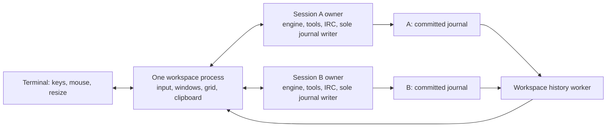

<!-- SPDX-License-Identifier: GPL-2.0-only -->

# Pager retention and the Vim workspace

Status: proposed implementation design, October 6, 2026. Source inspection is
against `7a70d81d336ef6f14d91ef944b1226c8efa65636`. This document describes the
intended behavior; the `vm` command and semantic attachment described below are
not implemented at that revision.

Implementation checkpoint: asynchronous pager ownership and retained rendering
are implemented in this branch. Held-pager regressions cover IRC delivery and
provider completion; interaction tests cover failures, tools and queued downloads.
History cursor reads now validate checkpoint bodies through a streaming parser
and return display metadata. Read-only snapshots preserve unfinished tails, and
refresh validates file identity and each appended record before extending a view.
The background reader returns bounded public event pages, cancels obsolete
requests and wakes the frontend only when a current result is ready.
The grid composes UTF-8 graphemes into a back frame and publishes differences
only after successful output. Unicode 17 tables supply shared cluster boundaries
and width policy; all 766 official grapheme-boundary cases pass locally.
The build switch `WITH_VM=0` omits these optional workspace objects.
Private workspace storage now supports atomic snapshots, unique names and ID
prefixes, exclusive ownership and open-first activity ordering. Probes preserve
existing locks; a lost frontend leaves a resumable snapshot. The frontend still
needs to define and validate its layout/draft payload and expose the commands.
The typed agent-session catalogue shares the classic list's collection, live
status probes, ordering and stored-row selection, and retains full session IDs.
The split tree now supports horizontal/vertical division, proportional resize,
equalization, collapse on close and strict round-trip snapshots. Terminal shrink
hides unfocused branches temporarily while preserving the tree for expansion.
Its depth stays within the shared JSON parser's nesting budget.
The independent input decoder recognizes UTF-8, cursor keys, modifiers, SGR mouse
and focus reports across fragmented reads. Bracketed paste is a literal stream
with explicit edit boundaries; lone Escape resolves through a timer without
waiting for another key. Oversized or unsupported control sequences are consumed
as unsupported input, and malformed ordinary UTF-8 is visibly replaced.
Rendering, wrapping and byte/cell navigation now share one source-unit policy,
including whole graphemes, inert controls, tab stops and ambiguous widths.
Wrapped rows retain logical tab columns and complete source anchors, including
units clipped by a one-cell viewport.
Public response projection now merges fragments by response ID and public-item
ordinal, independently of final graph local IDs or interleaved tool calls.
Terminal snapshots replace matching streamed text; unmatched observed text stays
labelled unconfirmed. Original byte counts survive redaction, and joined text is
redacted again to cover credentials split across fragments.
The workspace interface, semantic attachment
and IRC conversation work below remain to be implemented.

## 1. Outcome and decisions

Keep receiving and retaining session output while a pager, editor or transfer
owns the terminal. Add an optional full-screen workspace with Vim-style input,
history navigation, search, selection, splits and mouse controls. History comes
from retained session events and remains navigable across context compaction.
Verbosity changes apply to the historical text currently being viewed.

October 6 amendments make IRC conversations first-class buffers and give the
workspace its own saved-session namespace. A split can show a session's IRC
connection, channel or direct query independently of its agent transcript.
Qualified conversation addresses use `session/endpoint/target`. Workspace names
and `vm --resume` refer to saved layouts, separate from agent session names.

The main decisions are:

- `snajpagent vm` explicitly enters the workspace. Plain `snajpagent` keeps its
  current interface. Output height never activates full-screen mode.
- One workspace process owns the terminal and every window. Existing session
  owner processes continue owning their engines, tools, IRC and journals.
- Windows display buffers: agent transcripts, IRC connections, channels, direct
  queries and reports. Several buffers share one session owner/IRC connection.
- Named workspace snapshots retain the layout and buffer state. `vm -l` lists
  these workspaces; `vm --resume` restores one without submitting saved drafts.
- The workspace renders semantic history. It does not reconstruct history by
  interpreting the current terminal byte stream.
- A new private semantic attachment shares controller ownership with the
  existing terminal attachment. Existing owners and terminal clients remain
  usable throughout the transition.
- All retained journal history is addressable. RAM contains working pages and
  visible layouts; cache eviction never deletes history.
- Explicit yanks update an internal register and attempt workstation clipboard
  delivery. Remote delivery uses the existing negotiated wrapper transport.
- `:q` in an agent transcript explicitly quits that session. In an IRC or report
  buffer it closes the window. `:detach` preserves the session owner; `:close`
  closes any window. These distinctions are visible in help.
- `WITH_VM=1` includes the module in ordinary and release builds. `WITH_VM=0`
  removes its implementation. Runtime activation remains explicit.

This is a terminal workspace, with a supported Vim subset defined here. It does
not embed Vim, add a scripting language or turn transcript text into an editable
file. The first implementation has one session-host connection domain per
workspace. A remote workspace runs on its session host through the existing
`remote` wrapper.

## 2. Current implementation and the pager failure mechanism

The current source already provides most of the durable foundation:

| Area | Verified behavior at the source revision |
| --- | --- |
| Session execution | `session_host.c`, `session_relay.c` and `session_client.c` separate a surviving POSIX owner with a private PTY from its terminal frontend. Windows currently lacks this native-owner backend. |
| Local attachment | `terminal.sock` uses version-5 framing, one controlling terminal, reservation generations and physical-write acknowledgements. STATUS probes do not attach. |
| Detached display | The relay drains and discards raw PTY output. Reattachment reconstructs a bounded semantic catch-up; raw bytes are not a history store. |
| Public model output | `snag_app_flush_public()` commits complete UTF-8 `response_output` fragments before presentation. |
| Tool and IRC output | `snag_app_tool_output()` commits `process_output`; `snag_app_irc_event()` commits `irc_event` before presenting it. |
| Existing renderer | Render records contain typed content and source references, but `snag_render_flush_view()` consumes records after printing. They are pending queues, not a random-access transcript. |
| Old-history reads | `snag_session_history_open()` opens a verified committed prefix without a writer lock or recovery mutation. Forward/reverse iterators provide bounded work and cursors. |
| Existing `/history` | A report reads a bounded page, currently 4 MiB, and reports earlier history. This is not an all-history viewport. |
| Remote terminal | `remote.c` owns a local PTY wrapper. `screen_wire.c` supplies checked, acknowledged title-state framing for Mosh and a negotiated byte-stream path. Clipboard delivery is absent. |
| IRC targets | `server_chat()` accepts only the hosted room; incoming client `PRIVMSG`/`NOTICE` handling filters to the joined room. Nick-target routing and `/query` are absent. Agent/operator identities use separate links; channel event emission uses the operator link to avoid duplicates. |
| IRC history | `irc_event.c` validates an exact field set including endpoint, room and nick. Receiving identity and direct recipient are absent. Durable direct messages need a schema extension. |

Source entry points: [app.c](../src/app.c), [app_stream.c](../src/app_stream.c),
[app_events.c](../src/app_events.c), [ui.c](../src/ui.c),
[render.c](../src/render.c), [store.h](../src/store.h),
[session_host.h](../src/session_host.h), [session_relay.c](../src/session_relay.c).

The pager problem has a concrete source-level path. `SNAG_UI_EXTERNAL` stops
terminal input and sets the suspended flag. While the pager waits,
`service_external()` continues servicing tools and IRC. `SNAG_UI_IRC` can still
call the renderer immediately, and the presentation loop's pending-render flush
checks the native attachment barrier without checking external suspension.
Consequently, a record can be printed and consumed while the pager owns the
screen. The pager can overwrite those bytes, and closing it does not replay the
consumed record.

This establishes a defect in display ownership. It does not identify the exact
bytes lost in the reported incident: that incident has not been reproduced or
captured during this design work. The existing active-turn pager test closes the
pager promptly; it does not hold it through sustained background output.

There is also a scheduling constraint: the current pager call blocks the app
controller and runs a limited service callback. That callback does not run the
ordinary provider-turn loop. The fix must cover both display retention and
continued engine progress, without recursively invoking the app controller.

## 3. Fix pager retention first

### 3.1 Separate acceptance from painting

Introduce an explicit terminal lease in the presentation owner. Its states are
`PRESENTING`, `EXTERNAL`, `CATCHING_UP` and `DETACHED`. Only `PRESENTING` and
`CATCHING_UP` may issue ordinary renderer writes. Pager, editor and transfer
protocol output use the current external lease instead.

Retaining an event and painting an event have separate cursors. Acceptance
records a durable source reference, or retains a presentation-only item. Painting
advances only after the output sink accepts the complete logical range. A
partially written range retains its write offset. Code must not mark a render
record displayed merely because an external child is running.

On external entry:

1. Finish the current renderer write boundary, save the presented cursor and
   stop ordinary painting, including IRC, warnings, feedback and delayed flushes.
2. Preserve the composer and stop its input consumer. Transfer terminal modes
   and input ownership to the external child or transfer implementation.
3. Continue journal admission and engine service. Retain newly available ranges
   by source cursor instead of accumulating a text copy for every token.

On external return, restore terminal modes and geometry, enter `CATCHING_UP`,
render through a captured committed tail, then join live output. Events arriving
during catch-up extend the pending range; they cannot overtake it. Work is sliced
so resize, cancellation and attachment controls remain responsive. A long
backlog remains available even if the user interrupts catch-up and opens history.

Classic catch-up can still exceed a terminal's visible height, and Mosh may skip
intermediate screen states. Retained source history is the recovery mechanism;
VM supplies the navigable viewport over it. Successful physical writes alone do
not prove that every historical line reached a client's terminal scrollback.

Generated command reports already have a private temporary-file path for the
pager. Retain that snapshot through its display lifecycle. Presentation-only
notices that lack a journal source use a private spill file during suspension;
the in-memory queue holds offsets. This spool is transient presentation data,
not a second session journal. Close it after successful catch-up. Allocation or
disk errors produce an explicit retention failure through the available status
path; the implementation must never silently advance over dropped records.

### 3.2 Make external jobs asynchronous to the engine

Split the platform external-program primitive into start, poll/service and
finish operations. Preserve its existing process-group, foreground-terminal,
suspend/resume, temporary-file and error-restoration behavior. The app controller
stores the job handle and continues its usual provider/tool/IRC scheduling.
Only terminal interaction is suspended. A worker running the old callback loop
would introduce competing access to the app state and is not an acceptable fix.

Pager spawn failure, child failure, Ctrl-C, Ctrl-Z, terminal loss and an owner
shutdown all converge on one lease cleanup path. A normal external-job cancel
affects that job; the existing explicit session-interrupt action remains
separate. Detach or connection loss releases the actual terminal and preserves
the session owner. Raw external-program screen contents need not be replayed.
Their generated report snapshot and the session transcript remain available.

Keep current pager selection: when available, unset `PAGER` and bare `less` use
`less -X`; explicit pager commands retain their arguments. The retention fix
applies with the VM module compiled out.

## 4. CLI, workspace persistence and session selection

A **workspace** is the Vim-style application session: its name, windows, displayed
buffers and view state. An **agent session** owns a model engine and its journal.
A workspace can display several agent sessions and their IRC conversations. Each
namespace has independent names and IDs; identical names across namespaces are
valid and never imply the same object.

### 4.1 Commands and startup

```sh
snajpagent vm                         # new workspace, agent-session picker
snajpagent vm -N operations           # create a named workspace
snajpagent vm -l                      # list saved/open workspaces
snajpagent vm -l 30                   # include up to 30 stored workspaces
snajpagent vm --resume operations     # restore that workspace
snajpagent vm --last                  # restore the most recently active workspace
snajpagent vm --session SESSION_ID    # new workspace opening an agent session
snajpagent remote ssh -t host snajpagent vm --resume operations
snajpagent remote mosh host snajpagent vm --resume operations
```

Dispatch `vm` beside `remote` before normal session startup. `vm -l`, help and
version perform no provider/IRC startup and do not enter the alternate screen.
Workspace selectors accept exact names and unique ID prefixes; ambiguity lists
candidates. `-N` names a new workspace and rejects an existing workspace name.
`--resume` requires a workspace selector; `--last` resolves by activity. A bare
launch creates a workspace only when there is state worth saving; leaving an
untouched initial picker does not accumulate empty records.

`vm --session ID` explicitly uses the normal agent resume behavior: attach a live
owner or start a stopped one. Restoring a saved workspace is more conservative:
reconnect its live owners, show stopped sessions as stored history and offer
explicit resume for those sessions. Restore never replays prompts, sends saved
chat text, reconnects an explicitly removed IRC endpoint or automatically starts
all previously open model engines. Existing ordinary `snajpagent -l`, `--resume`,
`--attach` and `-N` retain their agent-session meanings. `vm --attach` is not
introduced: `vm --resume` restores workspace state and `--session` selects an
agent. This supersedes the initial design's `vm --resume AGENT_SESSION` examples;
that CLI was proposed, not shipped.

Inside VM, `:workspace` shows its name, full ID and save status; `:workspace name
NAME` renames it and `:workspace save` writes a snapshot immediately. `:workspaces`
opens the workspace picker. Selecting another workspace saves and detaches the
current one, then restores the destination; a failed destination open keeps the
current workspace usable. `:sessions` opens the agent-session picker, `:new [NAME]`
creates an agent session, `:buffer ADDRESS` selects a buffer and `:help` shows the
supported controls. Session names, endpoint names and peer nicks in examples are
ordinary user-selected identifiers, never special roles.

### 4.2 Saved state and workspace listing

Store workspace state privately under `$DOTDIR/workspaces/<workspace-id>/`,
separate from `$DOTDIR/sessions/`. A versioned `workspace.json` contains the name,
last meaningful activity, referenced agent IDs, buffer descriptors, split tree,
focus, cursor/top anchors, per-window verbosity/follow state and draft recovery
state. Connection descriptors reference their owning session and stable endpoint
identity. Credentials, sockets, controller generations and serialized engine
state are not copied into this file.

Write snapshots atomically through a private temporary file, file sync, rename
and directory sync using existing platform helpers. Debounce editing/layout
updates to avoid syncing every key; explicit save, detach, switch and clean exit
flush them. Report save failure without discarding the working state. Recovery
may lose the edit suffix since the last successful save after a hard process or
machine failure. A live owner's newer acknowledged draft takes precedence over
an old workspace snapshot; retain conflicting unacknowledged local edits as a
recovery draft for explicit selection. Never silently replace a live draft.

One frontend may actively use a saved workspace at a time. A private lock provides
that authority; a PID file alone does not. `vm --resume` reports an already-open
workspace rather than stealing it. A dead frontend leaves a resumable snapshot
and surviving agent owners. An old half-open SSH frontend remains open until its
normal transport detection releases it; resume must not kill it behind the user's
back. Saved workspaces are host/store-local. Running `vm` through `remote` lists
and restores the remote host's workspace namespace.

`vm -l` shows ID, name, `open`/`stored` status, last meaningful activity and
window/session counts. List all open workspaces first, then newest stored ones;
the default stored count is ten and `-l N` changes it, including zero. Timestamp
means user/layout/session activity, not filesystem atime, a repaint or a probe.
The listing reads snapshots and probes ownership without reserving a workspace
or attaching any agent. Preserve the last good snapshot on corruption; report
its error and never repair an unrelated file during listing. Unknown newer
snapshot versions fail explicitly.

### 4.3 Agent-session and buffer pickers

The agent picker keeps the same data and comparator as `snajpagent -l`: attached,
detached, running with unknown attachment state, then stored; newest journal
activity within groups and the existing ID tie-break. Initially show the CLI's
ten stored rows and load more on demand. Keep selection anchored to ID while
activity reorders rows. Enter attaches/resumes, `o` opens read-only history,
`n` creates, `/` filters metadata and `R` refreshes. Preview columns collapse on
narrow terminals while ID/name and state stay readable.

`:buffers` shows a tree of workspace agent sessions, their IRC connections,
channels, operator queries, agent queries and reports. Selecting a child changes
only the focused window. Agent-query buffers are labelled with the agent's IRC
identity and are read-only for operator sending. Buffer activity does not create
a second session or connection. Closing/replacing the last window associated
with a controlled agent detaches that agent; another window of any of its IRC
buffers keeps the shared controller alive. Drafts survive the detach path.

An agent already controlled elsewhere opens read-only. Explicit attachment may
report busy and never steals its frontend. Metadata/history inspection acquires
no controller. An unreachable owner remains unknown/running; failed probes do
not classify it as detached. Runtime VM activation stays explicit. A local alias
for plain startup remains a preference, independent of workspace persistence.

## 5. Process, thread and ownership model



The workspace has one event loop owning terminal reads/writes, window layout,
mode transitions, selection and control connections. A background history worker
performs cancellable journal reads, projection and search. Begin with one worker
and prioritize visible-page requests ahead of speculative prefetch and search.
Add concurrency only if measurements show a concrete need. Worker results carry
buffer and layout generations so obsolete results cannot move a newer viewport.

Each agent session has one backend connection/controller shared by all its
buffers. Each writable conversation buffer owns a distinct draft and submission
state. Windows independently own viewport, cursor, verbosity and follow state.
Two windows of the same conversation share its draft; different conversations
never share a draft or implicit target. Splitting a buffer creates no additional
engine, IRC connection, writer or controller.

The existing engine remains the sole journal writer. UI navigation does not
replay tools, trigger model requests or enqueue IRC messages. Existing synchronous
`snag_ui_send()` uses borrowed data and an engine/UI rendezvous; its pointer must
not be retained in a new asynchronous queue. New notifications own their small
payloads or refer to immutable committed ranges.

When used remotely, the workspace and history worker run on the session host.
The tunnel carries terminal state and input; multi-gigabyte history remains on
the host and is read there. The workstation wrapper handles workstation effects
such as clipboard publication. Multiple host domains can use separate workspaces
or an existing terminal multiplexer; a new network session daemon is unnecessary.

### 5.1 IRC connections, channels and direct queries

#### Buffer identity and addresses

A window is a view onto a buffer. A session owns a set of buffers, and its IRC
runtime owns the connections underneath them. Opening a window never implicitly
creates another network connection or changes another window's destination.

| Address / buffer | Meaning |
| --- | --- |
| `SESSION` | Agent transcript for an exact name or unique session-ID prefix. |
| `SESSION/ENDPOINT/` | Connection status, notices and conversation directory; trailing slash makes this a connection address. |
| `SESSION/ENDPOINT/#CHANNEL` | One channel conversation on that connection. |
| `SESSION/ENDPOINT/NICK` | Operator direct-message conversation with that nick on that connection. |

The session component names an agent session, not the saved Vim workspace.
Example: `:vsp work/localhost:6667/peer` opens a query beside the current buffer.
An equally useful sequence is `:vsp`, then `/query peer` in the new window.
Names such as work/peer are examples. Completion lists real session names/IDs,
endpoints and conversation targets, and the header always shows the resolved
session, endpoint, accepted sending nick and target.

`ENDPOINT` resolves an existing connection within that session. A displayed
connection label must resolve uniquely; the canonical host:port form remains
available, including bracketed IPv6. A label such as `local` in an example means
one exact connection, never the old fan-out meaning of an aggregate local route.
No query address accepts `all`, wildcard expansion or an implicit broadcast.
Opening an unknown endpoint reports an error; `/connect` is an explicit action.

The client keeps joined-channel state per connection so an external server can
have several channel buffers without extra sockets or losing an existing join.
The built-in server may retain its configured single room; its new DM support
does not require general multi-channel hosting. Its unsupported JOIN response
is displayed normally.

Split address components before percent-decoding them. Escape literal slash and
percent inside a component as `%2F` and `%25`; quoted command operands can contain
spaces. Use a full session ID if its name would be awkward. Treat `#` as channel
text inside this command parser, not a shell comment. The endpoint's advertised
channel prefixes determine channel versus nick targets; `/query` rejects a
channel target. Parsing and completion share this grammar.

Internally identify a conversation by owning session UUID, stable connection ID,
local identity role (operator/agent), conversation kind and conversation ID.
Connection generations and accepted nick aliases are live routing data, not its
permanent identity. Titles can change on a verified NICK event without losing
history, draft or viewport. Reconnect/removal cannot silently bind an old queued
send to a new connection occupying the same numbered list slot. Two sessions
connected to the same server still have distinct identities and buffers.

The buffer tree also exposes queries addressed to the agent identity, labelled
`agent` and read-only for operator sending. `:buffer --identity agent ADDRESS`
selects one explicitly. The ordinary three-component address and `/query` select
the operator identity. Operator input never impersonates the agent nick.

#### Commands, focus and sending

These IRC commands belong to the common application/IRC layer and work in the
classic interface too. VM supplies the per-window buffer and draft. The classic
interface supplies a single selected conversation. A compile-out build retains
functional direct messaging without VM.

| Command | Behavior |
| --- | --- |
| `/query NICK [TEXT]` | Open/focus an operator query in this window using its pinned session and endpoint; optional text sends once. Opening without text sends nothing. |
| `/query ENDPOINT/NICK [TEXT]` | Use an explicit endpoint in the focused agent session. |
| `/query SESSION/ENDPOINT/NICK [TEXT]` | Select the fully qualified query, including a different session owner. |
| `/query` | Pick an existing query in the current session; never invent a target. |
| `/msg ADDRESS TEXT` | Send once to a nick or channel using the same resolution rules, without changing the selected buffer. Retain its result in the target conversation. |
| `/notice ADDRESS TEXT` | Send a NOTICE explicitly as the operator identity. |
| `/me TEXT` | Send an action to the current channel/query, preserving its target and identity. |
| `/chat [ADDRESS]` | Select the current/default channel, or an explicit channel address. If there is no unique channel, open a picker. |
| `/connections [SESSION]` | Show connection status and child conversations for that session. Selection opens its connection buffer. |
| `/join CHANNEL` / `/part [CHANNEL]` | Explicitly join/leave a channel on the pinned connection; window close does neither. An unsupported channel reports the endpoint's result. |
| `/whois [NICK]`, `/names`, `/topic` | Query the appropriate peer/channel/connection; unsupported operations on a query report their scope without falling back to a channel. |
| `/nick [NICK]` | Inspect/change the operator nick on the pinned endpoint. Agent nick changes retain their separate tool semantics. |

A short `/query nick` inherits an endpoint only from the focused conversation,
connection buffer or an agent session with exactly one eligible connection.
Ambiguity opens endpoint selection and sends nothing. Once resolved, the buffer
pins the route. Creating or focusing a split cannot retarget another window's
composer. Plain text in a query goes to that peer; in a channel it goes to that
channel; in a transcript it remains normal agent input. A connection-status buffer
requires an explicit target before ordinary text can send. All entered commands,
resolved routes and failures remain visible.

Keep a draft per conversation and reuse it when returning to that buffer. At
submission, freeze session, connection identity/generation, local identity,
conversation/target, draft revision and request ID. Validate them at the owner.
A focus change while the request waits does not change its target. A stale,
removed or disconnected route yields a visible unsent/uncertain result and
retains recoverable text. A reconnect can restore the same buffer; it cannot
silently submit its draft. `/all` keeps its existing explicit channel-destination
scope within the selected agent session and never includes private queries.

The existing one-controller-per-agent contract applies across all its buffers.
Another session's connection can be displayed read-only without taking control;
sending requires that session's controller. A busy owner is reported rather
than stealing its existing terminal or creating a replacement connection.

#### Incoming messages, identity and attention

Incoming operator DMs create/reopen the corresponding hidden query buffer and
add an unread indication without moving focus or submitting a model turn.
Unread state is per conversation. A focused window following its latest painted
message advances the presentation read cursor; held/background views do not.
This UI cursor is independent of IRC delivery, model admission and compaction.
Closing a query view preserves history, draft and connection; later traffic
continues to accumulate and can make it visible in the buffer tree again.

IRC `PRIVMSG` can target a nick or a channel; `NOTICE` must not trigger automatic
replies. Match nick/channel spellings with the endpoint's advertised CASEMAPPING,
with the protocol fallback when it is absent.
See the [IRC client protocol reference](https://modern.ircdocs.horse/).
Follow verified peer NICK events within a connection, preserve old nick markers
and distinguish unrelated peers on different endpoints. After a disconnect or
nick reuse, retain the prior conversation as history with a discontinuity marker;
a matching nick alone does not establish persistent identity. Reconcile known
account metadata when actually negotiated, without treating it as task authority.
Keep uncertain queued sends unsent rather than delivering them to a reclaimed nick.

The local operator and agent already have distinct IRC identities. Preserve that
separation in the client and hosted server. Channel traffic seen by both links
is admitted once; direct messages to each identity must be received from its own
link. The current operator-only emission filter therefore needs a target-aware
replacement. Query lookup cannot require shared-channel membership.

DMs addressed to the operator remain operator conversation history and are
excluded from automatic model input, IRC compaction and default model-facing
history reports. Explicitly sharing one with a model uses normal operator input
and provenance. DMs addressed to the agent are admitted as targeted IRC input and
wake `irc_sleep` like an accepted direct mention. Preserve existing cancellation,
paused-goal and scheduling rules; a UI unread flag cannot alter them. Historical
replay and NOTICE do not generate automatic replies. Summaries keep private
conversation boundaries and never project private text into a public reply route.
This is an admission/projection rule within the existing same-user process/store
boundary, not a new filesystem access-control boundary.

Extend the existing `irc_send` tool with an explicit optional `target` (nick or
channel) on an exact `destination`. Omitting target preserves the existing channel
behavior. A nick target rejects destination `all` and ambiguous/null endpoint
selection. `irc_state` reports the agent's available conversations and targets;
model sends always use its agent identity. Freeze reply provenance through a turn;
concurrent channel and DM inputs never turn a private reply into a public send.
Tool schemas, context labels, summaries and tests must include the recipient and
local identity. An operator-focused window is never a model routing instruction.

#### Hosted delivery, receipts and durability

Add nick lookup and private delivery to the hosted server. Resolve connected
registered recipients independently of room membership, apply normal text/line
validation and send only to the intended peer plus a negotiated sender echo.
Private delivery must bypass the channel broadcast/history path. Third-party
peer-to-peer bodies never enter the hosting agent's conversation journal or the
room's replay. Only local participant identities retain their own DM history.
Error replies name the actual target; a missing nick, denied send or away notice
stays in the relevant conversation rather than forcing a channel reconnect.
Existing endpoint authentication/encryption properties apply to direct traffic.

Use a stable local send ID and explicit states: pending locally, written to the
connection, server-acknowledged where supported, failed or uncertain. Split long
messages on UTF-8 boundaries within the actual negotiated line budget and retain
per-chunk outcomes. Disconnection never automatically replays an uncertain chunk.
Allow an explicit retry using the original buffer/target after revalidation.

Negotiate `echo-message` and applicable correlation capabilities where supported.
A server echo acknowledges the server's handling, not the human recipient reading
it; servers may alter or filter a message. Correlate by supported labels/IDs and
stream order where unambiguous; identical text alone cannot deduplicate distinct
sends. Retain uncertainty where a unique match is unavailable.
See [IRCv3 echo-message](https://ircv3.net/specs/extensions/echo-message).
The built-in server can provide exact local send receipts. Incoming replay uses
real source IDs when available and marks uncertain historical duplication rather
than deleting legitimate repeated text.

Persist participant DMs before publishing them to the UI or admitting them to a
model. Introduce `irc_event_v2` with explicit connection ID, local identity,
conversation ID/kind, sender, target, direction, source message ID when available,
send ID/state, timestamp and text, in addition to existing IRC provenance needed
for replay. Normalize legacy `irc_event` records as channel events; never pretend
a nick is a channel in the old `room` field. Persist conversation/connection
identity and alias changes needed to recover the same buffers after resume.

This expands the original UI-only storage scope. Implement compatible readers,
checkpoint projection and context filters first. Direct-message-capable writers
use a new checkpoint snapshot revision when this schema becomes active; existing
records remain unchanged. Older binaries cannot resume a journal containing the
new DM schema and must fail on its unsupported event/checkpoint, before mutation.
Test that failure explicitly; a binary rollback is not a journal downgrade.
Keep prior binaries for unaffected sessions and retain the matching new reader
for DM-enabled journals. Announce this concrete compatibility boundary in the
manual and development delivery notes. No existing owner or journal is converted
merely by installing or opening the workspace. Old owners without the negotiated
DM capability offer inspection/classic attachment and a clear unsupported-send
result, never a channel fallback.

## 6. Semantic attachment and compatibility

### 6.1 Endpoint and authority

Add `view.sock` under the same private session directory on POSIX. It uses the
existing ownership and peer-credential checks. A session writer publishes and
cleans it up under the same endpoint-identity rules as `terminal.sock`.

A separate endpoint is justified by the different contract: terminal clients
receive bytes to display; workspace clients receive stable history boundaries,
status and command results. Keep the version-5 terminal framing intact so a new
binary can still attach to an old running owner. Do not send JSON controls into
the old PTY input path or turn ANSI parsing into a history API.

Both endpoints share one controller reservation and generation. A legacy terminal
and a workspace cannot control a session simultaneously. Read-only subscriptions
do not reserve input or change `-l` attachment status. A committed workspace
controller counts as attached even when its window is unfocused. Socket loss
releases its lease and leaves the owner running.

Committing a semantic controller switches the owner's presentation sink from
classic PTY painting to typed notifications and report retention. It keeps
canonical draft/route state but does not render a second, discarded transcript
for every live fragment. Read-only observers leave the existing sink alone.
Switching back to a classic controller restores its normal catch-up boundary.
An external terminal transaction temporarily bridges the owner's existing PTY
to the workspace's whole-terminal lease, using the current transfer framing;
ordinary semantic updates continue to accumulate by committed cursor.

### 6.2 Protocol contract

Use an independently versioned, length-delimited control envelope with checked
partial reads/writes. Reuse the existing 16 KiB transport slice where practical;
chunk long input and reports with offsets and a declared total. This is a frame
size, never a prompt, transcript or session quota. Unsupported protocol/schema
versions fail explicitly before acquiring control.

| Exchange | Required information and effect |
| --- | --- |
| `HELLO` / `CAPABILITIES` | Version, session identity, owner instance, supported history schema, observer/control and external-I/O capabilities. |
| `OPEN` / `SNAPSHOT` | Observer or controller intent; committed sequence, byte end and digest; status, model, effort, priority, connection/conversation catalogue and revisioned drafts. Snapshot and subsequent changes share one ordering boundary. |
| `RESERVE` / `COMMIT` / `BOUND` | Reuse the existing reservation-generation semantics and exclusive controller arbitration. Input starts only after BOUND. |
| `TAIL` / `STATE` | Coalescible committed-tail watermark and revisioned ephemeral status. They never contain an uncommitted journal suffix. |
| `DRAFT` | Controller generation, stable buffer/route identity, expected revision and replacement draft or edit. Accepted revisions are retained by the owner for later attachments. |
| `SUBMIT` / `RESULT` | Connection request ID, controller generation, stable buffer/route identity, draft revision and result, including the durable input/send identity once admitted. |
| `COMMAND` / `RESULT` | Existing command dispatch with explicit scope; report, error, state change or exclusive-terminal request as a typed result. |
| `CANCEL`, `QUIT`, `DETACH` | Distinct operations against the controlled session. Quit acknowledges intent and then completion through normal owner shutdown. |
| `REPORT` / external lease | Immutable report handle and metadata, or an attachment-bound terminal transaction. Workspace receives no arbitrary owner-supplied workstation command. |

The owner exposes a committed tail after its journal commit. Register the
subscription and capture its initial snapshot atomically with respect to tail
publication. On a slow subscriber, replace pending watermarks with the newest;
the complete event range still lives in the journal. Bound only the transport's
working buffers. Disconnect an unresponsive observer without blocking the engine.

The workspace opens the exact prefix through the existing read-only history API.
Add a refresh operation that verifies journal identity and the new committed
boundary before extending the reader. Replaced files, truncation, invalid hashes
or changed lineage invalidate cached pages and stop the read with a visible
error. The workspace never repairs, truncates or takes the session writer lock.
Opening stopped history obtains a verified final complete boundary read-only.

Commands use a serialized owner mailbox, with heap-owned input, separate from
the UI's existing synchronous request slot. A submission is acknowledged only
after existing admission commits succeed. Retain a receipt for each request
through the live owner connection/reconnect window. On lost acknowledgement,
query that receipt; never automatically resubmit an uncertain turn. If the owner
restarted and cannot establish acceptance from the durable input identity, show
the uncertainty and retained draft for explicit recovery.

Draft text stays local until an owner acknowledgement. An older draft reply
cannot overwrite newer typing. Detach flushes acknowledged draft state before
releasing control; sudden connection loss can lose only the unacknowledged edit
suffix, which the still-running workspace retains. Clean workspace exit warns
about an unsaved draft through normal command feedback, without discarding it.

### 6.3 Old owners, external I/O and operator context

Owners without `view.sock` offer read-only history and a clearly
labelled classic attachment action. Classic attachment temporarily hands the
workspace terminal to the existing frontend; its normal detach returns to the
workspace. Never restart an owner to obtain a capability. An old live owner
cannot advertise the new committed-tail boundary. Its observer therefore shows
a labelled best-effort snapshot of complete, hash-verified records, refreshing
on an idle timer rather than every frame. It must detect a subsequently rolled
back suffix and invalidate that range. Only a new owner snapshot or a stopped
session's verified final prefix receives the committed-boundary guarantee.

Generated `/status`, help, model lists and similar reports open immutable report
buffers inside the workspace. `/cat` opens a file snapshot with explicit refresh;
it must not treat a mutable pathname as immutable history. External editor/pager
and upload/download commands acquire the entire terminal, temporarily suspending
workspace painting. Reuse the existing attachment-bound transfer protocol and
terminal profile. Only one exclusive transaction may own the terminal, across
all windows. Cancellation and focus changes cannot redirect its protocol bytes
into a different session's composer. Owners continue working throughout.

The model-facing presentation hint needs a truthful workspace adapter. Send a
small controller snapshot indicating focused/unfocused, view, verbosity and
whether the user is following live output. The next provider request may use
that snapshot under the existing hint policy. Read-only observers, search terms,
selections and clipboard contents do not enter model context. A multi-window
hint must not claim that every tool output is visible or read.

## 7. History, projection and retention

### 7.1 Source and identity

Use the current JSONL history readers. The proposed
[binary storage format](session-storage.md) is a separate migration; VM neither
depends on it nor creates a parallel authoritative event log. Put history access
behind a small reader interface so that future storage can supply the same
committed-range and seek operations.

A display block has a stable identity based on session ID, source event sequence,
item identity and logical UTF-8 offset. It also has type, stream/channel, style,
verbosity policy and source ranges. View anchors use these identities and an
affinity at boundaries. Wrapped screen row numbers are derived and disposable.

Projection must merge streamed `response_output` with completed response items
without rendering the final response twice. Apply output corrections by identity;
retain interruption/failure markers. Reassemble tool stdout/stderr by their
recorded stream offsets, preserving the journal's interleaving order. Show an IRC
source event once; model-admission events are not a second chat message. Model
compaction changes the model's input projection and adds visible compaction
markers, while previous operator history remains available.

Ordinary history applies the existing visibility/redaction policy and renders
control bytes inert. Wire/debug views retain their explicit verbosity rules.
Model or tool text can never become a live terminal escape, clipboard request,
file-transfer control or Vim command. Binary output has a labelled representation;
copying its displayed text does not claim to recover original binary bytes.

### 7.2 Paging and caches

Keep a bounded cache of decoded event pages and a separate cache of laid-out
visible blocks plus nearby pages. Budgets govern regenerable working memory,
not history retention. Select initial budgets from measured fixtures and expose
their usage in developer diagnostics before adding user configuration knobs.

Fetch around source anchors through bounded forward/reverse reads. Reuse the
current 4 MiB read quantum as a starting scheduling unit; individual valid records
can exceed it. Parsing a large checkpoint may still be expensive. Perform it in
the worker, cancel at available parse/read boundaries, and avoid repeating it on
every motion. Never call full-session reducer replay to paint or search a page.

History cursor readers stream checkpoint records: validate canonical JSON and
envelope fields, compute the existing digest with `event_sha256` omitted, and
consume the payload without constructing its state tree. Callbacks receive only
format, snapshot version and provider-view presence. Full state loading and native
recovery retain their existing path. Hash-chain checks and rejection of malformed
or noncanonical data remain in force. Ordinary display records retain their
existing record-size contract.

Canonical equivalence tests cover both record versions, UTF-8/escaped keys,
integer bounds, tiny read chunks and hash boundaries. The storage test traverses
a 17 MiB checkpoint forward and backward with only 12 MiB of additional address space
available on Linux. Read-only readers check a caller-owned cancellation hook at
each filesystem read, including checkpoint parsing. Cancellation returns
ECANCELED, preserves verified cursors and never changes native writer ownership.
Tests interrupt open, snapshot, forward/reverse paging and refresh within a large
checkpoint, then continue the same verified view. Worker scheduling and measured
cancellation latency remain part of the workspace integration below.

The store exposes a read-only snapshot for stored sessions and old owners. It
captures the last complete record, reports an ignored unfinished suffix and
never acquires the writer lock or repairs journal bytes. A live old owner cannot
certify its committed boundary; label that view best effort. New owners provide
the committed cursor through semantic attachment. A refresh validates the old
boundary and appended hash chain before extending a view. Directory/journal
replacement or truncation invalidates cached pages; failure preserves the prior
bound. An unchanged tail needs only an identity check; its verified checkpoint
is reused across page requests. Tests keep the native writer active, preserve
partial tails and reject a byte-identical journal replacement as a different source.

The background reader owns its read-only journal view and immutable redaction
snapshot. It processes one visible-page request at a time, cancels superseded
work at read boundaries and publishes only the current request generation.
Results own their public event payloads and verified cursors. Pages use the
existing 4 MiB read quantum, allowing one larger valid record; large checkpoints
still produce only small metadata. The worker sleeps on a condition variable
between requests and wakes the frontend through the existing portable wakeup
channel. Refresh and source failure invalidate its cached view. Search and
viewport caches will build on this reader.

Maintain sparse offsets for visited pages. They are a disposable acceleration,
not a new required on-disk index. `gg` seeks the earliest displayable event and
`G` seeks the current tail. Neither requires knowing a total rendered line count.
Show source position/sequence and loaded-range information when an exact global
line count is unavailable. Do not invent a scroll percentage from loaded pages.

“Endless” means navigation through every retained committed event, subject to
the actual journal still existing. Cache eviction, model context limits, pager
lifetime and terminal height do not truncate that range. Pre-upgrade output
never recorded in the journal cannot be reconstructed. Command report snapshots
and presentation-only diagnostics remain available for their owning process's
lifetime; they are labelled separately from durable session history. Arbitrary
external programs' private screens are outside the transcript.

Keep report snapshots in private spill files while referenced, including a
command-result entry from which the buffer can be reopened. Do not silently
delete a report while a window or selection references it. Presentation reports
add no journal event type. The newly requested durable direct messages do require
a typed IRC schema extension, covered in section 5.1. Current reducers reject
unknown types, so that extension needs an explicit reader/writer compatibility
transition; it cannot inherit the original UI-only rollback promise. Persisting
presentation-only reports across restarts remains a separate storage decision.

### 7.3 Verbosity, following and selection stability

Each window has its own verbosity. Changing it invalidates that window's
projection/layout and re-renders both historical and future output. Preserve
the nearest stable source anchor; if its block becomes hidden, anchor to its
containing visible heading or nearest visible neighbor and show that adjustment.
Keep the original source anchor so restoring detail can recover the position.

The existing `/verbose [0..6]` command reads or changes the focused window's
verbosity in VM. `/chat` selects a channel buffer and `/rollout` the associated
agent transcript in that window. These are frontend presentation settings; other
windows of the same session retain theirs.
The controlling window's next presentation hint communicates the applicable
setting to the owner without rewriting durable session history.

`G` places the cursor at the newest visible text and enables FOLLOW. Navigation
away from the tail, search and visual selection enter HOLD. Incoming events add
a “new output” indicator without moving a held viewport. Returning to the tail
with `G` resumes following. Resize/reflow preserves the logical anchor, not its
old row number. A verbosity change preserves FOLLOW/HOLD state.

A selection pins a committed source boundary and the selected text projection.
New output cannot extend it. Resize can reflow its highlight. Verbosity changes
end visual mode with a visible notice and leave the existing register unchanged;
this avoids copying text that no longer matches the highlighted view.

## 8. Interaction contract

The transcript is a read-only buffer. The composer is an editable draft. The
status line identifies `NORMAL`, `INSERT`, `VISUAL`, `VISUAL LINE`, `VISUAL BLOCK`
or command/search entry, together with session identity, live/stored/read-only
state, model/effort/priority, verbosity and FOLLOW/HOLD. A tiny terminal prioritizes
session identity, mode and connection state. Engine “working” status comes from
owner state, not a frontend animation left running after an error.

### 8.1 Movement and composition

The following subset follows [Vim motion conventions](https://vimhelp.org/motion.txt.html)
and [scrolling conventions](https://vimhelp.org/scroll.txt.html). Unsupported
commands report briefly and leave the buffer unchanged.

| Keys | Effect |
| --- | --- |
| `h j k l`, arrow keys | Character and logical-line movement; `gj`/`gk` move wrapped display rows. |
| Counts, `w b e`, `0 ^ $` | Counted motions, word movement and logical-line boundaries. |
| `gg`, `G`, `[count]G` | Beginning, live tail, or one-based logical line. A distant numbered line may require cancellable scanning. |
| `Ctrl-U`, `Ctrl-D`, `Ctrl-B`, `Ctrl-F` | Half-page and full-page movement. |
| `H M L`, `zz` | Top/middle/bottom visible position; center the cursor. |
| `i`, `a`, `A` from transcript | Focus its composer at the remembered position or end and enter INSERT. |
| `Esc`, `Ctrl-[` | Leave INSERT/visual/command entry for NORMAL; preserve draft text. |
| `Tab` in NORMAL | Switch focus between transcript and composer. |
| `Ctrl-L` | Force a complete redraw from the current semantic state. |

In composer NORMAL, support the same applicable motions plus `i a I A o O`,
`x`, `d`/`c` with supported motions, `dd`, `cc`, `p`/`P`, `u` and `Ctrl-R`.
Undo is draft-local. Transcript delete/change commands report “read-only”.
Macros, mappings, arbitrary Ex commands and Vim scripting are outside this subset.

INSERT retains the existing composer behavior: Enter submits through normal
command/prompt dispatch and Ctrl-J inserts a newline. These are the existing
bindings; additional modified-Enter sequences require terminal support.
Multi-line bracketed paste
is inserted as one edit and cannot submit, invoke `:q` or execute normal-mode
keys embedded in the text. Completion, history, queued-input editing and file
attachments retain their current commands through the composer adapter.

Normal-mode `Ctrl-C` first cancels a local search/copy/external operation if one
is active; otherwise it performs the current session interrupt. The status bar
names the cancelled operation. Existing hard-escape behavior remains a separate
explicit sequence and must be tested through the new input decoder.

### 8.2 Search

`/pattern` searches forward and `?pattern` backward in NORMAL; `n` repeats and
`N` reverses. `/search TEXT` entered as a slash command invokes the same viewer
search, is visibly echoed as a command and never becomes a model prompt.
`/search` without text opens search entry. Slash-prefixed text in INSERT continues
to use the existing command dispatcher, so search cannot steal an ordinary prompt.

The initial search syntax is literal UTF-8 with case-sensitive matching and an
explicit `:set ignorecase` / `:set noignorecase` toggle. Do not advertise Vim
regular-expression compatibility. Search covers the active buffer's current
verbosity/view, across all retained history; a report buffer searches that report.
Use a background scan with overlap across chunk boundaries, progress by source
bytes/events, cancellation and a pinned committed tail. Report wraparound.
Reaching the pinned end offers subsequent live output on the next repeat.
Cold whole-history search is linear in the inspected history; a UI label must
not imply completion while only loaded pages have been searched.

Search results contain source anchors and excerpts. Opening a result does not
move other windows. Changing view/verbosity cancels an obsolete scan and keeps
the query for a new search. A corrupted historical range produces a visible
incomplete-search result, not “no matches”.

### 8.3 Visual selection, registers and mouse

Use `v`, `V` and `Ctrl-V` for character, line and rectangular selection, following
[Vim's visual modes](https://vimhelp.org/visual.txt.html). `y` yanks the selection;
`yy` and `y` plus a supported motion work in NORMAL. The unnamed register holds
the result and a linewise/blockwise flag. Yanking also attempts clipboard output.
`p`/`P` paste that register into the composer; transcript text remains immutable.

Copy logical text without terminal escapes, status decorations or soft-wrap
newlines. Linewise copy includes line separators. Blockwise copy uses the visual
column rectangle at selection time, pads short rows and never splits a wide or
combining character. The status reports copied bytes/lines and clipboard result.
Very large selections stream through a private file/register backing store.

Mouse mode is enabled inside VM and can be toggled with `:set mouse` /
`:set nomouse`. Use SGR mouse reports: click focuses and places the cursor,
wheel scrolls the hovered window, drag selects, and a separator drag resizes
splits. Use one click/drag implementation before adding multi-click gestures.
Terminal-native selection remains available through the terminal's own bypass
modifier or by disabling mouse reporting. Leaving VM restores mouse modes.

### 8.4 Windows and quit semantics

Use [Vim's split and focus conventions](https://vimhelp.org/windows.txt.html):
`:split [ADDRESS]` (`:sp`), `:vsplit [ADDRESS]` (`:vsp`), `Ctrl-W s/v`,
`Ctrl-W h/j/k/l/w`, `Ctrl-W =`, and size adjustments `Ctrl-W +`, `-`, `>` and `<`.
No argument splits the same buffer. A bare agent-session selector opens its
transcript; a qualified address opens its IRC connection/channel/query.

Keep a binary layout tree with orientation and proportions. Terminal shrink
temporarily hides windows that cannot fit their content/status minima, prioritizing
the focused window. Retain their buffers, leases and layout for expansion; show
the hidden-window count. Closing a window does not delete session storage.

Session quit deliberately follows the session lifecycle requested for this UI:

| Command/context | Effect |
| --- | --- |
| `:q` in a controlled agent transcript | Dispatch normal `/exit`: interrupt/settle active work, preserve the session and stop its owner. All buffers of that session show their offline/stopped state. Other owners keep running. |
| `:q` in an IRC buffer, read-only session or report | Close this window, preserving its draft/history. No IRC PART/QUIT, endpoint removal or agent shutdown occurs. |
| `:q` in the picker with no active view | Exit the workspace, releasing any remaining leases through detach. |
| `:close` | Close this window. If it was the last view of a controlled session, detach and preserve the owner and its draft. |
| `:detach` | Release the associated agent-session controller for all its buffers, leave its engine/connections running and show read-only history or the picker. |
| `:qa` | Explicitly quit the sessions controlled by this workspace, then exit after their normal shutdown acknowledgements. Unrelated and observed owners remain running. |

Unsent conversation drafts block a session-quitting `:q`/`:qa` with a clear
message. `:q!` in the agent transcript discards that session's drafts and requests
the same normal shutdown; it is never SIGKILL. An IRC-buffer `:q` only closes the
view and retains its draft; `/exit` remains explicit agent shutdown from there.
`:qa!` applies that rule to the workspace's controlled sessions. A slow quit
shows “waiting for session shutdown” and permits inspection or explicit detach.
It does not silently turn a timeout into a kill. Terminal close, broken SSH,
workspace crash and job-control suspension preserve session owners. A report's
close returns to its originating window without changing the session lifecycle.

## 9. Screen rendering and terminal correctness

Extract reusable typed text/style formatting from the current fd-writing
renderer. Keep the existing streaming sink and add a grid-layout sink. The shared
formatting policy controls labels, redaction and verbosity; each sink controls
placement. Avoid a VT emulator between the old renderer and the workspace.

The workspace builds a complete back grid for the current screen. Each cell
contains a grapheme reference, width/continuation flag and style. Diff it against
the last fully written front grid and emit changed runs with explicit cursor and
style transitions. Swap front/back only after all bytes in that frame complete.
If a newer frame arrives while writing, coalesce future work; finish the current
escape sequence/frame before changing the assumed terminal state.

Invalidation follows events: changed content, input, layout, status, terminal
size or a timed status update. An idle workspace blocks on readiness/deadlines.
It does not repeatedly lay out the transcript or spin to animate a working icon.
Keep pending output bounded to the in-flight frame and newest desired screen.
A stalled terminal blocks presentation, not journal admission or engine work.

Use the alternate screen only on explicit VM entry. Save and restore raw/cooked,
paste, mouse, cursor and screen modes on clean exit, suspend/resume, external
lease transitions and handled signals. `Ctrl-L`, resize, attachment recovery and
external return invalidate the front grid and force a full redraw. Synchronized
terminal updates can be used when positively supported; correctness cannot rely
on them. Redirected output or an incapable terminal gets a diagnostic before
any screen-control sequence, with the classic interface command available.

UTF-8 input decoding, grapheme boundaries, display width and byte-to-cell maps
must be shared by navigation, selection, wrapping and mouse hit testing. Current
UTF-8 helpers alone are not evidence of complete grapheme support. Use portable
tables/helpers for combining sequences and wide characters; test invalid UTF-8,
tabs, wide glyphs at the right edge and ambiguous-width terminal differences.
Preserve logical bytes even when the terminal renders an unusual cluster poorly.

The current helper implements the extended grapheme rules from
[Unicode 17 UAX #29](https://www.unicode.org/reports/tr29/tr29-47.html), checked
against its complete official test file. Generated data and source hashes are
retained; builds do not fetch Unicode data. Width is an explicit terminal policy:
wide/fullwidth characters use two cells, combining marks attach to their base,
emoji sequences/flags/keycaps use two, and ambiguous-width characters accept a
narrow or wide profile. This width policy is separate from normative grapheme
boundaries. The grid clips whole clusters, handles overlapping wide cells and
renders raw controls visibly. A failed output callback retains the prior front
frame and forces a full repaint; unchanged frames and cursors produce no output.
Frontend event-loop backpressure and real terminal qualification remain ahead.

Decode escape/key sequences incrementally. Use the existing terminal parser where
possible, extending it for mouse and VM commands. Lone Escape disambiguation must
not require a following key to flush a paste or a partial UTF-8 sequence. Keep
bracketed paste, capability replies, clipboard ACKs and file-transfer input in
their own active transactions before dispatching ordinary key bindings.

## 10. Clipboard and transport behavior

### 10.1 Local copy

Always commit a yank to the internal register first. Prefer a workstation-native
clipboard backend: platform API or a discovered fixed-argv helper such as
`pbcopy`, `wl-copy` or `xclip`, with data on stdin. Never interpolate selected
text into shell code. Detect an available graphical session and report helper
exit/failure; a helper name alone does not establish clipboard availability.

Where native publication is unavailable, OSC 52 is an optional terminal fallback.
Its ability to set a selection depends on terminal policy, as described in the
[xterm control-sequence reference](https://invisible-island.net/xterm/ctlseqs/ctlseqs.html).
Do not probe by reading the clipboard. Ordinary OSC 52 emission has no reliable
end-to-end write receipt; report “clipboard sequence sent”, distinct from a
confirmed native write. Respect the backend's size support and preserve the
internal register when external copy fails.

### 10.2 Remote copy

Negotiate a `clipboard-write` capability with `snajpagent remote`. Introduce an
explicit operation in the existing checked transfer envelope, separate from
file upload/download and the durable file outbox. Only the outer workstation
wrapper publishes the clipboard; inner wrappers relay the operation.

A transfer carries an attachment-bound nonce, operation ID, UTF-8 encoding,
declared byte length, sequenced chunks and final digest. The receiver stages the
selection in a private file and publishes only after verification. Duplicate
chunks are acknowledged without duplication. A completed operation ID returns
its receipt on retry instead of repeating clipboard publication. Receipts
distinguish native success, OSC emission, cancellation and failure.

Cancellation, expired attachment, replaced controller, truncated input or digest
failure leaves the old workstation clipboard untouched. A successful clipboard
write followed by a lost receipt is reported as uncertain until its receipt can
be recovered. New yanks serialize behind or explicitly cancel the previous
operation; late ACKs cannot finish a different selection. After capability
negotiation, stop forwarding protocol titles and keyboard replies as user text.

Reuse the negotiated byte-stream path over SSH and acknowledged title-state path
over stock Mosh. Mosh synchronizes visible terminal state and can omit intermediate
output, which is also why terminal scrollback is incomplete
([Mosh FAQ](https://mosh.org/)). A one-shot escape sequence is therefore not the
transport contract. The existing Mosh path retains each small frame until its
ACK. Large yanks may be slow on that path: show byte progress, permit cancellation
and keep the workspace responsive. Do not upgrade a missing capability to an
assumed success or a new lifetime quota.

Clipboard writes require an explicit input action such as a yank. Provider/tool
output can contain copied text but cannot trigger a clipboard operation merely
by being rendered. The wrapper remains a trusted-remote-session boundary: its
nonce binds the transport, not proof that a hostile host had a human gesture.
Provide a local wrapper setting to disable remote clipboard writes; no clipboard
read capability is introduced.

### 10.3 tmux, screen and transport matrix

Reuse the current attachment profile and mux routing from
[remote-terminal.md](remote-terminal.md). tmux routing requires a unique eligible
attached client tty; ambiguous or absent clients fail without sending controls
to an arbitrary terminal. GNU screen uses the existing DCS relay boundary.
Never change global tmux/screen settings to make a copy appear successful.
tmux's own OSC clipboard handling depends on configuration and terminal support
([upstream clipboard guidance](https://github.com/tmux/tmux/wiki/Clipboard)).

Qualification must exercise these actual layouts:

| Layout | Expected clipboard destination and mechanism |
| --- | --- |
| Local VM | Local native backend, with labelled OSC fallback. |
| Local tmux or screen containing VM | Current attached workstation; tested mux routing or native desktop access. |
| `remote ssh … vm` | Outer wrapper's workstation backend over negotiated byte stream. |
| `remote mosh … vm` | Outer wrapper's workstation backend over title-state transport. |
| `remote ssh/mosh … tmux … vm` | Correct currently attached tmux client path, then outer wrapper. |
| `remote ssh/mosh … screen … vm` | Qualified screen passthrough/relay, then outer wrapper. |
| Wrapper inside a local mux; remote mux; nested SSH | Test relay boundaries and ensure only the outer endpoint publishes. |
| Plain SSH/Mosh without wrapper | Internal register always; available terminal fallback is explicitly unconfirmed. |

Arbitrary nested multiplexers are not already qualified by the existing transfer
implementation. Each supported nesting needs a fixture and documented wrapper
placement. Missing support reports the failed capability while retaining the
selection. File upload/download must continue working in all qualified VM paths,
including while other panes receive output.

## 11. Module and platform boundaries

Proposed source responsibilities, combined further where implementation stays
clear:

| Component | Responsibility |
| --- | --- |
| Existing `ui`, `render`, `platform` | Pager lease fix, asynchronous external jobs, shared formatting and classic presentation. Always compiled. |
| Existing `irc`, `irc_runtime`, event/store/context layers | Channel/query routing, recipient-specific delivery, common commands/tools, durable DM schema and model/operator projection. Available with VM compiled out. |
| `session_view` | Semantic endpoint, controller arbitration and typed dispatch. Compiled with VM; existing terminal attachment remains independent. |
| `vm` | CLI entry, named workspace snapshots/locks/listing, buffers/windows, input modes, layout and grid output. |
| `vm_history` | Read-only source paging, stable anchors, projection, search and cache ownership. |
| `clipboard` | Register backing and workstation publication; wrapper protocol integrates in existing remote/screen code. |
| `vm_stub` | Helpful unsupported-feature result for a `WITH_VM=0` binary. |

Use `WITH_VM ?= 1` in the existing build configuration and include it in build
input fingerprints. A disabled build links no VM renderer/history workspace or
clipboard implementation, retains the shared pager correction and keeps normal
remote file transfer working. `vm --help` clearly reports the omitted feature.
Feature discovery prevents one side of a mixed installation from sending an
unsupported clipboard or semantic command. All release target recipes include
the module; custom lean builds can explicitly exclude it.

POSIX native owners are the first full live-workspace backend on Linux, macOS
and the supported BSD targets. Reuse their peer authentication and PTY code;
do not describe that existing implementation as Linux-only.

Windows ships the portable VM module too. The initial platform adapter provides
stored-history/report viewing and a single direct live session using the current
engine/UI boundary; splits can show that session and other stored histories.
It must clearly disclose that persistent multi-owner attachment and the `remote`
wrapper are unavailable on that platform today. Direct-engine termination follows
its current platform lifecycle, and cannot claim POSIX detach persistence. Disable
unsupported detach/multi-live controls before executing them. Closing the last
window of a direct live session keeps its buffer/engine hidden in the workspace;
exiting the workspace requires explicitly quitting that session first. A window
close must not silently become an engine exit. Full Windows
persistent ownership requires a separate same-binary owner launch and authenticated
named-pipe backend; it is a platform follow-up, not an implicit requirement to
add a second engine thread inside this workspace. A compiled feature flag alone
never counts as runtime qualification.

The new interface must use existing command and settings authority. `/configure`
explicitly reloads configuration and model cache; opening windows and repainting
do not reread them. Model selection, `/fast`, nick/route changes and command echo
retain their current semantics. All entered slash and colon commands appear in
the appropriate command history/result area, including failures. Viewer commands
remain presentation-only and never create a model turn.

## 12. Verification and acceptance

Use owned session fixtures and the local fake provider. Never test quit, detach,
failure injection or clipboard mutation against an unrelated live owner. Tests
must assert observable behavior and source-range completeness, not implementation
data-structure shape.

| Test family | Required observable result |
| --- | --- |
| Pager regression before/after | Hold a pager open across numbered IRC events, tool output and streamed model output. Demonstrate the old failure where reproducible; after the fix, verify every accepted item is retained and rendered once after return. Assert provider progress while the pager remains open. |
| Pager failure paths | Spawn failure, early/nonzero exit, resize, suspend/resume, interrupt, detach and terminal loss restore ownership and preserve retained ranges. Exercise native and direct frontends, and `WITH_VM=0`. |
| Durable history | `gg`, `G`, page movement and search traverse a multi-gigabyte synthetic journal, older formats, large checkpoints, interrupted responses, compaction and mixed tool streams without a full reducer replay. Corruption yields an explicit incomplete range. |
| Cache and responsiveness | A history scan and live output run together. Record input-to-paint latency, read volume, RSS and idle CPU. Repeated local motion reads cached/adjacent ranges; repeated redraw does not reread the journal prefix. Cancelling search lets a visible-page request progress. |
| View projection | Retrospective verbosity toggles preserve source position; hidden anchors restore predictably. Completion records do not duplicate streamed text. HOLD does not move on incoming output. |
| Input | Slow/fragmented Escape, UTF-8 and bracketed paste; a paste ending exactly at a read boundary appears without an extra key. Pasted Vim commands never execute. Composer edits, undo and queue handling preserve text. |
| Grid | PTY screen assertions cover partial writes, blocked output, resize, wide/combining text, external return and force-redraw. No protocol frame or raw model escape reaches the visible terminal. |
| Windows and lifecycle | Same-conversation splits share one draft; different queries/channels have distinct drafts and frozen routes. Session buffers share one controller. Verify transcript versus query `:q`, `:close`, `:detach`, unsent drafts, failed attach, stale generation and lost acknowledgement without duplicate input or owner kill. |
| Saved workspaces | `vm -N`, `-l N`, `--resume`, `--last`, rename and atomic save use a separate namespace from agent CLI flags. Restore split proportions, buffer addresses and anchors across exit/crash; detect live locks and corrupt/newer snapshots. Retain conflicting newer drafts. Never send saved text or restart stopped agents implicitly. |
| IRC direct routing | Operator and agent DMs work with the built-in and an external IRC fixture, including peers without common channels. Verify exact recipient/identity, same nick on different endpoints/sessions, nick changes/reuse, reconnect, line splitting, errors, NOTICE/actions and mid-send focus changes. Public `/all` never includes queries. |
| IRC privacy and history | Uninvolved clients, channel history and hosting-agent context never receive peer DMs. Operator DMs stay out of model admission/default history and IRC summaries. Agent DMs wake the right admission path. Resume and read-only history retain recipient/provenance; older readers reject the new schema before mutation. |
| Session list | Observers leave status unchanged; VM controllers show attached; disconnect shows detached only after verified release. Newest activity ordering and selected-row identity survive refresh. |
| Clipboard | Exact UTF-8 bytes and line/block selection; large streamed copy, unavailable helper, denied clipboard, digest mismatch, duplicated chunks, cancelled/lost receipt and nested wrappers. Internal register survives each external failure. |
| Remote and files | Real SSH, stock Mosh, tmux and GNU screen fixtures for the matrix above; clipboard and existing upload/download both work with resize, disconnect and background output. Test refusal for ambiguous tmux clients. |
| Compatibility/build | Old owner/new VM, old wrapper/new VM, VM omitted, all production target compile profiles, Windows capability restrictions and ordinary CLI preservation. |
| Context isolation | Navigation, search, copy and report viewing cause no provider requests or added context. A focused presentation hint has the right verbosity/follow state; explicit commands keep their existing journal/context effects. |

Use a desktop clipboard integration check on the actual supported workstation in
addition to a fake clipboard sink that verifies exact bytes. A fake backend
proves encoding and routing, not desktop clipboard access. Record which actual
terminal/mux versions and layouts passed; do not infer the entire matrix from a
single PTY test.

Performance acceptance is structural first: memory stabilizes with the working
set rather than journal age; redraw cost follows visible cells; history work
does not occupy the owner engine thread; idle CPU has no redraw loop. Benchmark
tail open, `gg`, cached page motion, cold search, heavy live output and tiny-screen
resizing on the existing hosts. Record measured timing targets after a baseline;
do not hide a slow linear scan behind an unsupported constant-time promise.

## 13. Implementation and delivery sequence

1. **Pager correction.** Reproduce and add permanent regression coverage; gate
   every ordinary display path under the terminal lease; add retained catch-up
   and asynchronous external jobs. Ship the fix through normal development
   delivery independently of the full-screen workspace.
2. **Read-only workspace.** Add the compile switch/stub, explicit CLI, grid,
   history reader, modes, movement, retrospective verbosity, search and visual
   registers. Exercise large fixture history and tiny terminals before connecting
   live control. Keep the command clearly experimental while incomplete.
3. **IRC conversations and workspace persistence.** Add explicit target-aware
   routing, common `/query` commands, recipient history and compatible readers
   before enabling new-schema writers. Implement workspace naming/listing/restore
   and buffer identities with isolated drafts. Qualify classic/compile-out DMs.
4. **Live semantic attachment.** Implement common controller arbitration, tail
   snapshots, drafts, typed commands, external-I/O transactions and disconnect
   recovery. Cover old owners and old frontends. Add picker and command reports.
5. **Windows and clipboard.** Complete split ownership, mouse, quit/detach,
   native clipboard and remote capability/receipt integration. Qualify file
   transfer and copy through SSH/Mosh/tmux/screen with all panes active.
6. **Platform and workflow completion.** Finish the Windows direct adapter and
   BSD qualification, compile-out checks and documentation. Publish the exact
   supported Vim subset and platform differences. Full feature completion means
   these acceptance cases pass, not merely that a full-screen demo launches.

Update `snajpagent.1`, affected tutorial/troubleshooting and README examples,
design/status pages and Unreleased notes with implementation changes. Render the
manual and check example syntax. Preserve the classic interface's append-only
rendering contract outside VM. The VM exception is explicit in the architecture.

Development delivery follows the current staging/master policy and recorded
shipment authority, using `Pavel Snajdr <snajpa@snajpa.net>`. Implementation
deliveries refresh the Mac and snajpadev binaries and manuals, preserve rollback
copies and keep running production owners intact. A running old owner gains new
features only on its normal exit/resume; installation never authorizes restarting
it. Source/development delivery does not select a new release version, tag or
website publication. No release is produced on E2B hardware.

## 14. Remaining decisions and risks

The engineering defaults above are sufficient to begin implementation. Local
automatic opt-in remains a user preference; the command works without resolving
it. The first development step is the held-pager regression, followed by its
retention and scheduling fix.

The largest implementation risks are the shared controller transition between
two frontend types, separating pure formatting from fd writes, and preserving
all external-terminal paths while the engine continues running. They deserve
focused early tests. The main performance risk is historical JSONL parsing,
especially large individual checkpoints; worker scheduling and visited-page
caches are required even before a future binary journal exists.

Clipboard qualification depends on actual terminal/mux placement and desktop
access. The checked wrapper protocol makes transport completion explicit, while
the internal register keeps copy useful when the external endpoint cannot accept
it. Session history completeness is bounded by retained source events; this
design cannot recover bytes that older versions never recorded.
